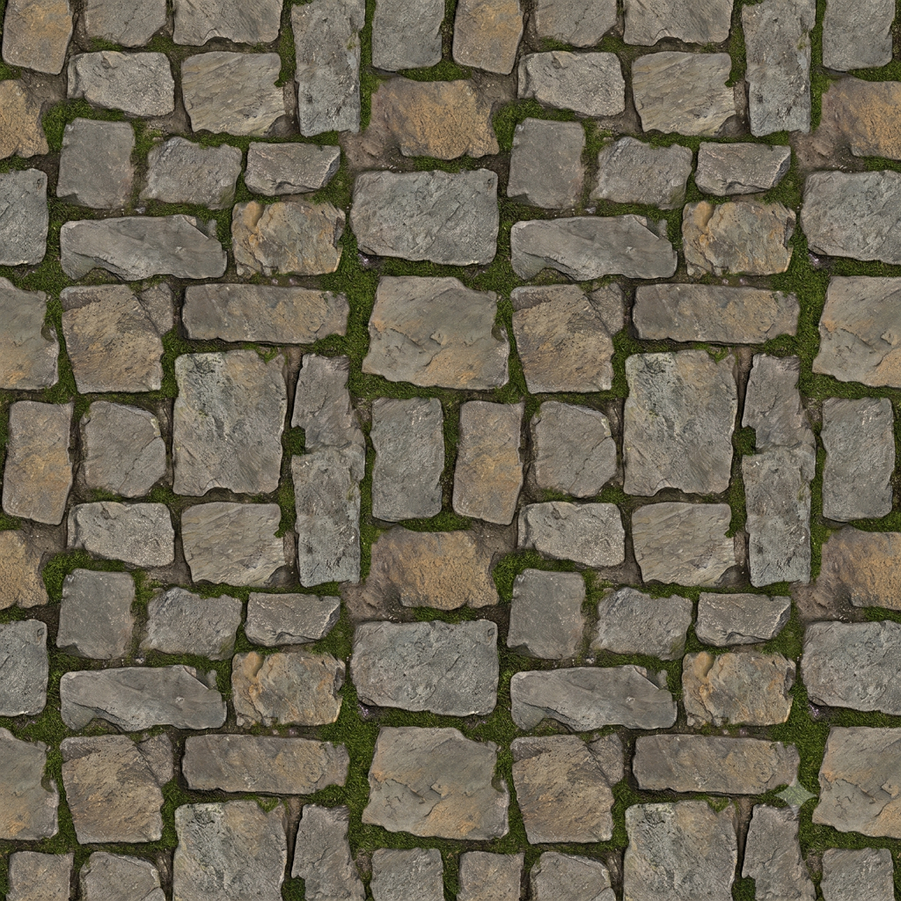

# 實戰紀錄 — A10 苔蘚草地 + A11 石板路(墓園地面材質)

> 概念圖拆資產案例。延續 [A1 哥德陵墓](A1-mausoleum.md),同一張哥德墓園概念圖的「地面層」。
> 對應工作流:`/asset-cutout`(表 B 背景色 / 平鋪) + `ai-media-generator` concept-to-3D pipeline。
> 兩件皆 **[C] 可複用可平鋪模組** → top-down 平拍 → **轉 PBR 材質(不生 mesh)**。

## 來源(索引)
- **生成平台:** 使用者生成(平台待補 — 推測 Nano Banana Pro / Seedream T2I)
- **日期:** 2026-06-23
- **原始素材:** 哥德墓園概念圖的地面 — 石板路(A11) + 苔蘚草地(A10)
- **墓園資產進度:** A1 陵墓 ✅(見 `A1-mausoleum.md`)· **A10 ✅ · A11 ✅** · 其餘(A2–A9)待做

---

## 用到的 prompt(逐字保存)

### A11 — 石板路 / 鵝卵石鋪面(top-down 無縫平鋪)
```text
Top-down orthographic flat texture tile derived from the cobblestone/flagstone path in
the attached concept art: perfectly SEAMLESS and TILEABLE on all 4 edges, square 1:1,
shot straight from directly above, zero perspective, even diffuse light, NO directional
shadow, NO baked highlight, NO purple/green scene tint (true de-lit albedo). Irregular
weathered stone slabs with moss in the cracks and dirt in the joints, scale matches a
1m x 1m module, flat albedo suitable as a PBR base color map.
```

### A10 — 苔蘚草地(top-down 平鋪)
```text
Top-down orthographic flat texture tile derived from the mossy grass ground in the
attached concept art: perfectly SEAMLESS and TILEABLE on all 4 edges, square 1:1, shot
straight from directly above, zero perspective, even diffuse light, NO directional
shadow, NO baked highlight, NO green scene tint (true de-lit albedo). Mossy turf with
grass blades, small weeds and dirt, scale matches a 1m x 1m module, flat albedo
suitable as a PBR base color map.
```

---

## 產出

### A11 石板路材質 tile

> ⏳ 待存入 `images/cobblestone-path-tile.png`(同 A1 流程:先存文字紀錄,成品圖另一 commit 同步)

top-down、灰/赭不規則石板、縫隙嵌苔 — 對應概念圖石板路材質。

### A10 苔蘚草地材質 tile

> ⏳ 待存入 `images/mossy-ground-tile.png`

top-down、真綠 albedo、苔塊 + 草葉 + 酢漿草 + 枯枝 + 碎石 + 泥土 — 對應概念圖地被層。

---

## QC(對照 pipeline「進 3D 前 QC 檢查表」)

| 檢查項 | A11 石板路 | A10 苔蘚草地 |
|---|---|---|
| top-down 正交、零透視 | ✅ | ✅ |
| de-lit(無投影 / 無 rim / 無景深) | ✅ | ✅ |
| 去除概念圖綠霧/紫光染色 → 真 albedo | ✅(灰/赭中性) | ✅(真綠,未被場景光染) |
| 內容對應原圖 | ✅ 風化石板 + 縫苔 | ✅ 苔+草+酢漿草+枝石 |
| 四邊無縫平鋪 | ⚠️ 待引擎 offset 驗 | ⚠️ 待引擎 offset 驗 |
| 巨觀亮度均勻(避免平鋪鬼影) | ⚠️ 略有明暗大塊 → 需 flatten | ✅ 大致均勻 |
| 浮水印 / 邊角 | 入庫前檢查右下角 | 入庫前檢查右下角 |

---

## 學到的(可複用結論)

- ✅ **`top-down orthographic flat texture tile … SEAMLESS and TILEABLE on all 4 edges … NO baked highlight … true de-lit albedo … PBR base color map`** 這組詞對 [C] 平面類資產有效,產出可直接當 base color → **值得收進 SOP 當「地面/牆面材質」標準模板**。
- ✅ **`NO purple/green scene tint` 是關鍵句。** 把概念圖的綠霧 / 紫光擋在門外,拿到中性 albedo;少了這句,地面會被烤上場景色,平鋪時整片偏綠/偏紫。
- 📌 **[C] 平面類的產出是「材質貼圖」,不是 mesh。** 下一步在 Substance/引擎派生 normal + height + roughness + AO;石板縫苔可轉 mask 驅動程序化苔蘚。
- ⚠️ **A10 草葉是「畫進平面」的。** 當純地面 albedo OK,但俯視是平的;要立體草 / 酢漿草請改用 **scatter 卡片(geometry)疊在地面上**,別靠烤進貼圖的草葉 —— 呼應 pipeline「地/毯/草別硬建模 → PBR + scatter」。
- ⚠️ **平鋪前先 flatten 巨觀亮度。** A11 有明暗大塊,直接平鋪會出現重複鬼影;高通 / de-light 壓平 albedo 後再拼。
- ⚠️ **入庫前檢查右下浮水印**(沿用 A1 的 Gemini ✨ 經驗),裁掉/修掉再進材質庫。
