# 實戰紀錄 — B1 夜霧森林地面背景：4K 放大 + 地面材質細節管線

> Game background asset 的「保真放大 → 增加細節」品質管線驗證紀錄。
> 對應工作流:`ai-media-generator`(quality-control / 放大與細節 pass 思路)。

**🔑 關鍵字(日後對 Claude 說這些詞即可叫出本紀錄):**
`B1`、`B1 紀錄`、`照 B1 配方`、`4K 放大`、`放大管線`、`保真放大`、
`材質保真 pass`、`TEXTURE-FIDELITY`、`增加細節`、`細節 pass`、
`UE5 地面質感`、`鎖句字典`、`鎖句`、`letterbox 白邊`、`白邊踩坑`、
`Universal Upscaler`、`Nano Banana 2`、`Leonardo 設定`、
`夜霧森林背景`、`投影貼圖品質`、`驗收 checklist`

## 來源(索引)
- **素材:** 夜霧森林地面背景(前景兩棵樹幹 + 苔蘚草地,16:9 滿版約 2K)
  - 版本 A:純黑背景(cutout / 夜景合成用)
  - 版本 B:青綠霧中枯樹背景(完整場景版)
- **用途:** 投影(camera projection)回 3D 灰盒場景
- **⭐ 管線定位(2026-07-03 確立):** 本管線的最終用意 = **生產灰盒管線的「質感參考板」(STYLE TRUTH)**,
  供灰盒重繪時掛參考。因此有兩套驗收標準:
  - **當資產用** → 全部鎖都要過(構圖/物件/輪廓保真)
  - **當質感參考用** → 只驗材質品質/色調/光;構圖與物件保真**不重要**(灰盒 prompt 會明文拒收參考圖的幾何)
  - 已入庫參考:夜森林([b1-forest-final-texture.png](images/b1-forest-final-texture.png))、
    雪地(雪山 4K,成品圖待補)、沙漠([b1-desert-reference.jpg](images/b1-desert-reference.jpg),
    物件有漂移但參考用途合格)
- **平台:** Leonardo.ai — Universal Upscaler(保真 2× 放大)+ AI Creation **Nano Banana 2**(材質細節 pass)
- **日期:** 2026-07-02
- **結果:** ✅ 最終版「材質保真 pass」達成期望 — 地面紋理細節提升至 UE5 掃描質感,構圖/色調/景深零漂移

---

## 最終定案管線

```
滿版 16:9 原檔(2K,無白邊 letterbox!)
  → Leonardo Universal Upscaler 2×(creativity 最低檔)
  → Leonardo AI Creation / Nano Banana 2「材質保真 pass」(下方最終 prompt)
  → 100% 原寸驗收(見 checklist)
  →(套圖時)四張同配方 → 互拼驗縫 → 縫帶 inpaint → 進引擎投影驗收
```

### 平台設定 — Leonardo.ai AI Creation(細節 pass 實際使用)

| 設定 | 值 | 備註 |
|---|---|---|
| Model | **Nano Banana 2** | |
| Image Dimensions | **16:9(4096×2304,Custom/Large)** | ⚠️ 選 **1:1 4096×4096 就是白邊方圖的來源** — 模型會把 16:9 輸入塞進方形畫布補白邊/outpaint。比例必須跟輸入圖一致 |
| Prompt Enhance | ⚠️ 建議 **關閉(None)** | Auto 會改寫 prompt,可能破壞 FRAME LOCK 等鎖句;鎖句型 prompt 一律關 |
| Style | ⚠️ 建議 **None** | Dynamic 等 preset 會疊自己的色調/對比,與曝光鎖、色盤鎖衝突 |
| Number of generations | 1 | 套圖批次時仍逐張跑,維持同配方 |
| Private Mode | On | |

---

## 用到的 prompt(逐字保存)

### 1. 最終版 — 地面材質保真 pass(✅ 驗證成功)

適用:要「地面紋理變高清(UE5 / Megascans 級)」而**不要**多出草叢/石頭/枯枝等物件。

```text
Enhance the ground surface of this dark misty forest game background.
This is a TEXTURE-FIDELITY pass, NOT an object pass — think of it as
replacing the ground material with a higher-resolution scan of the SAME
material.

INCREASE ONLY surface micro-detail on the existing ground: finer moss
granularity with subtle natural clumping, richer soil and dirt texture
with small variations in color and roughness, damp organic sheen where
the ground is darker, and gentle ambient-occlusion depth inside the
existing ground crevices and undulations. Target quality: photorealistic
PBR ground material, Unreal Engine 5 / Quixel Megascans scan fidelity.

Do NOT place anything on the ground: no standing grass blades or tufts,
no twigs, no branches, no stones or pebbles lying on the surface, no
leaves, no debris. The ground stays a continuous surface — only its
texture resolution becomes richer. Every existing shape, contour and
silhouette stays exactly as it is.

FRAME LOCK: keep the exact original 16:9 canvas, framing and camera — do
NOT crop, zoom, extend or outpaint. The two foreground tree trunks,
bushes and ground contours stay at their exact position and size.

PRESERVE THE DEPTH: the distant bare trees in the teal fog stay soft,
hazy and unsharpened — no detail or contrast behind the fog line; fog
density unchanged.

STRICT: no new objects of any kind, do not brighten the shadows, keep
the muted dark teal-green night palette exactly.
```

### 2. 變體 — 純黑背景版的放大/細節鎖句(版本 A 素材用)

黑背景 cutout 素材時,把 FRAME LOCK / DEPTH 段換成**黑鎖 + 邊緣鎖 + 曝光鎖**:

```text
STRICT: keep the pure black background exactly pure black (#000000) — do
NOT add noise, fog, stars, gradient or any texture into the black areas.
Keep the silhouette edges of the tree trunks and foliage against the
black background crisp and clean, no glow, no fringing. Do not brighten
the shadows — preserve the dark, muted night-forest grade and the exact
color palette.
```

### 3. 淘汰版 — 物件式細節 pass(❌ 不符本需求,留作對照)

允許清單寫「草葉/苔蘚塊/枯枝/小石」→ 產出**立起來的草叢與散落石塊**,
是「往地上放東西」不是「材質變高清」。要材質就用 prompt 1 的
TEXTURE-FIDELITY 寫法;要植被豐富度才用允許清單寫法。

---

## 產出對照

### 原圖(2K 滿版,細節 pass 前)
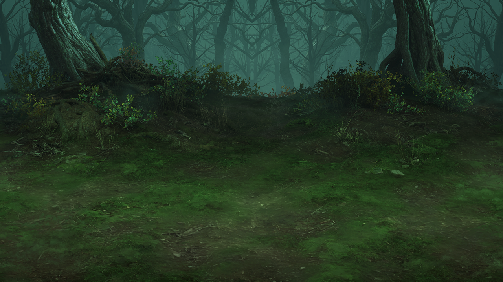

### 最終成品(材質保真 pass 後 — UE5 級地面紋理)
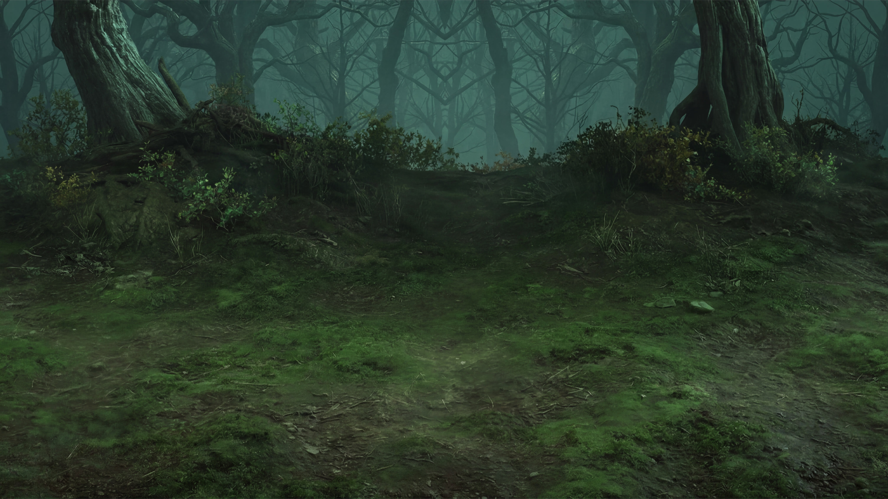

### 白底 cutout 樣本(踩坑 #7 對照)

單段保真放大 — 鎖邊成功但材質平淡(❌ 對照組):
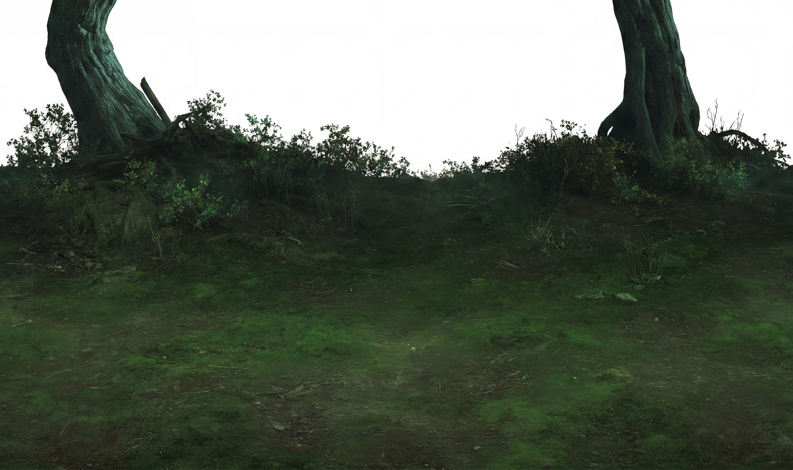

遮罩摳圖最終版 — 低解析 cutout 放大當遮罩,從完整版 4K 摳出,4096×2305 RGBA 帶透明通道(✅ 正解):
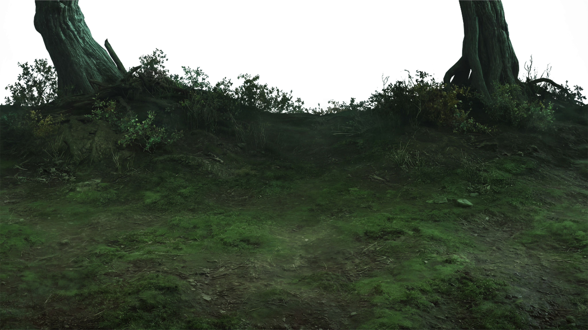

### 雪山樣本(亮部/景深/發光/歧義物件壓測)

原圖(1280 寬,3× 高倍率壓力測試):
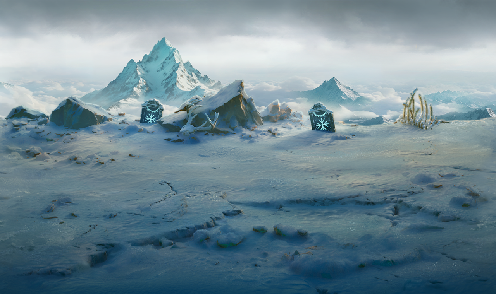

骸骨幻覺失敗版(踩坑 #6 證據 — 曖昧骨刺叢被「補完」成整具骸骨):
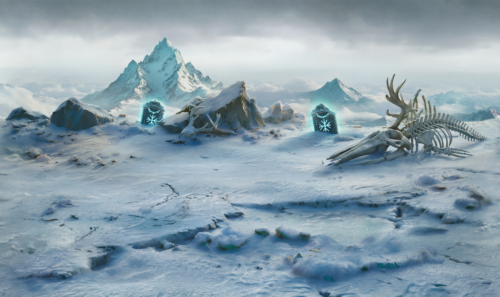

### 沙漠戰場樣本(暖色調/手繪風/多離散小物件壓測)

原圖(1280 寬):
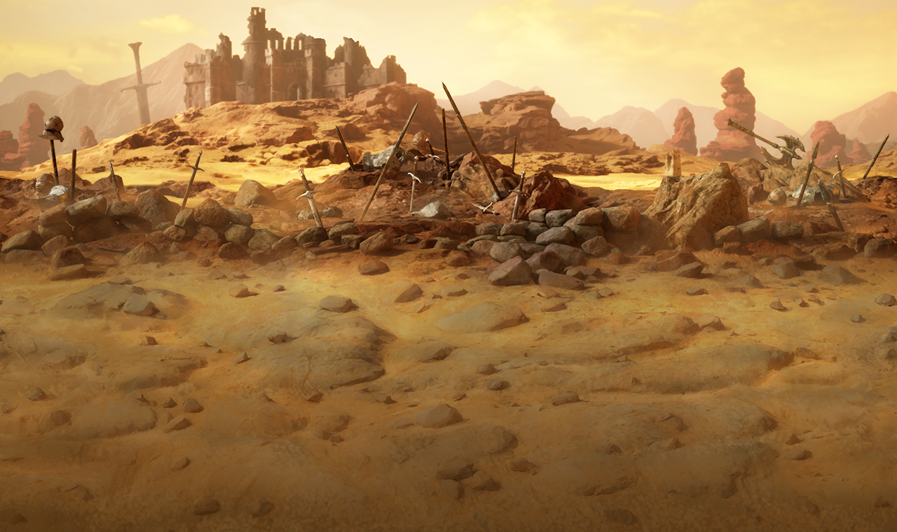

質感參考入庫版(混合方案:保真底 + 範圍限定沙地 pass;物件有漂移,參考用途合格):
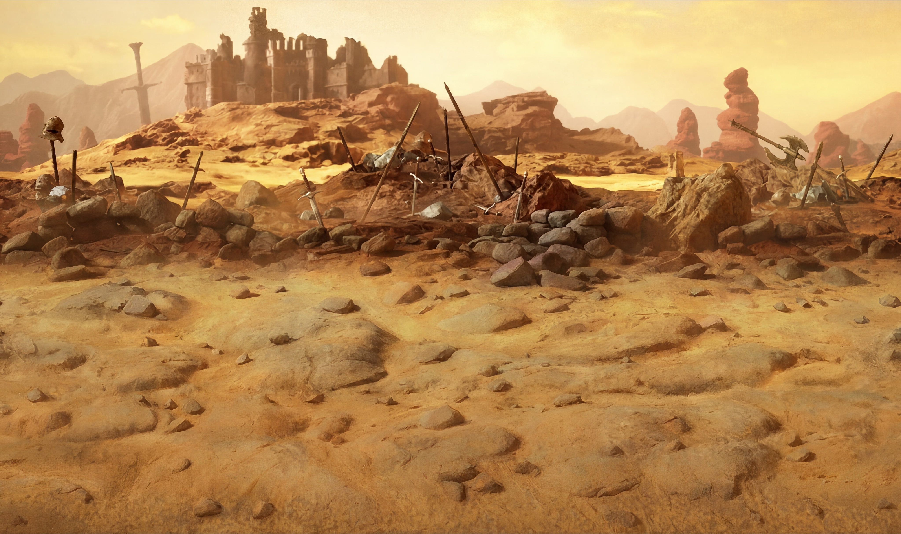

---

## 踩坑紀錄(依時間序)

| # | 現象 | 根因 | 解法 |
|---|---|---|---|
| 1 | Universal Upscaler 放大後綠色被提亮、往白天跑;細節是「抹平再銳化」的假細節 | **輸入是帶白邊 letterbox 的方形縮小版**,場景有效解析度只剩一半 | 一律用滿版原檔輸入;白邊裁掉 |
| 2 | NBP 細節 pass 輸出變 1:1、鏡頭拉近、多出大石/粗枝(甚至頭骨狀石頭) | 又餵了 letterbox 版 → 模型把白邊當 outpaint 區重新構圖 | 滿版輸入 + prompt 加 **FRAME LOCK** 段 |
| 3 | 細節長對了但地上多出草叢、枯枝、碎石(非需求) | 允許清單 = 「放置物件」指令 | 改寫成 TEXTURE-FIDELITY pass(prompt 1),物件全進禁止清單 |
| 4 | 遠景枯樹有左右鏡像對稱 artifact | 原圖生成時的對稱性瑕疵 | 選配修法:`Fix the mirrored symmetry in the distant background branches — make the tree silhouettes asymmetric and natural, while keeping them equally soft and hazy in the fog.` |
| 5 | 輸出反覆帶白邊方形(letterbox 的另一半根因) | Leonardo **Image Dimensions 選了 1:1**,16:9 輸入被塞進方形畫布 | Dimensions 改 **16:9 / Custom 4096×2304**,平台輸出比例永遠對齊輸入圖比例 |
| 6 | (雪景樣本)曖昧的骨刺叢被「補完」成整具動物骸骨;符文光暈被放大 | prompt 寫了 `cleaner definition on the bone structures` — 對**歧義物件**下「畫清楚」指令 = 邀請重新解釋 | 歧義物件改用**輪廓鎖**(見鎖句字典);發光元素加**光暈半徑鎖** |
| 7 | (白底 cutout 樣本)鎖邊成功但地面材質平淡,不如完整版成品 | 只跑了單段「faithful upscale」— 保真定性下模型不敢長材質;**材質豐富度來自兩段式的 TEXTURE-FIDELITY pass** | cutout 也要走完整兩段式;**更優解:同構圖已有完整版 4K 時,把低解析 cutout 放大當遮罩,從完整版直接摳出透明背景版** — 品質與完整版完全一致,零抽獎 |
| 8 | (沙漠樣本)NB2 全圖 pass 後武器丟失/合併 | **多離散小物件 = 注意力稀釋**,逐物件鎖(WEAPON LOCK)也追蹤不了十幾件小物 | 資產用途 → 類型分流走純保真放大;或混合方案(保真底 + 範圍限定 pass + 遮罩合成) |
| 9 | (沙漠樣本)前景被換成乾河床/沙丘地貌 | 寫實化 prompt 列了 wind ripples / cracks / pebble trails 等**地貌特徵配料**,模型全部畫好畫滿 = 重新設計地形 | 寫實 token 只能描述**渲染品質**(grain/AO/接觸陰影),不能描述**地貌特徵** — 地貌詞一律放禁止清單 |

### 踩坑證據圖

**#1/#5 — letterbox 白邊 + 色偏**(白邊吃掉解析度、綠色被提亮往白天跑):
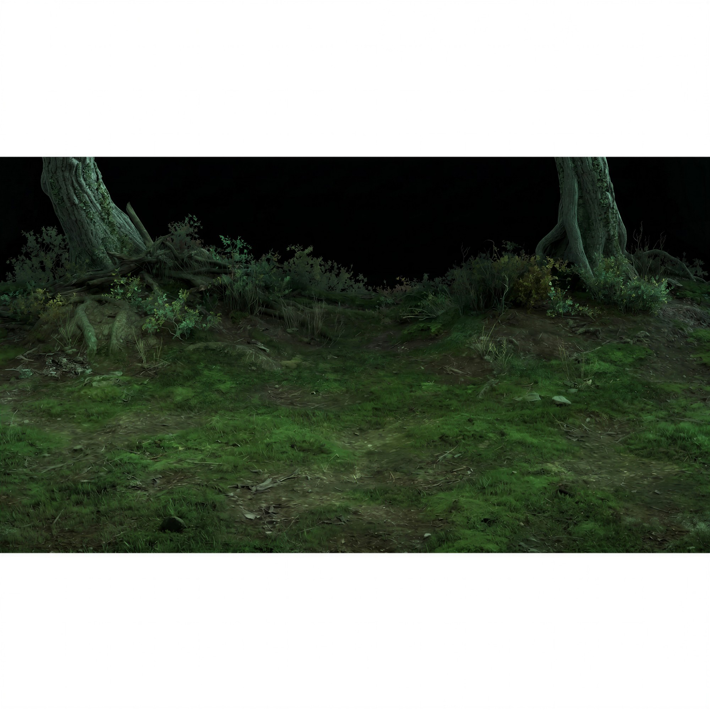

**#2 — 白邊被當 outpaint 區重新構圖**(比例變 1:1、鏡頭拉近、多出新前景):
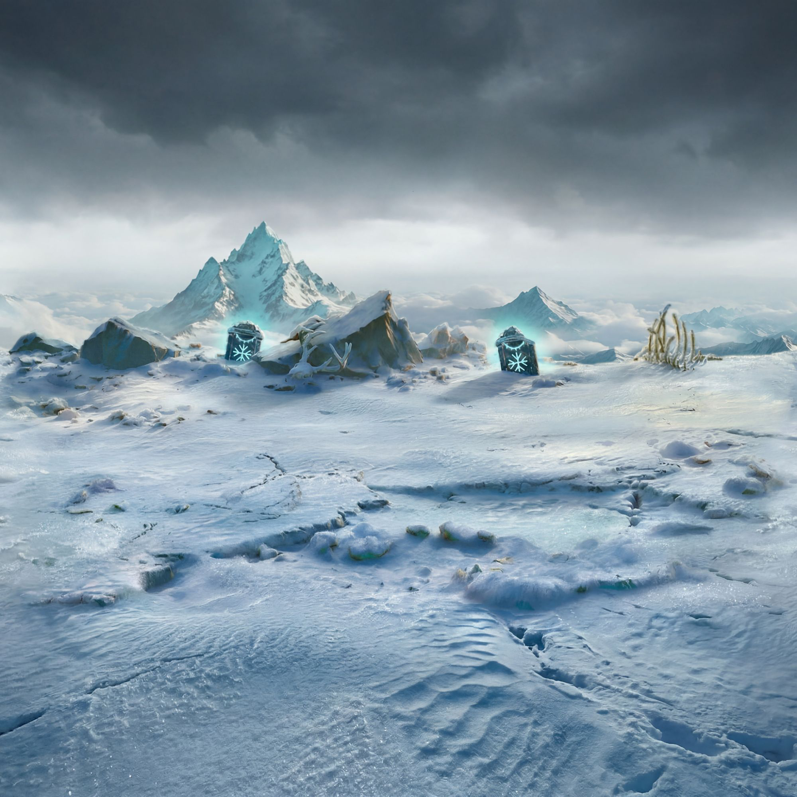

**#3 — 物件式細節誤用**(允許清單長出草叢/枯枝/碎石,行走面被雜物污染):
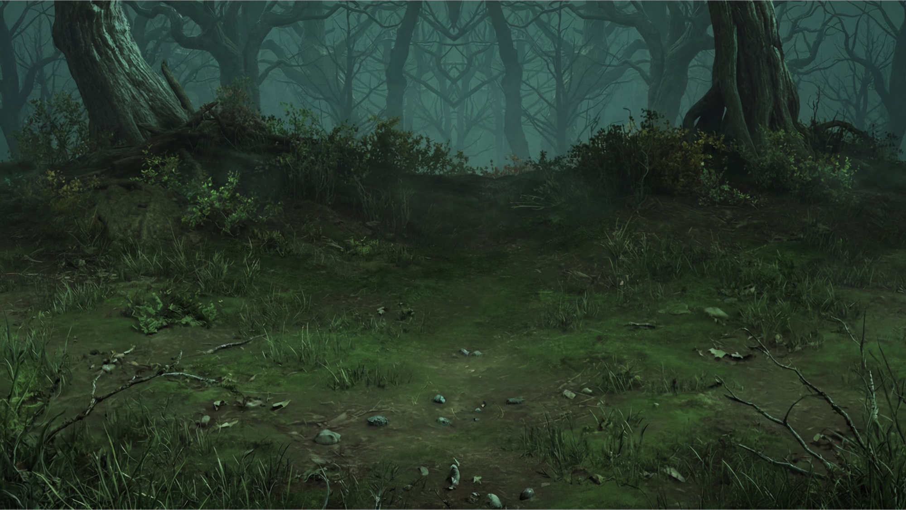

**#8 — 多離散小物件注意力稀釋**(沙漠戰場:NB2 全圖 pass 後武器丟失/合併,逐物件鎖也擋不住):
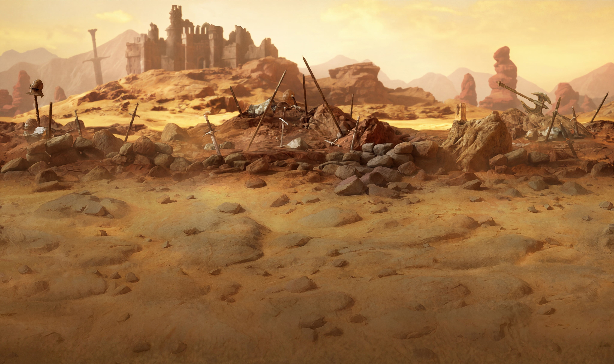

**#9 — 寫實化配料清單 = 重新設計地形**(wind ripples/cracks/pebble trails 全畫好畫滿,前景被換成乾河床):
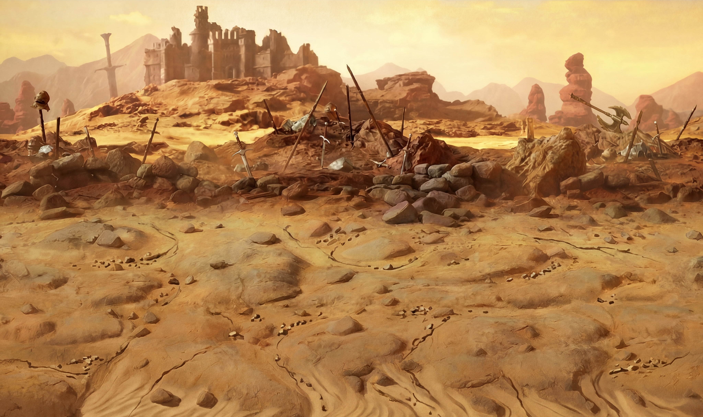

---

## 鎖句字典(可複用)

| 鎖 | 用途 | 關鍵句 |
|---|---|---|
| **畫框鎖** | 防裁切/變焦/outpaint | `keep the exact original 16:9 canvas, framing and camera — do NOT crop, zoom, extend or outpaint` |
| **黑鎖** | 純黑背景不長噪點/霧/星 | `pure black stays exactly pure black (#000000), do NOT add noise, fog, stars, gradient` |
| **白鎖** | 純白背景不被補天空 | `pure white stays exactly pure white (#FFFFFF) — no sky, clouds, fog, gradient, texture, or scenery in the white areas`(白底另需邊緣鎖加 `no semi-transparent blur`,曝光鎖加 `must NOT be lightened to match the white background`) |
| **邊緣鎖** | cutout 輪廓不糊不發光 | `silhouette edges ... crisp and clean, no glow, no fringing` |
| **曝光鎖** | 暗部不被偷提亮 | `do not brighten the shadows — preserve the dark, muted grade` |
| **深度鎖** | 霧後遠景不被銳化 | `distant trees in the fog stay soft, hazy and unsharpened — no detail or contrast behind the fog line` |
| **霧量鎖** | 霧不被清掉或加厚 | `do not thin out or thicken the fog` |
| **尺度鎖** | 紋理不被畫大一號 | `the ground texture scale stays identical to the input` |
| **定性句** | 給模型正確心智模型 | `This is a TEXTURE-FIDELITY pass, NOT an object pass — a higher-resolution scan of the SAME material` |
| **輪廓鎖(歧義物件)** | 曖昧形狀不被重新解釋/補完 | `keeps its EXACT original silhouette — sharpen only its surface texture. Do NOT reinterpret it, do NOT complete it into [骸骨等]` |
| **光暈半徑鎖** | 發光元素不變大不變色 | `same color, same brightness, and the SAME GLOW RADIUS as the original; do not enlarge or soften the halo` |
| **允許/禁止成對** | 控制細節種類 | ADD ONLY 清單 + do NOT 清單同時出現,缺一不可 |

---

## 驗收 checklist(100% 原寸)

- ☐ 輸出檔實際解析度達標(檔案屬性確認,別信平台標稱)
- ☐ 疊回原圖 50% 透明度:輪廓/地形線完全重合,只有表面細節變豐富
- ☐ 黑區吸管 RGB ≈ 0,0,0(版本 A)/ 霧區依然柔焦(版本 B)
- ☐ 輪廓交界無亮邊 fringe、無糊化
- ☐ 暗部亮度與飽和度未被抬升(對照原圖)
- ☐ 細節是「真的長出來」不是「抹平+銳化」
- ☐ 地面分區還在(綠苔區 vs 土路區沒被均質化)
- ☐ 沒有越界物件(花/蘑菇/動物/頭骨/大石/光束/螢火蟲)

---

## 穩定度驗證(進行中)

> 目的:把配方從「成功一次」升級為「可信賴的生產管線」。
> 規則:同一天跑完、鎖句逐字不動(只換場景描述詞)、每張 2 輪 × 每輪 4 張取最佳。

### 樣本矩陣

| # | 圖 | 類型(測的風險點) | 第 1 輪 | 第 2 輪 | 失敗項 |
|---|---|---|---|---|---|
| 1 | 森林地面白底 cutout | 去背資產(白鎖/邊緣鎖) | ⚠️ 鎖邊成功但材質平淡 | ✅ 遮罩摳圖收檔(4096×2305 RGBA) | 單段保真放大不長材質;cutout 品質正解 = 用遮罩從完整版 4K 摳(見結論) |
| 2 | 夜霧森林(B1 主案例) | 霧景+暗部+細節密集 | ✅ | ✅ | (letterbox 修正後通過) |
| 3 | 雪山符文石 | 亮部+大氣景深+發光元素+歧義物件 | ❌ 骨架被補完成骸骨 | ✅(輪廓鎖後) | 光暈需半徑鎖;NB2 區域修復=全圖重繪,收尾用 Photoshop 合成(合成暫擱置,成品圖待補) |
| 4 | (待填) | 模組成品(輪廓漂移) | ☐ | ☐ | |
| 5 | 沙漠戰場(劍陣+城堡廢墟) | 暖色調+手繪風+多離散小物件+3.2× | ❌ 武器丟失/合併,無明顯增益 | ✅ 混合方案(保真底+範圍限定沙地 pass);**當質感參考入庫**([b1-desert-reference.jpg](images/b1-desert-reference.jpg)) | 資產用途走類型分流(純保真放大);參考用途物件漂移可接受 |

### 判定標準

- 全樣本全項通過 → 配方標記「✅ 穩定」,可批次生產
- 特定類型固定翻車 → 該類型加專屬鎖句分支,記入踩坑表
- 同圖兩輪差異大 → 鎖 seed,或「開 4 挑 1」升級「開 8 挑 1」

---

## 學到的(可複用結論)

- ✅ **輸入檔比例 = 第一品質變數。** letterbox 白邊連續造成兩種不同災難(假細節+色偏、outpaint 重構圖) — 任何放大/細節工具,輸入一律滿版。
- ✅ **「增加細節」有兩種,prompt 寫法完全不同:** 物件式(允許清單:草葉/枯枝/小石)vs 材質式(表面屬性詞:granularity / roughness variation / damp sheen / AO in crevices)。要 UE5 質感 = 材質式。
- ✅ **定性句 > 禁令堆疊。** 開頭一句「這是材質保真 pass,等於同一塊地的高解析掃描」比一百條 do NOT 有效;禁令當保險。
- ✅ **Universal Upscaler 在滿版輸入 + creativity 最低 + 2× 下可用**;它的抬色調問題是 letterbox 誘發,非本體缺陷。
- ✅ **放大倍率 2× 安全、4× 危險** — sheet 排版時盡量讓單格底圖 ≥2K。
- 📌 **套圖(tileset)延伸:** 四張 tile 同一天、同模型版本、同 prompt 逐字、同參數跑;細節 pass 會動到接縫 → **修縫必須排在細節 pass 之後**(相鄰兩張拼一起只 inpaint 縫帶)。
- ✅ **cutout(去背)資產的 4K 正解:** 同構圖已有完整版 4K 成品時,**不要單獨重放大 cutout** — 把低解析 cutout 放大當遮罩(黑白剪影縮放無品質問題),在 Photoshop 從完整版 4K 直接摳出透明背景版。品質與完整版完全一致、邊緣手動可控、零抽獎。單獨放大 cutout 需走完整兩段式 + 白鎖/邊緣鎖,材質仍略遜。
- ✅ **AI 大面積、確定性工具收尾:** NB2 的「區域修復」實為全圖重繪 — 修好 A 會重擲 B(打地鼠)。單一物件的修復/合成,收尾交給 Photoshop 遮罩合成,把骰子收走。
- ✅ **類型分流(選管線前先判斷圖的細節性質):** 圖的細節是**有機微紋理**(草/苔/沙/雪/樹皮)→ 兩段式含 NB2 細節 pass 有增益;圖的細節是**筆觸/離散小物件**(手繪概念風、滿地武器道具)→ **只走純保真放大器**(Topaz / Real-ESRGAN / UU 低 creativity),生成式 pass 會抹筆觸、丟物件(多離散小物件 = 注意力稀釋,逐物件鎖也擋不住)。
