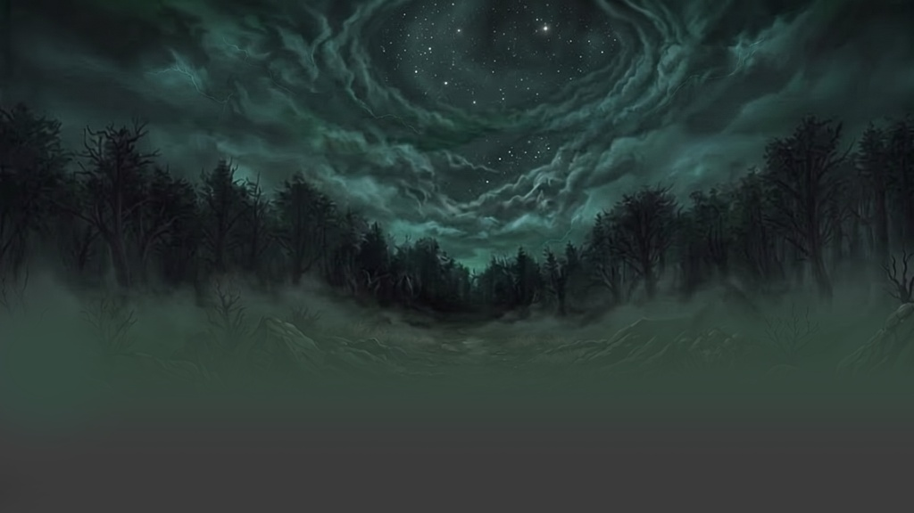
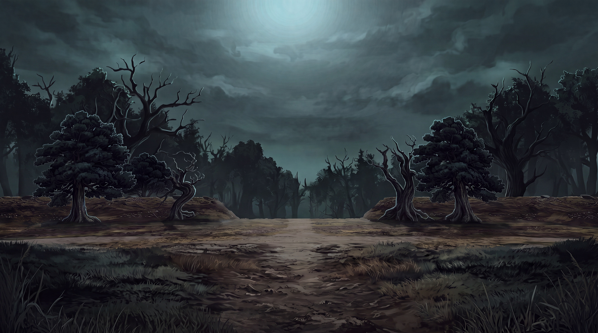
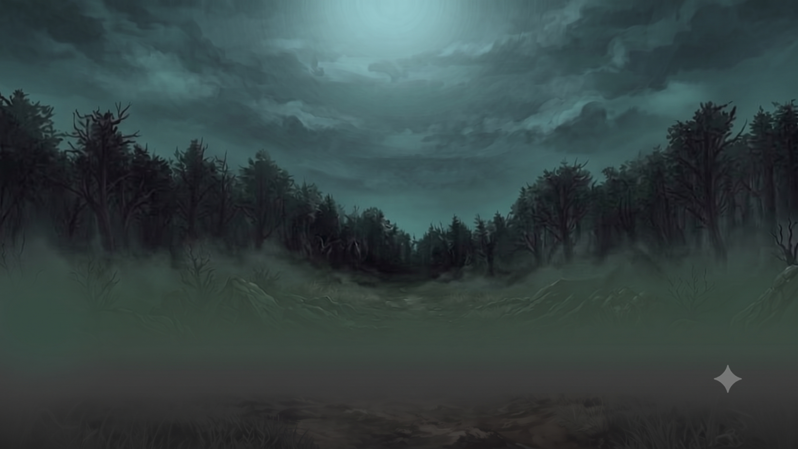
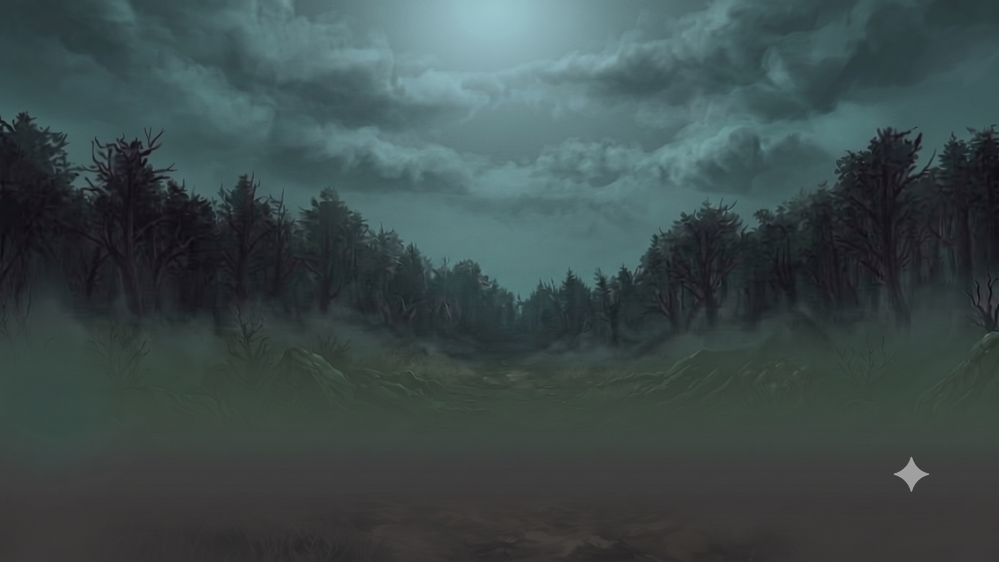

# 實戰紀錄 — B12 跨圖天空移植(圖1 的天空換成圖2 的天空)+ 天空後製

> 兩張同風格背景圖之間「只搬天空、其餘全鎖」的 NB2 雙參考合成,以及移植後的
> 天空質感升級與重打光。前置知識:[B1](B1-forest-bg-4k-detail.md)(鎖句字典/
> 像素預算)、[B2](B2-greybox-module-pipeline.md)(幾何滲漏/角色標籤法)。

> 📎 **編號沿革:** 本案例在開發分支上原編為 **B8**,合入 main 前 B8/B9/B10/B11
> 已被其他案例佔用,故改號為 **B12**(避免與 main 撞號)。舊引用「B8 天空移植」
> = 本檔。

**🔑 關鍵字(日後對 Claude 說這些詞即可叫出本紀錄):**
`B12`、`B12 紀錄`、`B8 天空移植`(舊號)、`換天空`、`天空移植`、`跨圖移植`、
`SKY DONOR`、`捐贈者標籤`、`地平線鐵幕`、`樹冠縫隙鎖`、`重調色進色盤`、
`天空 UE5 質感`、`筆觸消除`、`紅圈標註`、`畫記編輯`、`搬月亮`、`光源搬家`、`滅舊燈`

## 來源(索引)

- **素材:** 兩張同為手繪風的夜森林背景(同構圖語言、不同天空)
  - **BASE(圖1):** 星漩渦天空版 — 森林/樹線/霧/地面都已定案,只有天空要換
  - **SKY DONOR(圖2):** 暴風雲天空版 — 只取其天空(層疊雲 + 頂部柔和月光暈)
- **平台:** **Gemini(Nano Banana)** 直接生成(雙圖參考);平台設定思路沿用 Leonardo NB2 配方
- **日期:** 2026-07-26
- **結果:** ✅ pass 1(移植)、pass 2(UE5 質感)一次過;pass 3(搬月亮)已寫好待驗證
- **生成連結(Gemini):**
  - 血月2_天空1 — <https://gemini.google.com/u/2/app/7ff1d4cb964f0831?utm_source=app_launcher&utm_medium=owned&utm_campaign=base_all>
  - 血月2_天空2 — <https://gemini.google.com/u/2/app/0543552c5f6350fc?utm_source=app_launcher&utm_medium=owned&utm_campaign=base_all>
- **Claude Code session:** <https://claude.ai/code/session_01AxGHb9XFs7EPkVNYCVed55>

---

## 最終定案管線

```
兩張滿版無黑邊原檔
  → pass 1「天空移植」(ref1 = BASE、ref2 = SKY DONOR)
  → pass 2「天空 UE5 質感」(單圖,消筆觸)
  → pass 3「天空重打光」(單圖 + 紅圈標註,搬光暈位置)⏳ 待驗證
  →(保險)PS 沿樹冠線柔邊遮罩,只露新天空 → 樹線以下零漂移
```

平台設定同 [B1 設定表](B1-forest-bg-4k-detail.md#平台設定--leonardoai-ai-creation細節-pass-實際使用):
Model = Nano Banana 2、Dimensions 比例 = 輸入圖、**Prompt Enhance / Style 一律 None**、開 4 挑 1。

> ⚠️ **每個 pass 前都要做「輸入衛生」**:上一段輸出若帶黑邊(letterbox)或平台浮水印,
> **先裁滿版、先點掉浮水印再餵下一 pass**。本案例全程未清,黑邊與右下閃光一路帶到最後 —
> B1 踩坑 #1/#5 的變體,只是這次沒被引爆(見下方風險表 #1)。

---

## 逐字 prompt

### 1. 天空移植 pass(ref 1 = BASE、ref 2 = SKY DONOR)✅ 一次過

```text
Reference image 1 is the BASE — a dark misty forest scene. Its
forest, treeline silhouette, ground, fog and camera are all correct
and FINAL. Only its sky must be replaced.

Reference image 2 is the SKY DONOR — use ONLY its sky: the heavy
layered storm clouds with a soft dim moonlit glow near the top. Do
NOT copy anything else from it: not its trees, not its ground, not
its path, not its terrain — nothing below its horizon may appear in
the result.

TASK: replace reference 1's sky (the swirling star vortex and its
stars) with reference 2's storm-cloud sky. The new sky sits BEHIND
reference 1's treeline: every branch, twig and tree silhouette keeps
its exact shape, and the sky shows through the same gaps between the
branches as before. Blend the new sky softly into the existing fog
at the horizon line.

COLOR: regrade the new sky into reference 1's muted dark teal-green
night palette so it feels lit by the same scene — do not import
reference 2's grey-brown tones into the forest, do not brighten the
trees, fog or ground. Keep the glow dim.

FRAME LOCK: keep reference 1's exact canvas, framing and camera — no
crop, no zoom, no outpaint. Everything below the treeline stays
pixel-identical. No stars, no moon disc, no new objects.
```

### 2. 天空 UE5 質感 pass(單圖,消筆觸)✅ 一次過

```text
This is a SKY-ONLY texture-fidelity pass on this night forest scene.
Think of it as re-rendering the SAME sky as a photorealistic Unreal
Engine 5 volumetric skybox — the cloud layout is correct and FINAL,
only the rendering quality changes.

UPGRADE ONLY THE SKY: remove the visible paintbrush strokes and
replace them with soft, physically-lit volumetric clouds — layered
cloud density, subtle self-shadowing inside the cloud banks, gentle
light scattering around the dim glow at the top, and a fine
atmospheric haze gradient toward the horizon. Target quality: UE5
volumetric clouds / cinematic skybox fidelity.

LOCK THE SKY'S DESIGN: every cloud bank stays at its exact position,
scale and shape; the dim glow keeps the same position, the same
brightness and the SAME GLOW RADIUS — do not enlarge or intensify
it, do not add a moon disc, no stars, no lightning, no birds. Keep
the muted dark teal-green palette exactly — do not brighten the sky,
do not shift it toward blue or grey.

BELOW THE TREELINE NOTHING CHANGES: the tree silhouettes, every
branch and twig, the fog and the ground stay pixel-identical, and
the sky shows through the same gaps between branches as before.
FRAME LOCK: keep the exact original canvas, framing and camera — no
crop, no zoom, no outpaint.
```

> 太寫實跟整體美術風打架時,把 target 句換成:
> `semi-realistic painted skybox with smooth blended gradients — no visible individual brushstrokes`
> (保留繪畫感但抹掉筆觸,通常才是遊戲背景的甜蜜點)。

### 3. 天空重打光 pass(單圖 + 紅圈標註,搬光暈)⏳ 待驗證

**輸入 = 在裁乾淨的圖上用純紅粗線畫圈標出月亮目標位置。**

```text
SKY RELIGHT pass. The red circle drawn on this image is an
ANNOTATION marking where the moon's glow must be — the circle itself
must NOT appear in the output.

TASK: move the bright moonlit glow from the top-center of the sky to
the position marked by the red circle, and redistribute the clouds
to match the new light position: the cloud banks part slightly
around the glow, cloud edges facing it catch soft rim light, and the
sky away from the glow falls into deeper cloud shadow. The former
top-center bright area becomes ordinary dark cloud cover — no
leftover second glow.

KEEP THE GLOW ITSELF IDENTICAL: same size, same brightness, same
soft radius, same color — a dim glow behind the clouds. NO visible
moon disc, no stars, no god rays.

KEEP EVERYTHING ELSE: the same cloud rendering style and the muted
dark teal-green palette — do not brighten the sky overall. BELOW THE
TREELINE NOTHING CHANGES: tree silhouettes, fog and ground stay
pixel-identical. FRAME LOCK: keep the exact canvas, framing and
camera — no crop, no zoom, no outpaint.
```

---

## 產出

### 素材

**BASE(圖1):星漩渦天空版** — 森林/樹線/霧/地面已定案,只有天空要換


**SKY DONOR(圖2):暴風雲天空版** — 只借它的天空(層疊雲 + 頂部柔和月光暈)


### 成品

**pass 1 — 天空移植:天空已換、色調融進 BASE 色盤(✅ 一次過)**


**pass 2 — 天空 UE5 質感:筆觸消除、體積雲質感(✅ 一次過)**


> 📌 `b12-moon-annotation.png`(pass 3 紅圈搬月亮輸入)待補 —— 該 pass 尚未實跑驗證。

---

## 風險與踩坑

| # | 風險 | 根因 | 防線 |
|---|---|---|---|
| 1 | 黑邊(letterbox)一路帶進每個 pass | 前一 pass 輸出未裁就直接當下一 pass 輸入 | 每 pass 前裁滿版;本案例僥倖未引爆,**不可視為安全**(B1 踩坑 #1/#5) |
| 2 | DONOR 的樹/地形/小徑滲進結果 | B2 踩坑 #1 幾何滲漏:NB2 會吸收參考圖構圖 | **地平線鐵幕**:`nothing below its horizon may appear in the result` |
| 3 | 樹梢細枝被新天空蓋掉或重畫 | 換天時樹冠是最脆弱的交界 | **樹冠縫隙透空鎖**:`the sky sits BEHIND the treeline ... shows through the same gaps` |
| 4 | 新天空像貼上去的(色調不合) | DONOR 灰褐 vs BASE 青綠,直接搬必然違和 | **重調色進 BASE 色盤**:`regrade the new sky into reference 1's palette so it feels lit by the same scene` |
| 5 | 模型「好心保留」原本的星星 / 補畫月盤 | 「UE5 skybox」「moonlit」自帶星空與月亮聯想 | 明文 `no stars, no moon disc` |
| 6 | 消筆觸 pass 把雲重新設計 | 寫實化 prompt 若列雲種特徵 = 重新設計(B1 踩坑 #9) | 寫實 token **只描述渲染品質**(self-shadowing / light scattering / haze gradient),不描述雲的特徵;加雲形輪廓鎖 |
| 7 | 消筆觸 pass 順手放大光暈 | 發光元素是保真 pass 最愛動的東西 | **光暈半徑鎖**(B1 字典)逐字照抄 |
| 8 | 搬光源後舊位置沒關燈 = 雙月 | 只寫「搬到新位置」,沒說舊位置要熄 | `The former ... bright area becomes ordinary dark cloud cover — no leftover second glow` |
| 9 | 紅圈標註殘留在輸出 | 模型把標註當畫面元素 | 開頭定義 `is an ANNOTATION ... must NOT appear in the output`;仍需挑張(4 張通常 2-3 張乾淨) |
| 10 | 「樹線以下 pixel-identical」不保證 | NB2 無真正區域遮罩,鎖句是意圖不是保證 | 收尾走 PS:原圖疊上、沿樹冠線柔邊遮罩只露新天空 |

---

## 技法字典(新增)

| 技法 | 用途 | 要點 |
|---|---|---|
| **捐贈者標籤法(SKY DONOR)** | 跨圖只借某一層 | B2「角色標籤+except」的專用化:BASE 標 `correct and FINAL`、DONOR 標 `use ONLY its [層]` |
| **地平線鐵幕** | 一句話擋掉整個下半部滲漏 | `nothing below its horizon may appear in the result` — 比逐項列 `not its trees, not its...` 更難繞過,兩者併用最穩 |
| **樹冠縫隙透空鎖** | 換天不吃掉細枝 | `the new sky sits BEHIND the treeline ... shows through the same gaps between the branches as before` |
| **重調色進 BASE 色盤** | 移植層與宿主圖融為一體 | `regrade ... so it feels lit by the same scene` — 講「同一場景的光」比講「改成某某色」更自然 |
| **紅圈畫記編輯** | 用圖指定位置,取代文字座標 | 在**裁乾淨**的圖上畫純紅粗圈 → prompt 開頭宣告它是 ANNOTATION 且不得出現在輸出。比「右上方約三分之二高」精準得多(同 B8 障礙物定位的紅圈定位法,不同用途) |
| **光源搬家滅舊燈** | 移動光源不留雙光源 | 搬家 prompt 必須同時寫「新位置亮」+「舊位置變回一般暗部」 |
| **打光綁雲(重分佈的韁繩)** | 雲要動但別自由重畫 | 把雲的變化寫成「為配合新光源」(朝光側 rim light、背光側加深),而非「重新排列雲」 |

---

## 驗收 checklist

- ☐ DONOR 的樹/地形/小徑**零滲漏**
- ☐ 樹冠細枝逐根還在,縫隙透空關係與原圖一致(100% 放大看樹梢)
- ☐ 新天空色調 = BASE 色盤(吸管比對,無灰褐入侵)
- ☐ 樹線以下疊回原圖 50% 透明度:完全重合
- ☐ 光暈位置/大小/亮度符合預期,**無第二個亮區**
- ☐ 無星星、無月盤、無紅圈殘留
- ☐ 黑邊已裁、平台浮水印已點掉

---

## 學到的(可複用結論)

- ✅ **跨圖移植的成敗全在「借哪一層」講不講得死。** BASE/DONOR 雙標籤 + 地平線鐵幕
  一次就過,沒有重演 B2 那種連續 4 輪的幾何滲漏 — 差別在於這次滲漏範圍被一條
  **空間界線**(地平線)切開,而不是靠列舉禁止物件。**能用空間界線鎖就別用物件清單鎖。**
- ✅ **移植 = 三件事一起做,少一件就露餡:** 換內容(sky)、鎖交界(樹冠縫隙)、統色調(regrade)。
  多數「貼上去感」來自漏做第三件。
- ✅ **B1 的 TEXTURE-FIDELITY 定性句可平移到任何元素** — 只要把「同一塊地的高解析掃描」
  換成「同一片天空的 UE5 重新算圖」,配上輪廓鎖 + 光暈半徑鎖,消筆觸一次就過。
  **定性句是模板,不是森林地面專用。**
- ✅ **紅圈畫記編輯 = 用圖說位置。** 位置類指令(搬東西、指定區域)寫文字座標很不穩,
  直接在圖上畫記號再宣告「這是標註不是畫面」精準得多。代價:要挑張排除殘留。
- 📌 **待辦:** ①pass 3(搬月亮)實跑驗證,結果回填本檔 ②`b12-moon-annotation.png` 補進 `images/`
  ③輸入衛生(裁黑邊/去浮水印)應排進每個 pass 之間,目前是全程積欠
- 📌 **同場未紀錄:** 同一批實驗還有「灰盒渲染 → 陰森氛圍重繪 → 風格統一 pass →
  樹形邪惡化(SILHOUETTE-RESHAPE)」的另一條線(不同圖系),尚未立檔。
