# 實戰紀錄 — B2 灰盒 → 夜森林地面模組(master tile)生成管線

> 灰盒(greybox)→ 符合灰盒幾何的 game art 模組。歷經三條路線的完整攻關紀錄。
> 對應工作流:`ai-media-generator`;前置知識:[B1](B1-forest-bg-4k-detail.md)(鎖句字典/類型分流/像素預算)。

**🔑 關鍵字(日後對 Claude 說這些詞即可叫出本紀錄):**
`B2`、`B2 紀錄`、`灰盒`、`greybox`、`灰盒算圖`、`模組`、`master tile`、
`貼材質灰盒`、`textured blockout`、`圖案活化`、`頂光`、`zenith light`、
`幾何滲漏`、`像素預算`、`Crop-Gen-Paste`、`色標灰盒`、`深度圖 guidance`、
`套圖管線`、`可旋轉模組`

## 來源(索引)

- **素材:** Blender 灰盒(平面模組,行走區+緩坡區)、深度圖(Mist pass)、分色圖、
  貼材質灰盒;風格參考 = B1 夜森林成品
- **平台:** Leonardo.ai AI Creation / **Nano Banana 2**(主力)、Phoenix/SDXL + Image Guidance(深度路線,已棄)
- **Claude 對話連結(本案全程:三路線攻關 → 逐輪判讀 → 收斂 → 紀錄;同串亦產出 B1):**
  `https://claude.ai/code/session_011YGmpRjwkgusd3tkm9wMuj`
- **日期:** 2026-07-03
- **使用者條件:** 無 3D 技能(Blender 僅能出基本渲染),分佈設計靠貼圖與 Photoshop
- **結果:** ✅ 貼材質灰盒路線收斂,master tile 完成(待引擎投影最終驗收)

---

## 最終定案管線(全程無 3D 技能需求)

```
1. 貼材質灰盒 — 在灰盒上貼佔位貼圖,把「材質分佈」直接烙進像素
   (行走區=暗色濕土、植被區=苔草;分佈的有機交錯畫在貼圖裡)
2. NB2「圖案活化」pass — 定性句:圖案是真相,讓它長出立體
3. NB2「頂光 polish」pass — zenith light 給立體感 + 色調縱深(旋轉安全)
4. Photoshop 灰盒剪影收邊(確定性,修外緣毛邊)
5. 投影回 plane(畫框必須 = 原渲染相機,見 Crop-Gen-Paste)
```

### 模組規格(已定案)

- 光照:**無水平方向光**;允許**頂光(zenith)**——影子垂直落,模組旋轉光影不變
- 無霧(霧交給引擎做,不烙進貼圖)
- 幾何 = 灰盒鎖;行走區 = 微潮霧面深色泥土(NOT dry, NOT glossy)
- 生成階段模組填滿畫面(像素預算),隔離交給遮罩

---

## 管線素材(輸入)

### 貼材質灰盒(核心輸入 — 分佈用貼圖烙進像素)
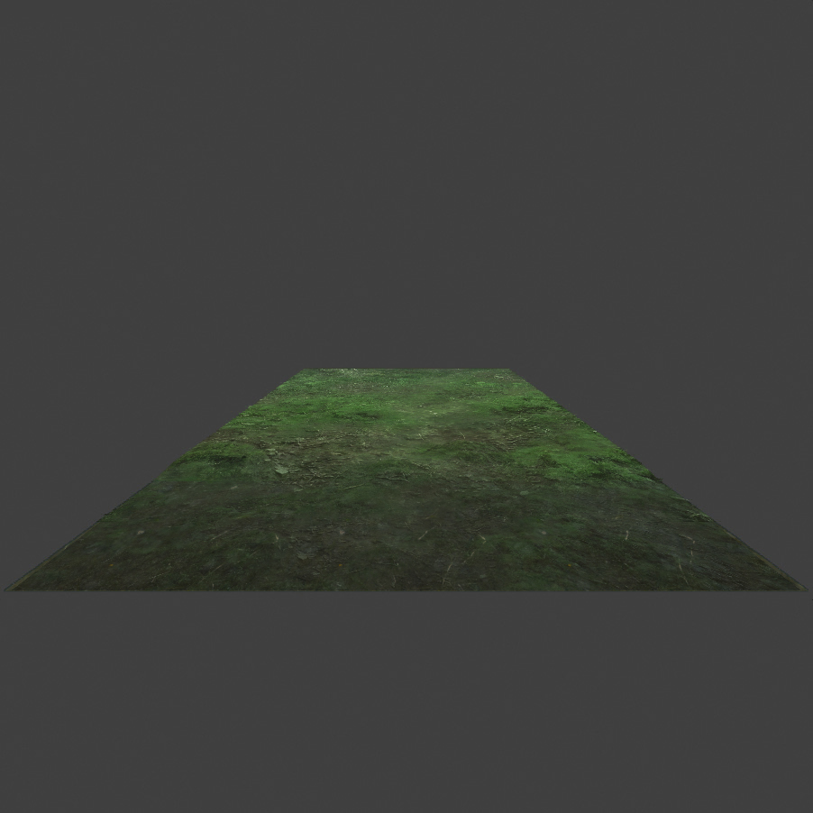

### 精緻度參考(B1 森林成品裁白邊版,實際餵入檔)
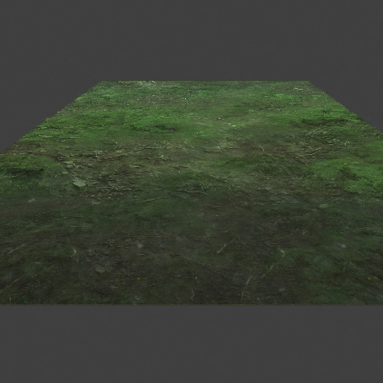

### 過程素材(路線 A/B 用,最終管線不需要)

素灰盒(疊圖驗收底圖):
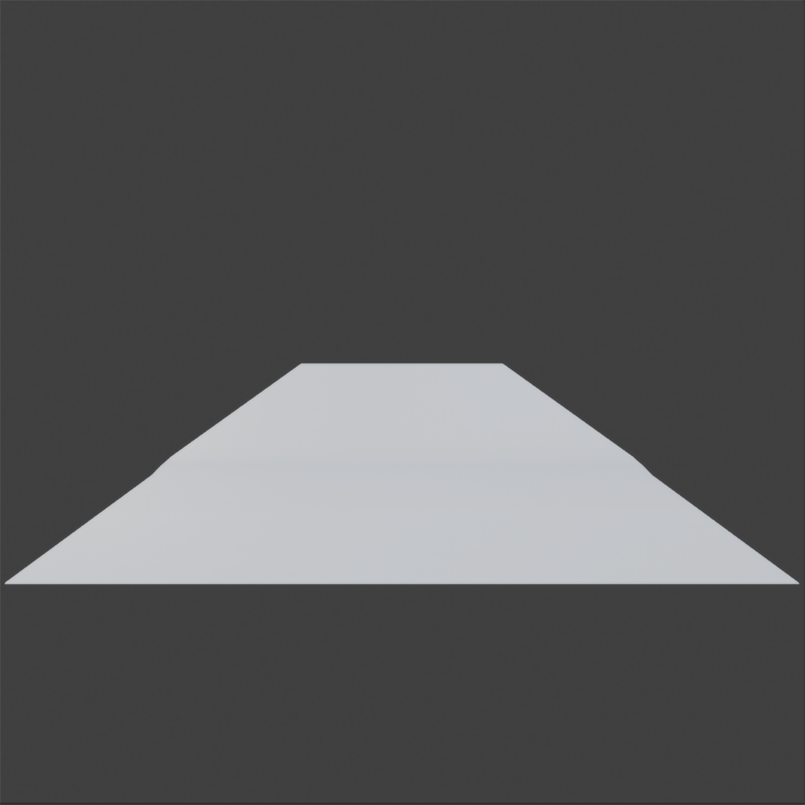

Blender 真深度圖(路線 B 用;Mist pass + Invert,近白遠黑):
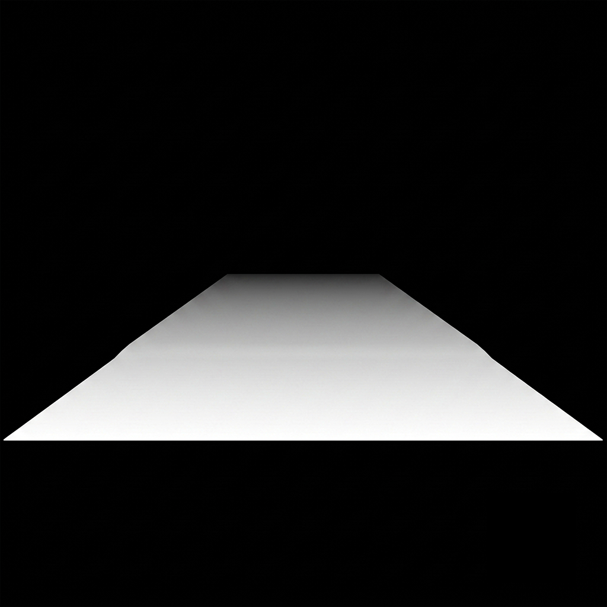

平塗分色圖(踩坑 #2 素材 — 不帶坡度資訊,緩坡被誤讀):
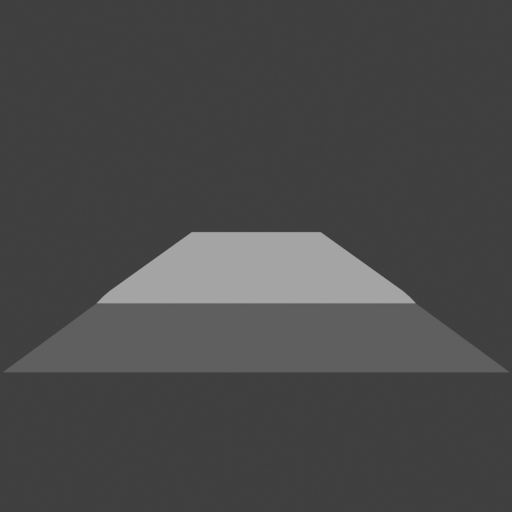

---

## 逐字 prompt(最終版三連發)

### 1. 圖案活化 pass(ref 1 = 貼材質灰盒、ref 2 = 精緻度參考)

```text
Reference image 1 is the BASE — a game ground module with a flat
placeholder texture. Its camera, outer silhouette, dark empty
background, and the moss/soil distribution PATTERN are all correct
and final. Its only problem: the texture is flat and lifeless.

Reference image 2 is the FIDELITY TARGET — a finished forest floor
showing how detailed, dimensional and organic the surfaces should be.
Use it ONLY for material quality and for how moss, soil and litter
intermix at small scale. Do NOT copy its layout, its terrain, its
banks, its bushes, or its trees — nothing from its composition may
appear in the result.

TASK: bring reference 1's exact pattern to life at reference 2's
fidelity. Keep reference 1's camera, silhouette, background and
distribution pattern EXACTLY:
- Wherever reference 1 shows MOSS: grow it into low, spongy,
  three-dimensional moss cushions with fine granularity — matching
  reference 2's moss.
- Wherever reference 1 shows DARK SOIL: packed damp earth, fully
  matte, fine mud grain — matching reference 2's ground — with
  scattered fine leaf litter, thin twigs and tiny half-buried pebbles.
- Add gentle natural micro-relief (small bumps and dips) across the
  ground, keeping the module's outer silhouette unchanged.

LIGHTING: soft, even, non-directional ambient light — no sun, no cast
shadows. Muted dark teal-green night palette — do not brighten. NO
fog, no mist. No bushes, no trees, no rocks, no props. The background
stays dark and empty exactly as reference 1.
```

> ⚠️ 原版含 `mixed with small grass tufts of varied sizes` — 會長出立草,已刪除。
> 不要草就同時在 LIMITS 加 `no standing grass tufts`。

### 2. 除草 pass(單圖,長了草才需要)

```text
Remove the standing grass tufts and grass blades from this ground
module. Everything else stays pixel-identical: the moss cushions, the
soil, the leaf litter, the silhouette, the camera, the lighting, the
palette, and the dark background. Where a grass tuft is removed, fill
the spot with the surrounding moss or soil naturally. Do not add
anything new.
```

> 副作用:整體會稍微變糊。能用 PS 內容感知點掉的就別跑這 pass。

### 3. 頂光 polish pass(單圖,治「平、悶」— ✅ 定稿關鍵)

```text
Polish this ground module. Keep the camera, outer silhouette,
distribution pattern and dark background EXACTLY.

1. LIGHT FROM STRAIGHT ABOVE (zenith): soft top-down light — moss
   cushion crowns catch gentle light, crevices and dips between them
   fall into soft shadow. No horizontal light direction, no long cast
   shadows — only vertical, rotation-safe depth.
2. Deepen the tonal range: darker, richer shadows in the recesses;
   slightly lifted moss highlights. Do not brighten the overall
   exposure.
3. Add subtle natural hue variation: some moss patches lean
   yellow-green, others deep green; soil varies between dark brown
   and grey-brown.
4. Remove the standing grass blades; keep the low moss and litter.
5. The module's outer edges stay clean and straight, matching the
   plane — no moss overhanging the silhouette.

No new objects, no fog, muted dark night palette.
```

---

## 產出

### 圖案活化 pass 輸出(材質分佈到位,但有立草、整體平)
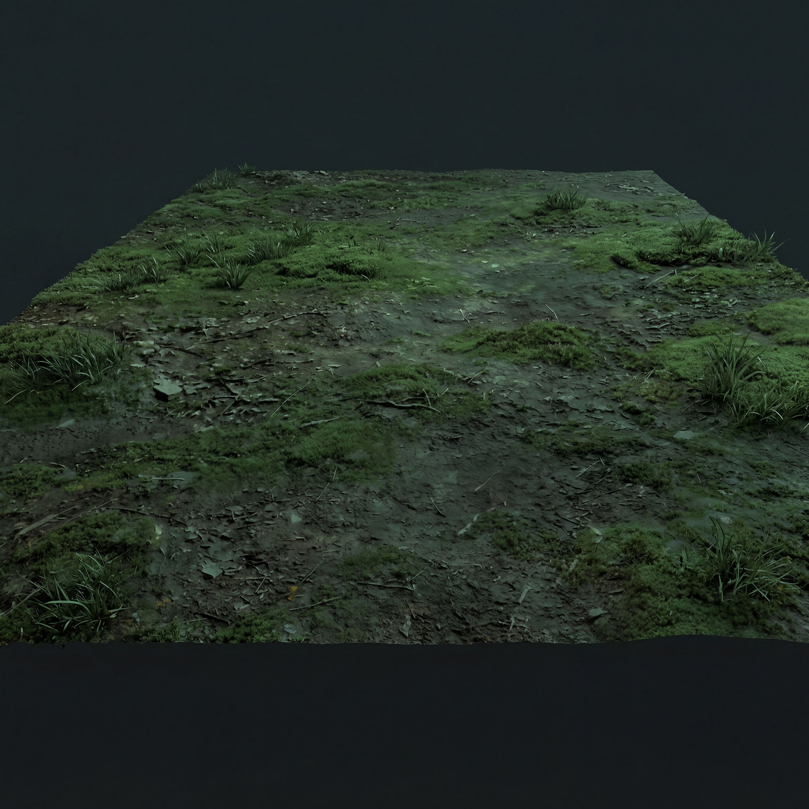

### 除草 pass(草除掉,略糊)
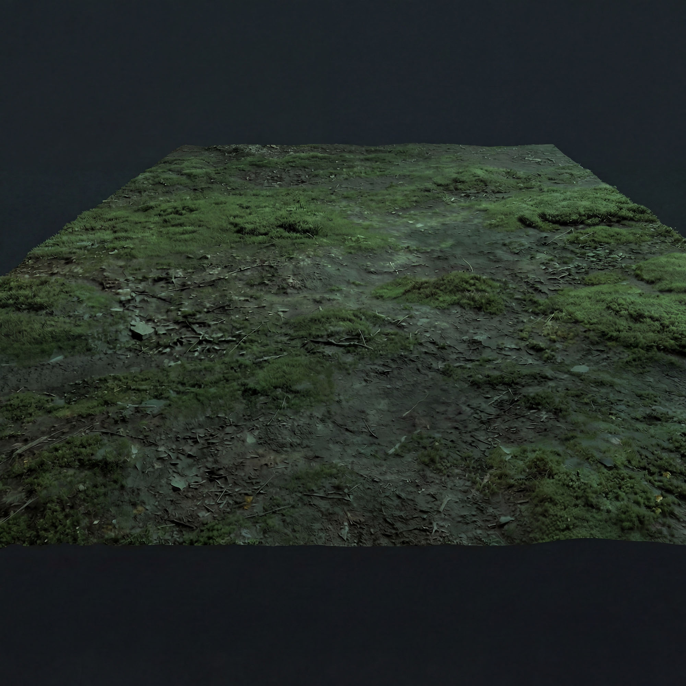

### 頂光 polish 定稿(✅ master tile — 立體感+色調縱深到位)
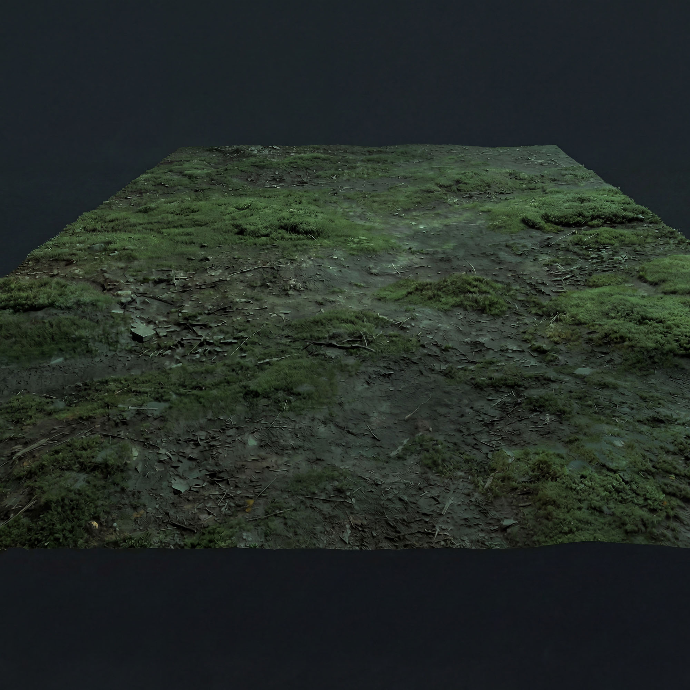

---

## 三條路線成敗對照(本實驗最大資產)

| 路線 | 做法 | 結果 | 死因/勝因 |
|---|---|---|---|
| **A. NB2 語意路線** | 灰盒/分色圖 + 舊模組成品當風格參考 | ❌ 連續 4 輪 | **幾何滲漏**:風格參考的構圖(雙坎夾走道)反覆滲入;弱幾何灰盒(緩坡)攜帶的結構資訊壓不過強構圖參考圖 |
| **B. SD 深度 guidance** | Phoenix/SDXL + Image Guidance(Depth) | ❌ 2 輪後棄 | 幾何部分服從,但 **SD 畫布填滿症**(背景長牆/飄浮植被)、深度圖大片均勻白被讀成疊層平板、出「自然場景」不出「乾淨模組」 |
| **C. 貼材質灰盒** | 佔位貼圖烙分佈 → 活化 → 頂光 | ✅ 3 pass 收斂 | **把任務從「生成」變「增強」**:幾何/分佈用像素說話,AI 只做它最穩的材質升級(B1 驗證過的模式) |

## 踩坑紀錄

| # | 現象 | 根因 | 解法 |
|---|---|---|---|
| 1 | 風格參考的雙坎構圖反覆滲入新模組(×4) | NB2 多圖參考會吸收參考圖**構圖**,except 條款/反懸崖鎖/換詞都壓不住 | 有前科的參考圖**永久除名**;風格改用「材質色票板」(裁成不含構圖的特寫)或貼材質灰盒 |
| 2 | 緩坡被畫成垂直坎 | ①平塗分色圖不攜帶坡度資訊 ②"bank" 一詞自帶懸崖聯想 | 分色圖要**帶光影渲染**;用 "gentle smooth rise / low hillside",禁用 bank |
| 3 | Gemini「畫」的深度圖高度與灰盒不符 | AI 是重繪不是計算,無 3D 座標 | 深度圖只能從 3D 軟體算(Blender Mist pass + Invert);AI 畫的深度圖不可信 |
| 4 | SD 路線:角落飄浮植被、背景長牆、底部疊層土片 | SD **怕空**,必填滿畫布;深度圖大片均勻近白被誤讀 | 別跟背景打架 — 模組填滿畫面生成,隔離交給遮罩(但本路線終棄) |
| 5 | 貼材質路線初版:材質糊、平、淡 | **像素預算**:模組只佔畫布 1/3,材質分不到像素(letterbox 教訓變體) | **Crop-Gen-Paste**:記座標裁切→高解析生成→原位貼回,投影畫框零位移 |
| 6 | 兩區乾淨分界 = 「地毯感」 | prompt 鎖到只准換材質,禁了生態分佈;分區貼圖太死板 | 分佈的**有機交錯直接畫進佔位貼圖**(苔土咬合);或開範圍限定的「生態授權」 |
| 7 | 材質到位仍「平、悶」 | **全均勻光照在平面上 = 零光影調變**,立體感無從產生 | **頂光(zenith)**:正上方光無水平方向性,旋轉安全,苔丘頂亮縫隙暗 → 立體感解鎖 |
| 8 | 活化 pass 長出立草 | prompt 寫了 `grass tufts`(允許清單效應,B1 踩坑 #3 重演) | 已從配方刪除;除草 pass 會糊,小範圍用 PS 點掉 |
| 9 | 三參考版(加掛光線樣本)被干擾 | 光線樣本 = 幾何滲漏前科圖,第 4 次滲漏 | 光線資訊**文字就鎖得住**,不值得掛圖;參考圖數量最小化原則 |

### 踩坑證據圖

**#1 — NB2 幾何滲漏**(風格參考的雙坎夾走道構圖滲入,緩坡被畫成坎):
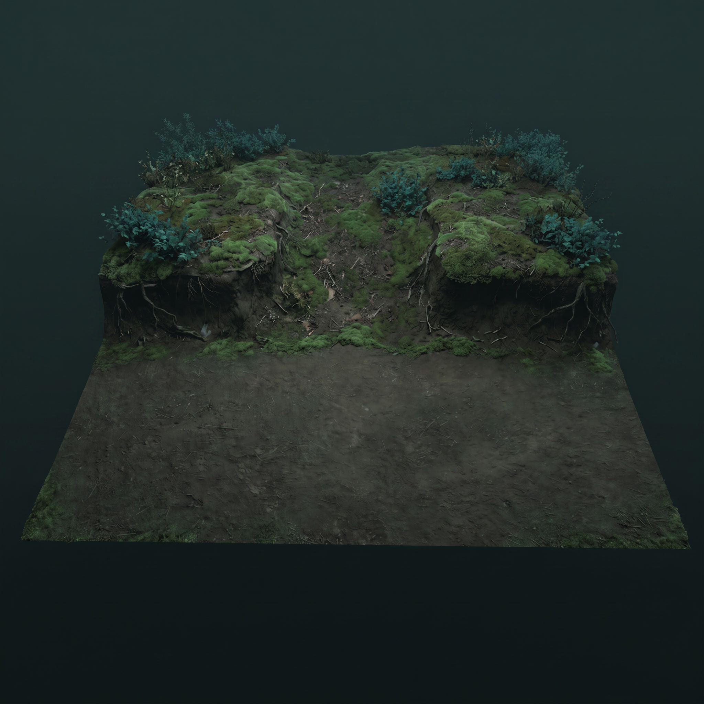

**#4 — SD 深度路線「場景化」**(長出森林背景與樹,出自然場景不出乾淨模組):
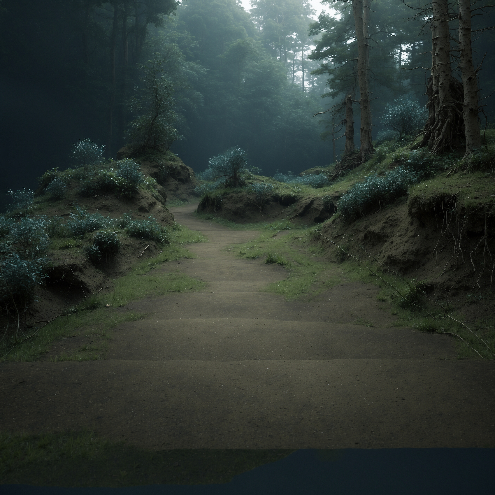

**#4 — SD 怕空症**(角落飄浮植被、土丘、圓木):
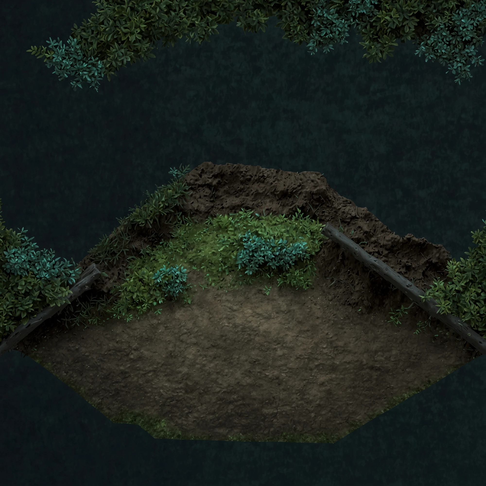

**#6 — 兩區直線分界初版**(「地毯感」的來源對照):
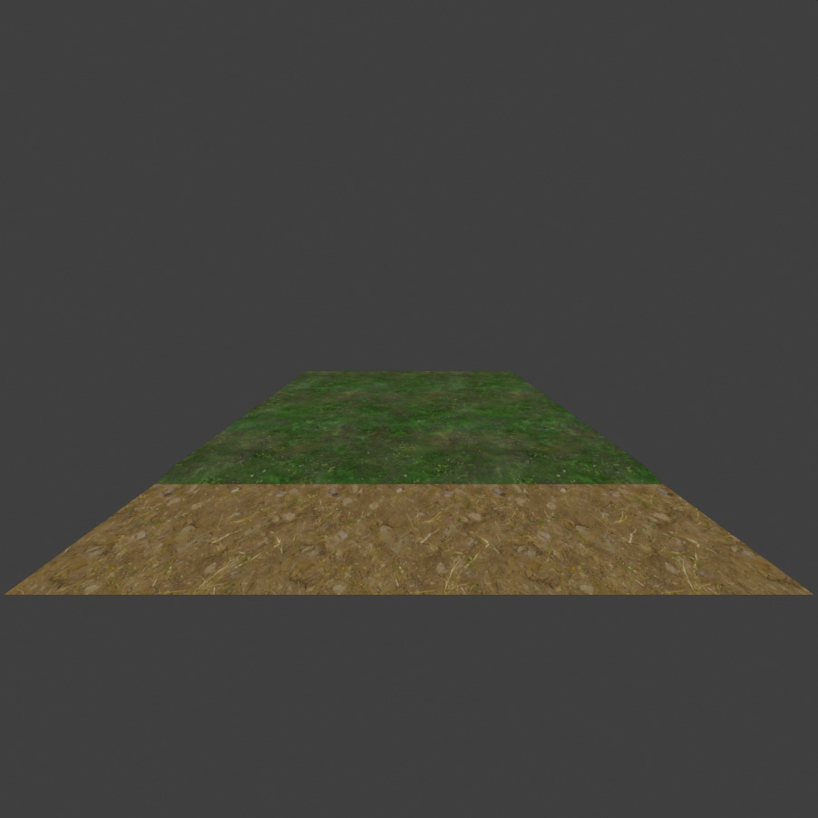

---

## 技法字典(新增)

| 技法 | 用途 | 要點 |
|---|---|---|
| **貼材質灰盒** | 幾何+分佈+粗材質一次餵給 AI | 分佈的有機交錯畫進貼圖;佔位材質越接近目標色,AI 猜的越少 |
| **圖案活化定性句** | 讓 AI 只長立體不改分佈 | `The texture's PATTERN is correct and final... bring this exact pattern to life` |
| **頂光(zenith light)** | 立體感 + 可旋轉兩全 | `LIGHT FROM STRAIGHT ABOVE... no horizontal light direction — only vertical, rotation-safe depth` |
| **材質色票板** | 圖鎖風格但零構圖滲漏 | 從成品裁「不含構圖的材質特寫」並排成一張;滲漏的載體是構圖,特寫裁掉構圖 |
| **Crop-Gen-Paste** | 像素預算 vs 投影對位兩全 | PS 記選區座標→裁切生成→原位貼回;裁切是可逆的借用,不是破壞畫框 |
| **角色標籤+PRIORITY** | 多參考各司其職 | 每張一個角色+except 條款+衝突優先權;參考圖數量最小化,冗餘資訊的圖寧缺勿掛 |
| **texel 尺度標定法** | 材質顆粒 vs 角色比例對齊 | ①引擎放角色+tile,縮放 tile 到尺度對(苔丘≈腳掌),讀 scale 值 S ②佔位貼圖 tiling × (1/S) 重渲 ③重跑活化+頂光,tile 以原尺寸擺回即對。**尺度修在佔位貼圖,不修參考圖**(圖案是真相,尺度確定性傳遞);開工前用角色高的方塊同框快篩定錨 |

## 量產階段:prompt 驗證與修正(2026-07-05 討論定案)

> 目標:master tile 配方 → 橫/直/十字/T 套圖量產。開跑前把三連 prompt
> 重新過一遍 4 題自檢(查平台簽名/token 對簽名/避禁忌/長度甜蜜點),
> 結論如下。**歷史逐字 prompt(上方)不動,量產用本節 v2。**

### 驗證結論(對照 NB2 簽名 + B1 鎖句字典 + 本篇踩坑表)

- ✅ NB2 簽名合規:自然段落、多圖參考各司其職(角色標籤+except)、無 flag 語法。
- ⚠️ 長度:活化 pass ~230 字,超過 NB2 t2i 甜蜜點(80–150 字)— 但鎖句型
  multi-ref edit pass 屬例外,B1/B2 均已實證有效。**量產鐵律:只做下方
  三個最小修正,不再加長** — 每加一鎖都稀釋注意力(B1 踩坑 #8)。
- ❌ 發現缺口 3 處 → 修正 A/B/C。

### 修正 A — 活化 pass 補「禁草句」(缺口:紀錄註記有、逐字 prompt 沒有)

上方註記寫了「不要草就同時在 LIMITS 加 no standing grass tufts」,但定稿
prompt 只刪允許句、未加禁句 → 除草 pass(會糊)在 master tile 輪仍被迫跑。
量產版在 LIGHTING 段的禁止清單加:

```text
No standing grass tufts or grass blades — only low, ground-hugging
moss and flat leaf litter.
```

目的:讓除草 pass 在量產中降級為「例外時才跑」,主線二連(活化→頂光)收斂。

### 修正 B — 兩 pass 補畫框鎖動詞禁令(B1 鎖句字典移植)

活化與頂光 pass 都只有 `Keep ... camera ... EXACTLY`,缺 B1 畫框鎖的
動詞禁令。master tile 一次過可能只是沒被踩到;量產 4 張抽獎次數變多,
補上成本極低。兩個 pass 的 camera 鎖句尾各加:

```text
— do NOT crop, zoom, extend or outpaint.
```

### 修正 C — 活化 pass 補尺度鎖(⚠️ 未驗證,重跑 master tile 時先驗)

texel 標定後佔位貼圖 tiling × 1/S 重渲,但活化 prompt 的苔蘚顆粒度寫
`matching reference 2's moss` — ref 2 的苔丘尺寸可能壓過重渲後的佔位
尺度,標定白做。提議加:

```text
Moss cushion size and soil grain SCALE follow reference 1's placeholder
pattern; reference 2 defines material fidelity only, NOT feature size.
```

驗法:重跑 master tile 時疊回佔位貼圖比對苔丘尺寸;若仍被 ref 2 帶走,
退一步把 ref 2 裁成與目標 texel 尺度一致的特寫(材質色票板技法變體)。

> 頂光 pass 第 4 條 `Remove the standing grass blades` 在無草輸入時為
> 空指令 — 保留當保險,不動。

### 量產 SOP(橫/直/十字/T)

1. **順序鐵律:** 讀出引擎 S 值 → 佔位貼圖 tiling × 1/S 重渲 →
   master tile 重跑(v2 prompt,順驗修正 C)→ 引擎投影驗收 →
   **通過才開量產**。順序反了 = 四張全重做。
2. **接口一致性(新需求,master tile 配方沒覆蓋):** 模組拼接處的苔/土
   分佈必須連續 — AI 各張獨立生成不會自己對齊。解法 = 確定性前置:
   四張佔位貼圖的**接口帶用同一段貼圖素材畫**,苔土交錯畫成過渡帶
   (「分佈設計交給人」原則的延伸)。
3. **同配方紀律(B1 套圖結論移植):** 四張同一天、同模型版本、同 prompt
   逐字、同參數;逐張跑;開 4 挑 1,同張兩輪差異大再升開 8 挑 1。
4. **十字/T 空角像素預算:** 模組佔畫面比下降是形狀固有,Crop-Gen-Paste
   裁到模組 bounding box 即可;空角若長東西 → 掛 B1 黑鎖句
   (`pure black stays exactly pure black — do NOT add noise, fog, stars, gradient`)。
5. **色調一致性:** 四張並排驗 palette;偏色重抽,不後製硬拉。
6. 全套過驗收後補 B1 穩定度矩陣 #4「模組成品」格。

## 驗收 checklist

- ☐ 疊回灰盒:輪廓/分區邊界對齊
- ☐ 分佈圖案 = 貼材質灰盒定義的圖案
- ☐ 立體感:苔丘頂亮、縫隙暗(非地毯)
- ☐ 光影無水平方向(旋轉安全);無霧
- ☐ 行走區:微潮霧面深色泥土,無反光
- ☐ 外緣乾淨平直(投影需求;毛邊用灰盒剪影收)
- ☐ 引擎投影最終驗收(遊戲相機)
- ☐ (量產)苔丘尺寸 vs 角色比例正確(texel 標定生效,修正 C 未被 ref 2 帶走)
- ☐ (量產)相鄰模組拼接處 moss/soil 分佈連續
- ☐ (量產)四張並排色調一致

## 學到的(可複用結論)

- ✅ **「生成」與「增強」是兩個成功率天差地別的模式。** NB2 把抽象圖翻譯成場景會即興發揮;把接近目標的圖變高級則極穩。管線設計的核心 = 想辦法把任務推進「增強」區間 — 貼材質灰盒就是這個推手。
- ✅ **幾何滲漏是 NB2 多圖參考的結構性風險**:參考圖的構圖會被吸收,文字鎖不住。防線只有兩道:參考圖裁成無構圖的材質特寫,或乾脆讓輸入圖自帶正確幾何。
- ✅ **像素預算三度應驗**(B1 白邊、SD 緊框、本輪模組佔比):主體佔畫面比例 = 材質品質上限。Crop-Gen-Paste 讓它與投影對位相容。
- ✅ **均勻光的代價是立體感;頂光是兩全解。** 「無方向光」規格的本意是可旋轉 — 垂直打的頂光同樣可旋轉,卻保住光影調變。規格要鎖的是「水平方向性」,不是「一切方向性」。
- ✅ **AI 大面積、確定性工具收尾**(B1 結論在灰盒管線再次成立):分佈設計交給人(貼圖/PS)、材質升級交給 AI、邊界隔離交給遮罩。
- 📌 **待辦:** ①texel 尺度標定(引擎中 tile 需縮約 70% 才符角色 — 待讀出精確 S 值,佔位貼圖 tiling × 1/S 重跑)②引擎投影驗收 → 通過後以本模組為 master,量產橫/直/十字/T — **量產一律用上方〈量產階段〉的 v2 prompt 與 SOP**(接口帶一致性、開 4 挑 1、色調並排驗收;B1 穩定度矩陣最後一格同時補上)
