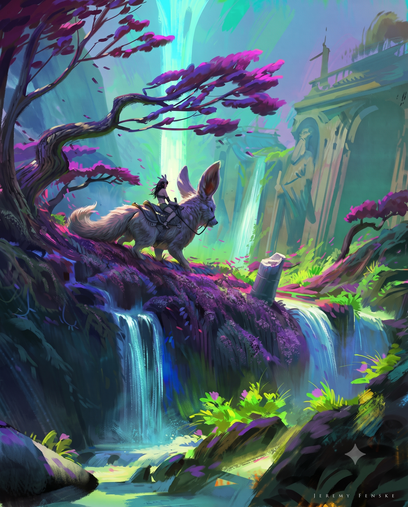

# 實戰紀錄 — B3 手繪筆觸奇幻概念圖：NB2 材質保真 pass 失敗實證（「不能強求」範例）

> 4K 放大品質管線的**反面教材**：手繪筆觸 + 角色 + 離散小物件型的圖，
> 硬跑 Nano Banana 2 材質保真 pass 的結果 = 重繪級漂移。
> 本紀錄是 [B1](B1-forest-bg-4k-detail.md) 類型分流結論的正式實證樣本 —
> **這類圖不能強求生成式 pass，直接走純保真放大分支。**
> 對應工作流：`ai-media-generator`（quality-control / 放大與細節 pass 思路）。

**🔑 關鍵字（日後對 Claude 說這些詞即可叫出本紀錄）：**
`B3`、`B3 紀錄`、`不能強求`、`不能強求的範例`、`筆觸型放大`、
`手繪風放大翻車`、`NB2 重繪`、`簽名搬家`、`角色圖 4K`、
`概念圖放大`、`Fenske 案例`、`類型分流實證`

## 來源（索引）

- **素材：** Jeremy Fenske 風格奇幻概念圖 — 少女騎乘巨大耳廓狐生物、
  苔蘚懸崖多層瀑布、紫紅色扭曲樹、遠景持杖鬍鬚石像 + 發光青綠瀑布。
  厚塗手繪筆觸、高飽和 teal-purple-magenta 配色。
  原檔 1080×1350（4:5 直式），右下有畫家簽名 "JEREMY FENSKE"。
  （對照圖見下方〈產出對照〉）
- **圖的類型判定（B1 類型分流）：** ⚠️ 筆觸/離散小物件型 —
  手繪概念風 + 角色（小臉）+ 鞍具韁繩皮帶 + 歧義遠景雕像 + 發光元素，
  **五個高風險元素全中**。B1 結論本來就預測此型應走「純保真放大」分支；
  本次是刻意壓測「鎖句堆好堆滿能不能撐住」。
- **平台：** Leonardo.ai — AI Creation **Nano Banana 2**（照 B1 配方跑材質保真 pass）
- **放大倍率：** 1080→4096 目標約 3.8×（壓測區；B1：2× 安全、4× 危險）
- **日期：** 2026-07-03
- **結果：** ❌ **資產用不合格（重繪，非放大）** / ✅ 質感參考用合格（色調偏亮需注意）

---

## 嘗試的管線（照 B1 配方逐項執行）

### 平台設定

| 設定 | 值 | 備註 |
|---|---|---|
| Model | Nano Banana 2 | |
| Image Dimensions | Custom 3276×4096（4:5，同輸入比例） | 實收檔案約 1638×2048 — 未達 4K 標稱（傳圖壓縮或設定未吃到，B1 checklist「別信平台標稱」再度應驗） |
| Prompt Enhance | None | |
| Style | None | |
| Number of generations | 1 | |
| Private Mode | On | |

輸入為滿版原檔，無 letterbox（B1 踩坑 #1/#2/#5 已迴避）。

### 用到的 prompt（逐字保存）

在 B1 鎖句字典基礎上，針對本圖新增**筆觸鎖**與**角色鎖**：

```text
Enhance the surface detail of this painterly fantasy concept art
(a girl riding a giant fennec fox above mossy waterfalls). This is a
TEXTURE-FIDELITY pass, NOT an object pass — think of it as a
higher-resolution scan of the SAME painting.

INCREASE ONLY surface micro-detail on existing surfaces: finer fur
strands on the fox creature, richer moss granularity on the purple
cliff, crisper bark texture on the gnarled tree, and finer highlight
detail in the existing waterfalls — all rendered as confident painterly
brushwork.

PRESERVE THE BRUSHSTROKES: this is hand-painted digital concept art —
keep the bold visible brushstrokes and stylized shapes exactly; do NOT
smooth them into photorealism, do NOT add photographic grain or noise.

FRAME LOCK: keep the exact original 4:5 canvas, framing and camera — do
NOT crop, zoom, extend or outpaint. The girl, the fox, the saddle and
reins, the tree, the statue and every rock stay at their exact
position, size and silhouette.

CHARACTER LOCK: the girl's face, pose and outfit, and the fox's anatomy
and harness keep their EXACT original design — sharpen only surface
texture, do NOT reinterpret, redraw or "fix" them.

PRESERVE THE DEPTH: the distant ruins and stone statue stay soft and
atmospheric — no added contrast or detail behind the haze. The statue
keeps its EXACT original silhouette — do NOT complete or reinterpret it.
The glowing teal waterfall keeps the same color, same brightness, and
the SAME GLOW RADIUS as the original; do not enlarge or soften the halo.

STRICT: no new objects of any kind (no birds, no extra petals, no
particles, no fireflies), do not brighten the shadows, keep the
saturated teal-purple-magenta palette exactly.
```

---

## 產出對照

### 原圖（1080×1350，Jeremy Fenske 簽名在右下）


### NB2 材質保真 pass 產出（❌ 重繪級漂移；✅ 質感參考用合格）


---

## 結果判定

### 🔍 重繪鐵證（最不需要爭論的一條）

**畫家簽名 "JEREMY FENSKE" 從右下角搬到左下角，且變大。**
放大器不會搬簽名 — 只有「重新畫一張」才會。
右下角另多出 ✦ 星形生成浮水印（Nano Banana / Gemini 系標記）。

### 漂移清單（肉眼即可判，50% 疊圖免做）

| 元素 | 漂移 | 對應失守的鎖 |
|---|---|---|
| 狐狸 | 頭型變圓更兔子臉、雙耳張開變單大耳為主、尾巴重畫 | CHARACTER LOCK |
| 少女 | 羽毛頭飾變大、坐姿前傾、手臂位置改變 | CHARACTER LOCK |
| 雕像 | 持杖鬍鬚老人被「磨掉」成模糊浮雕殘影、柱式與頂部尖塔重構 | 輪廓鎖（與 B1 雪山骸骨同類失敗，方向相反：磨掉 vs 補完） |
| 樹 | 主幹變粗、分枝結構不同、葉團全部重排 | FRAME LOCK（位置/剪影） |
| 越界物件 | 底部長出粉紅花叢、飄落花瓣變多 | STRICT 禁止清單 |
| 色調 | 整體提亮增豔（萊姆綠/洋紅拉高）、暗部被抬升 | 曝光鎖 / 色盤鎖 |
| 筆觸 | ✅ 有守住 — 仍是厚塗手繪感，未照片化 | 筆觸鎖（唯一全守的鎖） |

### B1 checklist 對照

- ☒ 解析度達標 — 實收約 1638×2048，未達 4K
- ☒ 疊圖輪廓重合 — 全面漂移
- ☒ 角色 / 離散小物件保真 — 重繪
- ☒ 歧義物件輪廓 — 雕像被重新詮釋
- ☒ 無越界物件 — 粉紅花叢
- ☒ 暗部 / 色盤不動 — 提亮增豔
- ☑ 筆觸保留（沒照片化）
- ☑ 細節是「長出來」不是「銳化假細節」（但是重繪出來的，非原圖細節）

**雙標準判定（B1 管線定位）：**
- 當**資產**用 → ❌ 不合格
- 當**質感參考**（STYLE TRUTH）用 → ✅ 合格（筆觸級細節質量好；色調偏亮、✦ 浮水印兩點需注意）

---

## 學到的（可複用結論）

- 🔴 **「不能強求」定律：** 筆觸/手繪概念風 + 角色 + 離散小物件型的圖，
  NB2 全圖生成式 pass **鎖句堆好堆滿也守不住** — 本次同時上了定性句 +
  FRAME LOCK + 角色鎖 + 輪廓鎖 + 光暈半徑鎖 + 曝光鎖 + 筆觸鎖 + STRICT 禁止清單，
  八鎖齊發仍然重繪級漂移。與 B1 沙漠戰場樣本（#8 注意力稀釋）同型同命。
  **此型圖一律直接走純保真放大分支（Topaz Gigapixel / Real-ESRGAN /
  UU 滿版 + 最低 creativity），不要再試生成式 pass。**
- ✅ **簽名 / 文字 = 最便宜的重繪偵測器。** 圖上有簽名、logo、任何文字時，
  驗收第一眼先看它 — 位置或字形變了就是重繪，其他項目不用查了。
- ✅ **筆觸鎖本身有效**（唯一全守的鎖）— 風格層面 NB2 聽得懂
  「不要照片化」；守不住的是**幾何與構圖層**。生成式 pass 的失敗模式是
  「同風格重新作畫」，不是「畫風跑掉」。
- ✅ **B1 類型分流升級為預測工具：** 判圖時數風險元素
  （手繪筆觸 / 角色小臉 / 離散小物件 / 歧義形狀 / 發光元素），
  中 2 項以上就直接分流到純保真放大，省一次抽獎與等待。
- 📌 本樣本已回填 [B1 穩定度驗證矩陣](B1-forest-bg-4k-detail.md#穩定度驗證進行中) 第 6 列。
