# 實戰紀錄 — B4 master 貼圖 → 套圖變體道路縫合(同圖材質替換管線)

> 一張已驗收的 master 貼圖,依照原風格只改「貼圖內容」,衍生整套 tile 變體
> (道路版→全草版→四方連續版→直路版→路口版)。
> 對應工作流:`ai-media-generator`;前置:[B2](B2-greybox-module-pipeline.md)(貼材質灰盒)、B1(鎖句字典)。

**🔑 關鍵字(日後對 Claude 說這些詞即可叫出本紀錄):**
`B4`、`B4 紀錄`、`同圖變體`、`材質替換`、`區域替換`、`套圖變體`、
`master 變體`、`道路改草地`、`全草地 tile`、`四方連續`、`二方連續帶性質`、
`整寬橫帶`、`凹凸移植`、`區域編輯鏈`、`道路規格書`、`直路=橫路轉90°`

## 來源(索引)

- **素材:** 草地橫向道路 master 貼圖(二方連續,已驗收)——由三相機管線產出
  (CAM_GEN2 反解相機 + 活化/頂光 pass + 投影攤平,詳見
  [B6](B6-three-camera-pipeline.md))
- **平台:** Leonardo.ai / Nano Banana 2(單圖 edit pass)+ Photoshop(確定性收尾)
- **Claude 對話連結(本案全程:區域編輯鏈 → 直路兩路線攻防 → 縫合定案 → 端頭版 → 紀錄;同串亦產出 B5、B6):**
  `https://claude.ai/code/session_01McptxmyoZ38F6SvbgpnK5Y`
- **日期:** 2026-07-07 ~ 10
- **結果:** ✅ tile 2(走道版+四方版)、tile 4 直路(road_base_master,引擎驗證過)、
  端頭版 road_fade 完成;tile 3 路口待做

---

## 套圖起點(master 從何而來)

整條套圖鏈的**第 0 步** — 灰盒 + 場景材質參考餵 NB2,生成最初的地面模組
(CAM_GEN2 視角,詳見 [B6](B6-three-camera-pipeline.md));再投影攤平成
tile 1 道路 master,之後的所有變體(草地/雪地/直路/端頭)都由它衍生。

| 灰盒(幾何) | 場景風格/材質參考 | NB2 生成模組(起點成品) |
|---|---|---|
| 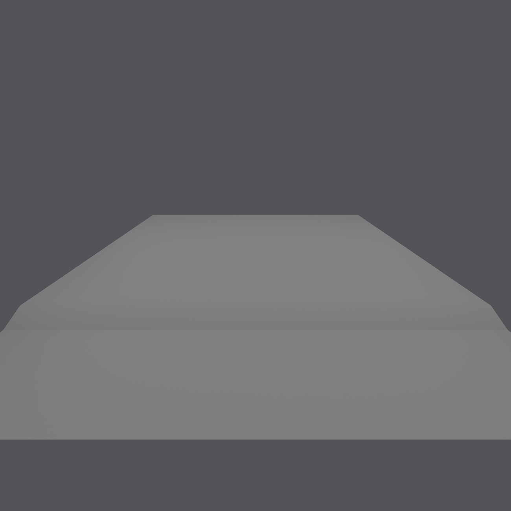 | 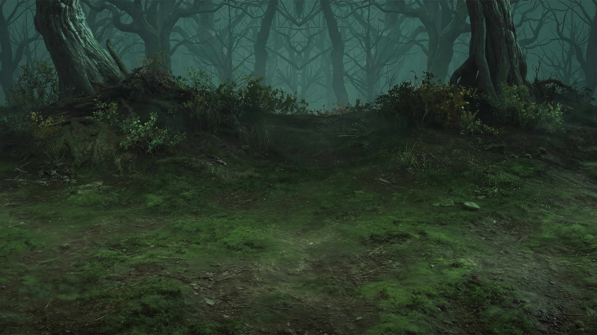 | 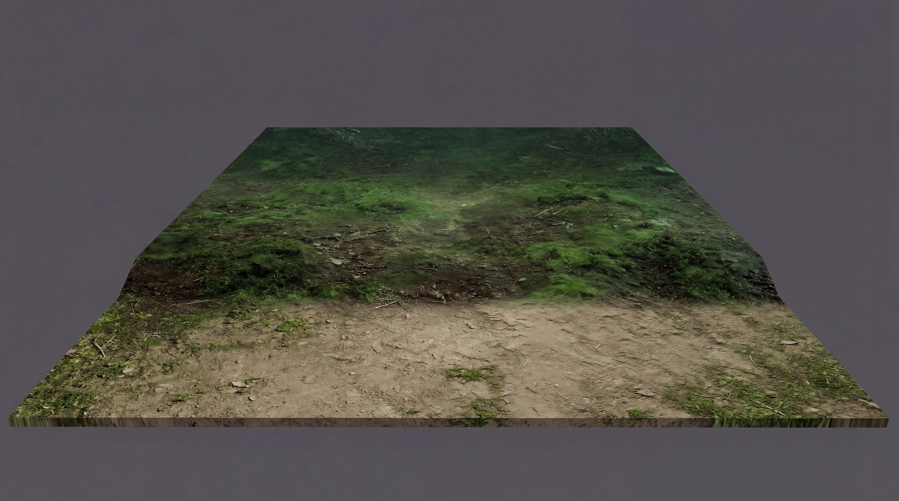 |

> 灰盒只給幾何/範圍,場景參考只給材質色調,構圖/透視/像素預算的攻防全在
> [B6](B6-three-camera-pipeline.md);本篇從「已有 master 貼圖」往下接。

**產圖平台:** Leonardo.ai / Nano Banana 2 —
[生成連結](https://app.leonardo.ai/generation/image/%E5%9C%961%E6%98%AF%E7%81%B0%E7%9B%92-%E5%9C%962%E6%98%AF%E5%A0%B4%E6%99%AF%E9%A2%A8%E6%A0%BC%E5%8F%83%E8%80%83%E5%9C%96%E5%9C%B0%E9%9D%A2%E6%9D%90%E8%B3%AA%E5%8F%83%E8%80%83-%E9%9C%80%E6%B1%82-%E6%88%91%E8%A6%81%E5%81%9A%E4%B8%80%E5%BC%B5-%E5%B7%A6%E5%8F%B32%E6%96%B9%E9%80%A3%E7%BA%8C%E7%9A%84%E5%9C%B0%E6%9D%BF-1c4e21c2-45b7-4c56-b7d8-ed5c900e6b94)

**起點逐字 prompt(原始中文弱約束版):**

```text
圖1是灰盒
圖2是場景風格參考圖地面材質參考

需求:
我要做一張 左右2方連續的地板
請參考圖1灰盒的範圍和起伏  範圍外維持控空白

貼圖表現  參考圖2做出材質表現
前方是樹林里通道泥土地 青苔較少  壓得比較緊實
緩坡的後方是森林原始地面
地板材質  符合整體環境的材質表現 跟透視表現
```

> ⚠️ 這是**未馴化的起點版**:「請參考」「符合…透視表現」都是弱約束,
> 生成會透視漂移(diorama 化)。為什麼漂、怎麼收成鎖句型 prompt —
> 完整解剖見 [B6 踩坑 #1](B6-three-camera-pipeline.md)。此處保留原文
> 作為「一切的起點」對照。

---

## 核心心法

**套圖 = master 的「區域編輯鏈」,永遠不重新生成。**

```
tile 1 草地橫向道路(master) ─┬→ tile 2 全草地(= 1 減道路)
                              │     └→ 四方連續版(= 2 再減頂部霧帶 + 修十字縫)
                              ├→ tile 4 直向道路(= 2走道版 加直路帶)〔待做〕
                              └→ tile 3 橫接直路口(= 1 加直路分支)〔待做〕
```

- 每張新 tile 從**最近的已驗收祖先**衍生 → 色調/尺度/風格自動全套一致
- 重新生成一張 = 引入一次獨立抽樣 = 色偏風險;已抽中驗收的結果**不要**丟回抽獎箱
- 目標材質就在同一張圖裡 = **自帶零漂移的風格參考**,這是全管線成功率最高的任務型

### 套圖三規則

| # | 規則 | 要點 |
|---|---|---|
| 1 | **區域編輯鏈** | 所有變體都是 master 的區域編輯,不重生成(見上) |
| 2 | **道路規格書** | 橫路帶 y 位置/高度、直路帶 x 位置/寬度、羽化寬度——定案成數字,全套沿用(tile 3 的路口開口才對得上 tile 4) |
| 3 | **直路 = 橫路材質「貼實像素」+ AI 縫合**(2026-07-08 實戰修訂) | 原版「轉 90° 直接用」不完整——AI 重畫材質必走樣,遮罩重畫路線已判死(踩坑 #3)。正解:真材質帶裁接到規格寬、堆疊佔位 → AI 只做縫合/咬邊(見〈直路生成〉節) |

---

## 逐字 prompt(勝利版)

### 1. 道路帶 → 草地(✅ tile 2 主 pass)

```text
Reference image is a seamless ground texture: mossy forest floor with a
dirt path strip along the bottom edge. TASK: replace the dirt path strip
entirely with the SAME mossy forest floor as the CENTER of this image —
NOT a flat fill: continue the center's low spongy moss cushions, small
bumps and dips, fine leaf litter and thin twigs downward through the
strip, with the same soft relief shading — cushion tops slightly
lighter, crevices slightly darker — and the same texture scale. When
finished, no trace of where the path was may remain.

Everything outside the strip stays pixel-identical: same pattern, same
colors, same muted palette — do not brighten. Flat even ambient light,
no cast shadows, no rocks, no logs, no standing grass tufts, no new
objects.
```

三個關鍵鎖(v1 失敗後補的,見踩坑 #1):
`NOT a flat fill`(明文否定失敗模式)、凹凸規格逐項寫死(丘/坑/丘頂亮縫隙暗/同尺度)、
`no trace of where the path was`(防「材質對了但看得出是補丁」的帶狀殘影)。

### 2. 頂部霧帶 → 苔地(✅ 四方連續前置——殺垂直色調梯度)

```text
Reference image is a seamless mossy forest floor texture. Its TOP STRIP
(upper third) is darker, smoother and hazier than the rest. TASK:
replace this top strip with the SAME mossy forest floor as the CENTER
of the image — NOT a flat fill: continue the center's low spongy moss
cushions, small bumps and dips, fine leaf litter and thin twigs upward
through the strip, with the same relief shading and the same texture
scale. Remove the dark haze completely — the finished image must be
evenly lit with ONE uniform tone from top to bottom, no vertical
gradient. When finished, no trace of the strip boundary remains.
Everything below the strip stays pixel-identical: same pattern, same
colors, same muted palette — do not brighten beyond the center's
existing tone. Flat even ambient light, no cast shadows, no rocks, no
logs, no standing grass tufts, no new objects.
```

### 3. 直路交界活化(tile 4 用,配方已定**未實測**)

```text
Reference image is a mossy forest floor texture with a vertical dirt
path running from bottom to top. The path material and the moss are
both correct and final. TASK: ONLY naturalize the two long transition
edges where the dirt path meets the moss — make moss creep over the
path edge in small irregular bites, scattered fine litter crossing the
boundary, exactly like a real forest path edge. The path itself, the
moss areas, the colors, the tone falloff toward the top, and the
texture scale all stay pixel-identical. No rocks, no logs, no standing
grass tufts, no new objects.
```

### 每次 edit pass 的「老三樣」確定性保險

1. **開 4 挑 1**(區域重繪變異大;4 張全平就升 8)
2. **PS 遮罩合成**:生成圖疊回原圖,遮罩只露編輯帶+過渡邊——NB2 區域修復實為
   全圖重繪(B1 教訓),沒編輯的區域一律用原像素
3. **offset 驗縫**:編輯帶碰到畫布邊緣就必驗(它重畫過邊緣像素)

---

## 產出對照

### tile 1 — master(草地橫向道路,起點)
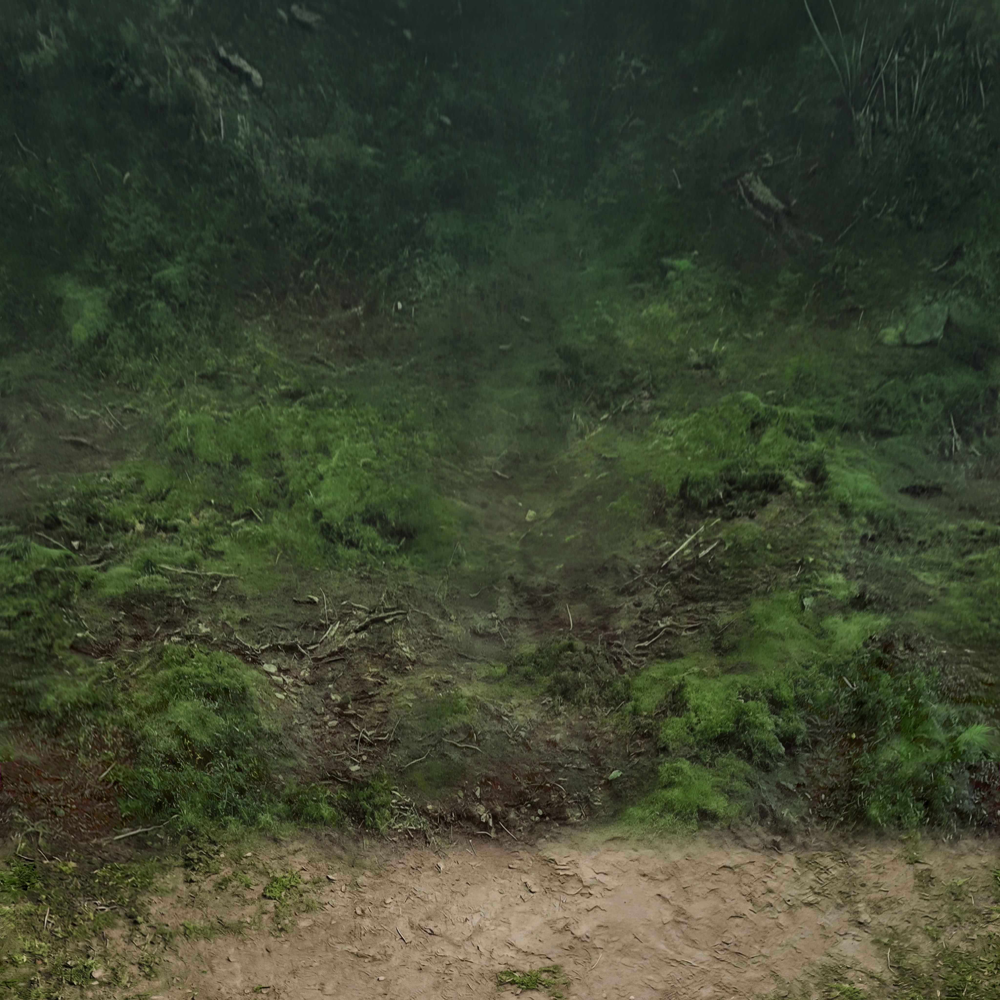

### 踩坑 #1 — 道路帶替換 v1:材質對了但平面填充(❌ 對照組)
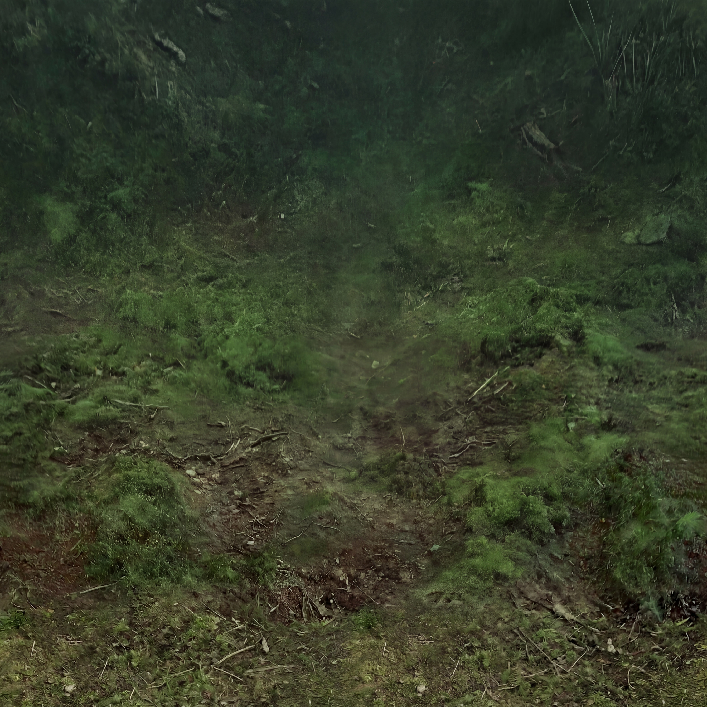

### tile 2 走道版 — v2 prompt(NOT a flat fill + 凹凸規格)重生成(✅)
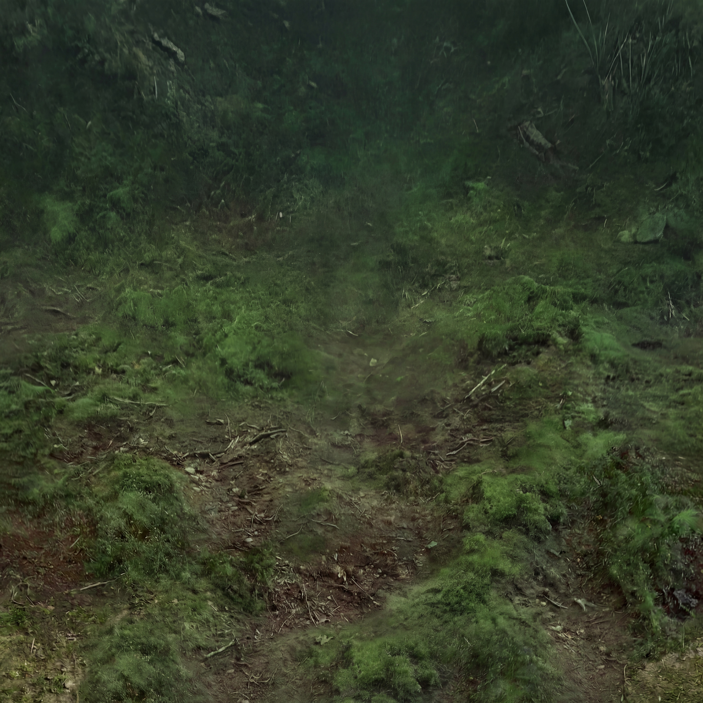

### tile 2 四方連續版 — 頂部霧帶替換 + 勻色 + 修十字縫(✅)
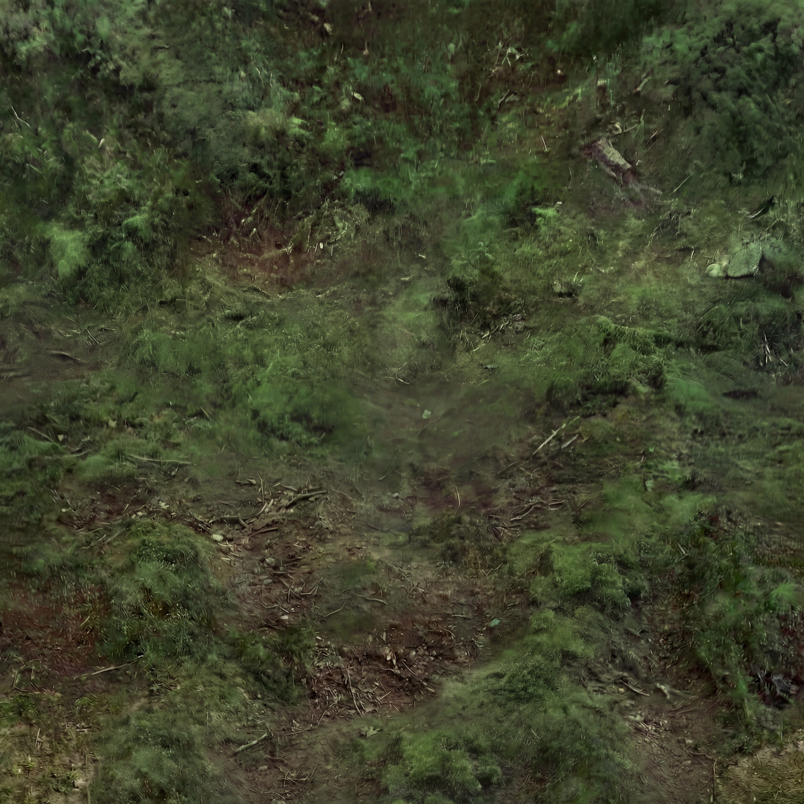

## 直路生成(tile 4 路基,2026-07-08 定案)

### 兩路線成敗對照

| 路線 | 做法 | 結果 |
|---|---|---|
| A. 遮罩重畫 | 三參考:草地底圖 + 白帶佈局遮罩 + 路材特寫;AI 畫路 | ❌ 位置寬度可控,但**材質走樣**(濕滑泥流 ≠ 乾燥壓實土);後續精修 pass 又生出黑影帶 |
| B. **真像素佔位 + AI 縫合** | 真路材帶裁接堆疊佔位 → AI 只縫合/咬邊 | ✅ 材質原真、引擎驗證過 — **材質必須同源時的唯一正解** |

**遮罩法的適用邊界(定案):** 材質可以重新發明 → 遮罩法快而夠用;
材質必須跟既有資產同源 → 一律佔位縫合。AI「轉述」材質(參考圖+文字間接傳遞)
必走樣;唯有真像素直接在畫布上,材質才保真 —— B2「把生成變增強」在貼圖層的重演。

路線 A 的三張輸入(草地底圖 / 佈局遮罩 / 路材特寫):
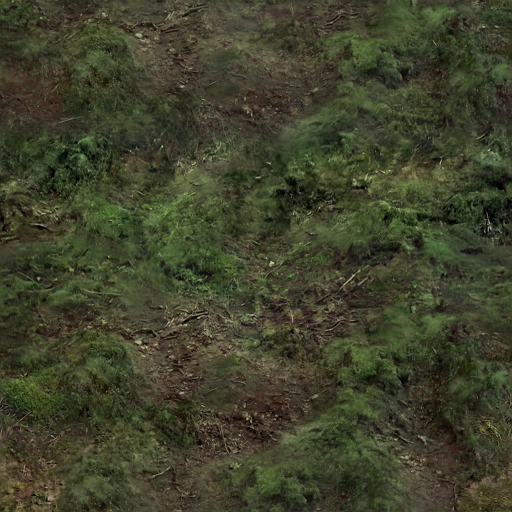
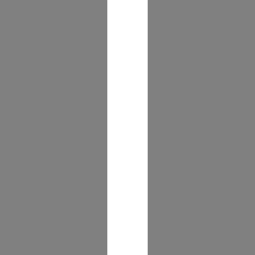
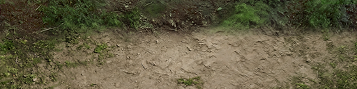

→ 路線 A 輸出(v1/v2 各見下方對應版本;共同病徵:位置寬度大致照遮罩,
但材質是 AI「轉述」出來的,跟特寫帶不是同一種土 — 踩坑 #3)

### 路線 A 兩版 prompt 逐字(❌ 對照組 — 記失敗原因)

**v1(初版三參考):**

```text
Reference image 1 is the BASE — a seamless mossy forest floor texture.
Everything outside the new path must stay pixel-identical to it.

Reference image 2 is a LAYOUT MASK: the white vertical stripe marks
exactly where the path runs — a straight vertical band about one sixth
of the image width (650 px of 4096), centered, from bottom edge to top
edge. It carries layout information ONLY — no colors or materials.
Do not widen, narrow, taper or meander the path.

Reference image 3 is the MATERIAL TRUTH for the path surface: packed,
compacted damp earth, fully matte, fine mud grain, sparse moss.
Use it ONLY for the path's material character and texture scale —
RETINT it to match reference 1's muted dark green-brown palette and
lighting. Nothing from its composition may appear.

TASK: draw the path onto reference 1 following reference 2's layout,
in reference 3's material. Naturalize the two long edges: moss
creeping over the path edge in small irregular bites, fine litter
crossing the boundary. The path's relief shading matches the
surrounding moss — same lighting direction, flat even ambient light,
no cast shadows. Do not brighten. No rocks, no logs, no standing
grass tufts, no new objects.
```

**v1 失敗原因:**
①路色跑灰橄欖、細節平、路面有明暗帶、無凹陷感——材質是 AI 轉述的,不是素材本人;
②`damp earth` 文字跟素材實際屬性(**乾燥**蒼白壓實土)衝突,文字贏了 → 畫成濕泥;
③`RETINT to match` 給了模型改色自由,材質性格隨色一起丟失。

v1 輸出:
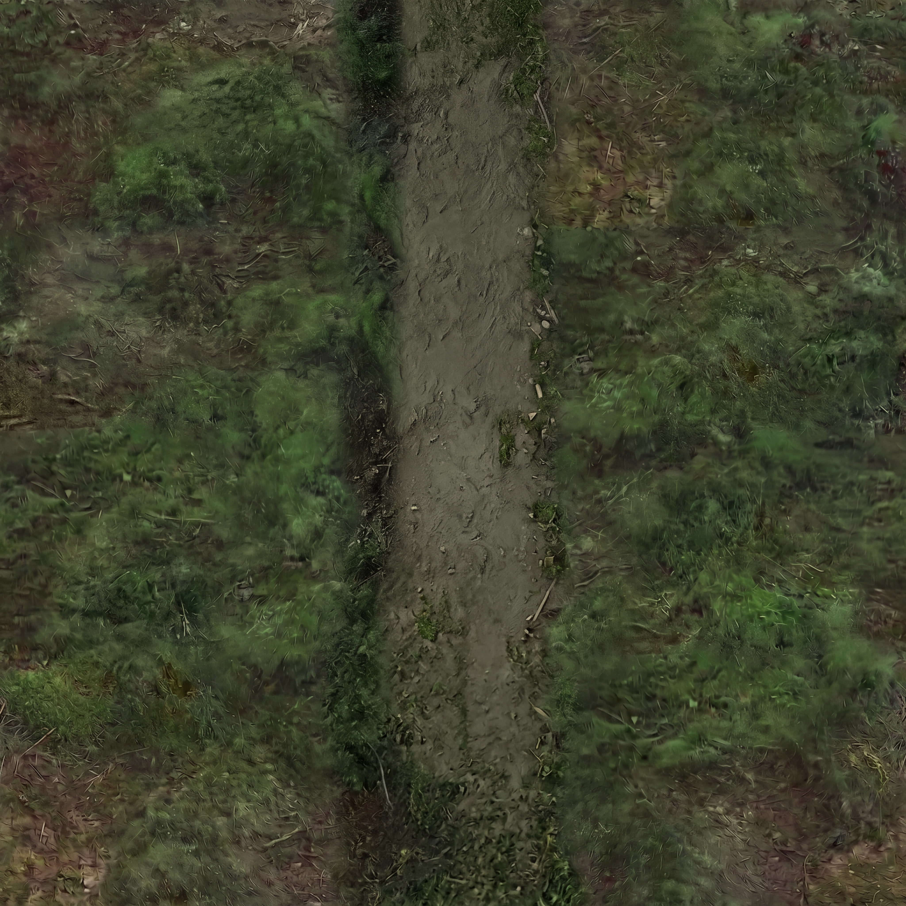

**v2(修正版 — 四段規格化,補否定鎖):**

```text
Reference image 1 is the BASE — a seamless mossy forest floor texture.
Everything outside the new path must stay pixel-identical to it.

Reference image 2 is a LAYOUT MASK: the white vertical stripe marks
exactly where the path runs — a straight vertical band about one sixth
of the image width (650 px of 4096), centered, from bottom edge to top
edge. It carries layout information ONLY — no colors or materials.
Do not widen, narrow, taper or meander the path.

Reference image 3 is the MATERIAL TRUTH for the path surface: packed,
compacted damp earth. Use it ONLY for the path's material character
and texture scale.

TASK: draw the path onto reference 1 following reference 2's layout,
in reference 3's material:

1. COLOR: muted damp grey-brown earth that sits naturally in
   reference 1's dark mossy palette — no warm orange tint, no olive
   tint, do not brighten.
2. DETAIL: fine compacted mud grain, faint trampling marks, scattered
   fine twigs and leaf litter, a few tiny half-buried pebbles — at the
   same physical scale as reference 3.
3. LIGHTING: the path is evenly lit from end to end — NO dark streaks
   or shadow bands along the path, no brightness gradient along or
   across it, no vignette, no cast shadows. Same soft, even,
   non-directional ambient light as reference 1.
4. EDGES: moss creeps over the path edge in small irregular bites,
   fine litter crossing the boundary. The path sits very slightly
   lower than the moss — a soft low moss lip with only a gentle tone
   change at the boundary, NOT a dark shadow line, NOT a black seam.

No rocks, no logs, no standing grass tufts, no bushes, no new objects.
```

**v2 失敗原因(定案判決):**
v2 修掉的全是**症狀**——黑影帶(LIGHTING 禁令)、失敗色(NOT grey/olive)、
黑縫(EDGES 改苔唇)都改善了;但**病根沒動**:路面材質仍由 AI 重畫,
出來還是「像路的泥」而不是素材那種乾燥壓實土(縮圖就看得出不是同一種材質)。
結論:**轉述失真無法用 prompt 修辭治好** — 材質同源需求下,遮罩重畫路線
整條判死,轉路線 B(真像素佔位 + AI 縫合)。

v2 輸出:
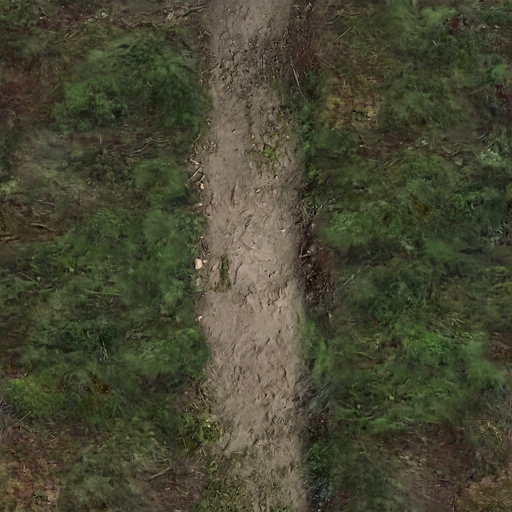

### 直路規格書(定案)

```
貼圖 4096×4096(模組 30×30m,1m ≈ 136.5px)
直路帶:長 4096px(貫穿上下)× 寬 650px(≈4.8m),置中,x 1723–2373
650px = 泥土路面實寬;草土咬合帶各約 100–150px 吃在草地側
tile 3 路口的直路段沿用同數字
```

### 定案流程(路線 B)

```
1. 橫路材質帶轉 90°、裁接至 650px 寬(變窄用「裁掉路面中段拼回」,
   不用縮放 — 縮放會壓扁顆粒毀 texel 尺度)
2. 段落堆疊佔位:交錯 offset + 隔段水平翻轉(防重複節奏);
   夾入路中的源帶草緣綠紋先仿製點掉
3. 貼上草地底圖(x 1723–2373)成完整合成圖 — 不可餵白底單帶
   (AI 沒有兩側苔地可咬合,白底又是誤讀源)
4. NB2 縫合 pass(下方 prompt)— 開 4 挑 1
5. PS 遮罩合成只露路帶+過渡邊 → offset 50% 驗左右縫 → 存 road_base_master
```

### 逐字勝利 prompt — 縫合 pass(保亮版)

```text
Reference image is a seamless mossy ground texture with a vertical
dirt path that was assembled by pasting strips of a real path photo.
The path's MATERIAL is exactly right — dry, compacted pale earth with
fine gravel, small cracks and faint trampling marks — and it must
STAY this material. Fix ONLY the assembly artifacts:

1. SEAMS: remove the repeated horizontal seams inside the path where
   the pasted strips meet — make the path one continuous unbroken
   stretch of the SAME material. Do not change its grain, cracks or
   gravel; do NOT repaint it into wet mud.
2. TONE: keep the path's current brightness, color and dryness
   exactly — do NOT darken, do NOT desaturate, do NOT retint the
   path. Tone matching will be done later outside this step.
3. EDGES: naturalize the two long boundaries — moss creeping over the
   path edge in small irregular bites, fine litter crossing over, a
   soft low moss lip with only a gentle tone change — NOT a dark
   shadow line.
4. LIGHT: even ambient light throughout — no streaks, no gradients,
   no vignette, no cast shadows.

The path stays exactly as wide and as straight as it is. Everything
outside the path and its edges stays pixel-identical. No rocks, no
logs, no standing grass tufts, no new objects.
```

> TONE 段的「保亮」是刻意的:路基是 master,調色歸 PS 最後統一(B5 鏈要短原則);
> 明文禁調色還順帶封掉模型「順手壓暗重畫」的自由度。

### 產出對照

佔位合成 BASE(草地 + 亮色路帶,送縫合前):
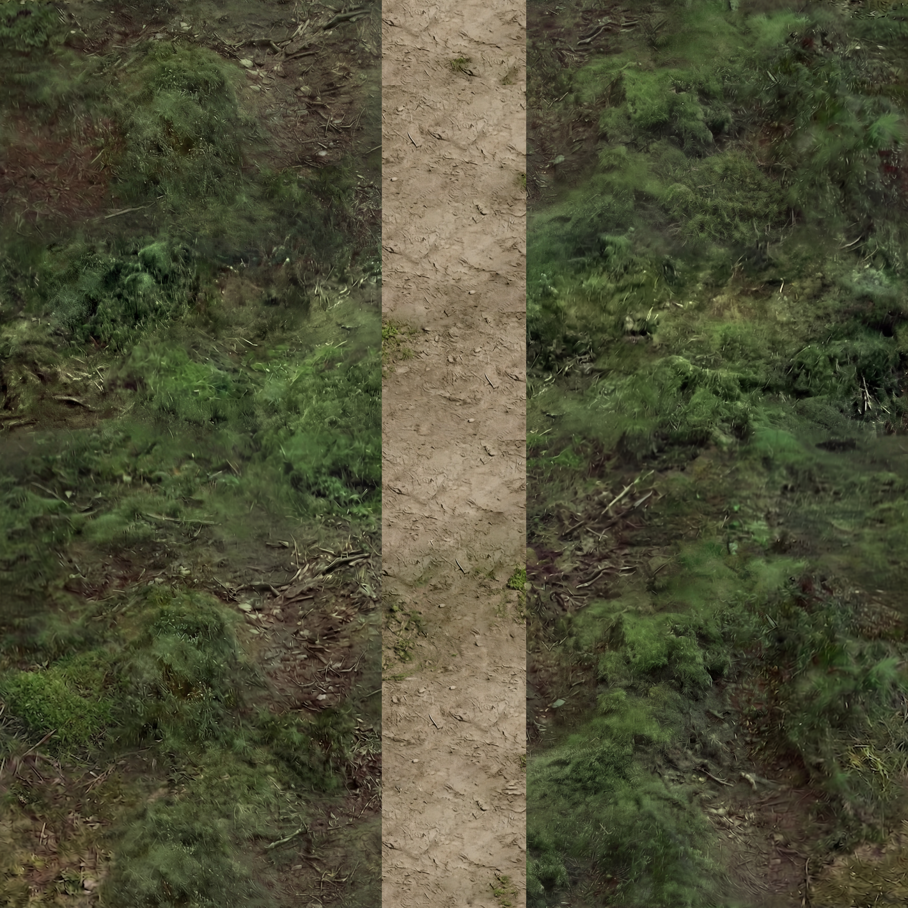

縫合定稿 — road_base_master(✅):
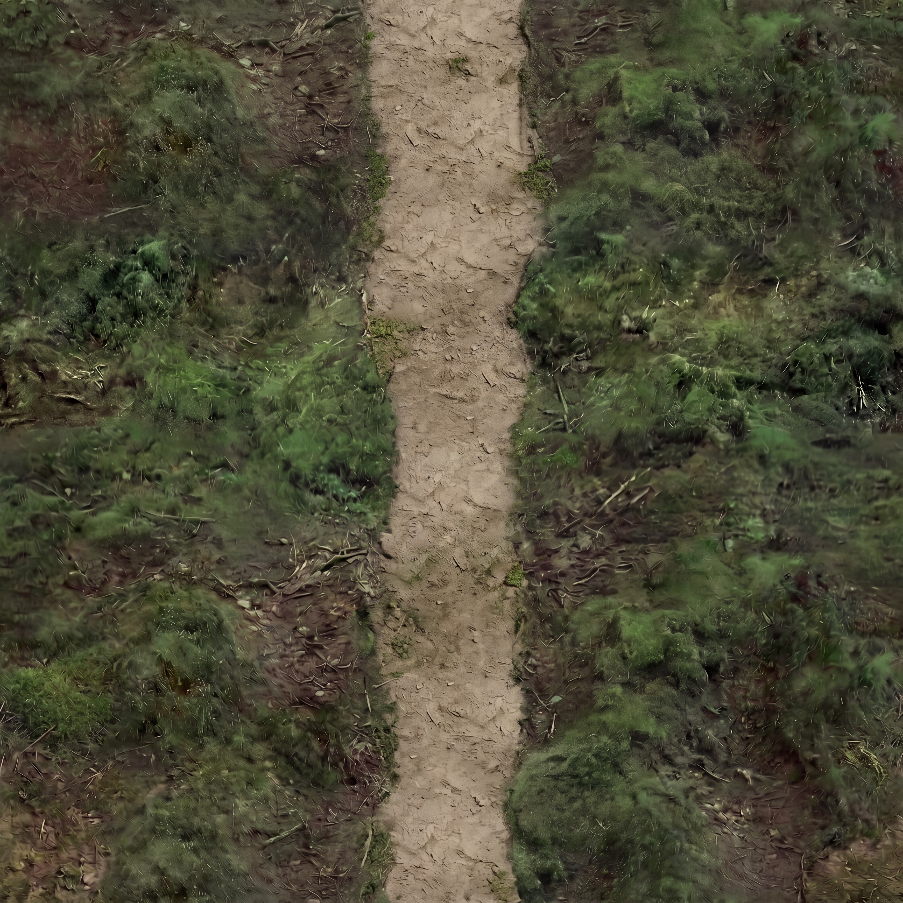

引擎驗證 before / after(第一版道路 → road_base_master 換裝):
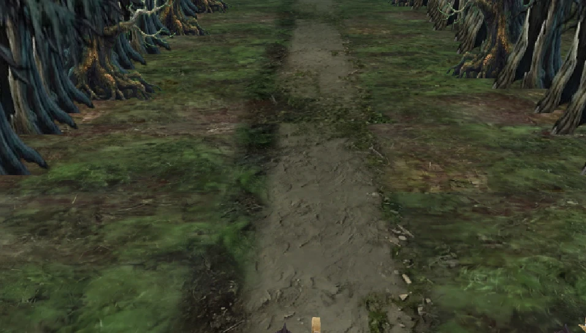
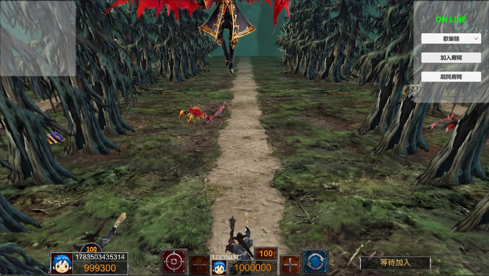

### 路面系 master → 變體(規劃,備而未做)

| 變體 | 雕刻內容 | 關鍵鎖 |
|---|---|---|
| 車道版 road_ruts | 沿路軸兩道淺車轍 | 大形鎖 + 轍距寫死(車寬換算 px) |
| 碎石版 road_gravel | half-buried 碎石散佈 | 密度量化,防畫好畫滿 |
| 端頭版 road_fade | 路往一端漸稀收口(路的 cap tile) | 另一端保 650px 規格銜接;**配方已定案,見〈端頭版〉節** |

## 端頭版 road_fade(路的 cap tile,配方定案 2026-07-10)

> 路從下緣進入、在草地中自然消散的收口 tile。佔位縫合路線的變體應用:
> 佔位階段多擺一個「端頭」,prompt 多一段 ENDING 授權。

### 佔位

真路材帶照直路配方裁接堆疊,但只鋪到中段;**端頭先擺幾何尖角佔位即可**
(消散的樣子交給 AI,位置由佔位定)。下緣那端保 650px 規格,可與直路 tile 銜接。


### 逐字 prompt(縫合 + 端頭消散)

```text
Reference image is a seamless mossy ground texture with a dirt path
entering from the bottom edge and ENDING in the grass around the
middle of the image, assembled by pasting strips of a real path
photo. The path's MATERIAL is exactly right — dry, compacted pale
earth with fine gravel — and it must STAY this material. The path's
position, width and where it ends are correct and FINAL. Fix ONLY
the assembly artifacts:

1. SEAMS: remove any pasted seams inside the path — one continuous
   unbroken stretch of the SAME material.
2. EDGES: naturalize the two long boundaries — moss creeping over the
   path edges in small irregular bites, scattered fine litter and
   small moss clumps crossing over, a soft low moss lip — NOT
   straight cut lines.
3. THE ENDING: the path's tip currently looks like a hard geometric
   point — rework it into a natural path end: the trodden earth
   peters out gradually, breaking into smaller worn patches and bare
   spots that fade into the moss, with grass closing over the last
   stretch. Keep the ending at the same position — do NOT extend the
   path further into the image.
4. TONE / LIGHT: keep the path's current brightness, color and
   dryness exactly — do NOT darken, do NOT repaint it into wet mud.
   Even ambient light throughout, no cast shadows, no gradients, no
   vignette.

The path stays exactly as wide and as straight as it is. Everything
outside the path and its edges stays pixel-identical. No rocks, no
logs, no standing grass tufts, no new objects.
```

### 要點

- **ENDING 段是本 tile 的靈魂**:消散寫成具體畫面(踏痕漸稀 → 碎斑 →
  草合攏)+ `do NOT extend` 鎖(不鎖模型愛把路「畫完」通到頂邊)
- 挑選判準:端頭消散自然(非禿斷、未被延長)、路寬筆直、材質乾燥蒼白原樣
- 端頭改不動(幾何尖角原樣)→ 套踩坑 #5 階梯:裁下半 1:1 讓端頭變主角重跑
- 通過後規格書記:**端頭收口位置 y 座標**(拼接相容:下緣接直路、上方接純草)

### 產出(✅ 定稿)

端頭消散成立 — 踏痕漸稀 → 碎斑 → 草合攏;本張含兩種收口樣態
(寬直收口 / 窄蜿蜒收口),可作兩款端頭素材:
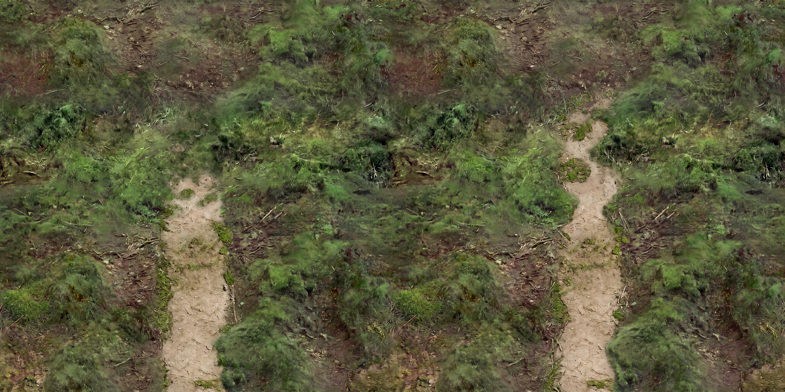

## 橫路下緣縫合(零變化除錯實錄,2026-07-09)

> 任務:tile 1 橫路的**下邊界**(路面 vs 畫布底部窄草帶)咬合自然化。
> 價值在除錯過程 — 連續兩發「零變化」的根因各不相同。

### 零變化除錯階梯

| 輪 | 現象 | 根因 | 對策 |
|---|---|---|---|
| 1 | 輸出 = 輸入,零變化 | **可修範圍圈錯**:prompt 指定修「上緣」還鎖死下緣(`bottom edge stays path material`),但上緣本來就自然 — 模型無事可做 | 先確認「Fix ONLY ___」填的是不是真正想動的位置 |
| 2 | 圈對下緣仍零變化 | **目標佔比 <2%**:邊界帶貼著畫布邊,注意力分不到;`Fix ONLY assembly artifacts` 又讓模型自行判斷「有無缺陷」→ 判無 → 原樣交卷 | ①Crop-Gen-Paste 裁大目標 ②**缺陷宣告成事實**(`Right now this line is TOO STRAIGHT`),不留判斷空間 |
| 3 | 裁切版一發成功 ✅ | — | — |

**通則:目標 <5% 畫面就直接 Crop-Gen-Paste,別跟注意力搏鬥;
「零變化」幾乎都不是平台故障,是 prompt 的可修範圍或缺陷判斷出了問題。**

### 平台限制(入帳)

Leonardo NB2 輸出尺寸只有 **1:1 與 16:9** 兩種 → Crop-Gen-Paste 的
裁切規格直接遷就這兩種比例來裁。

### 逐字勝利 prompt(裁切版,1:1 底部方裁)

```text
Reference image is the bottom section of a seamless ground texture: a
horizontal dirt path with mossy ground above it, and a NARROW GRASS
STRIP along the very bottom edge. The path's material and the moss
are correct and FINAL.

TASK — rework the boundary where the path's bottom edge meets the
narrow grass strip. Right now this line is TOO STRAIGHT and abrupt.
Make it a natural forest path edge: grass and moss creeping up over
the path's lower edge in small irregular bites of varied size,
scattered fine litter and small moss clumps crossing the boundary, a
soft low lip — an organic, uneven line. Do not remove or widen the
grass strip; do not shrink the path.

Keep the path's material, brightness and dryness exactly — do NOT
repaint it into wet mud, do NOT darken it. Everything in the upper
half of the image stays pixel-identical. Even ambient light, no cast
shadows, no gradients. No rocks, no logs, no standing grass tufts,
no new objects.
```

### 產出對照

裁切輸入(1:1 底部方裁 — 邊界從 <2% 變成畫面主角):
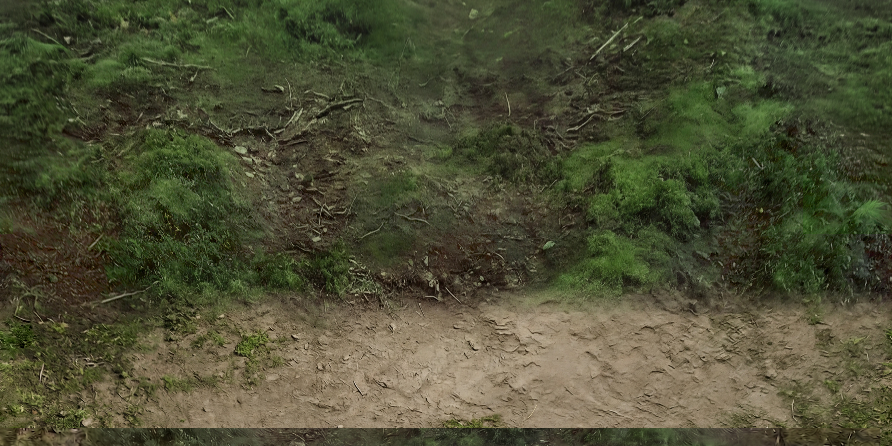

裁切版輸出(✅ 下緣咬合成立;路面中段順手長的苔塊由遮罩決定收不收):
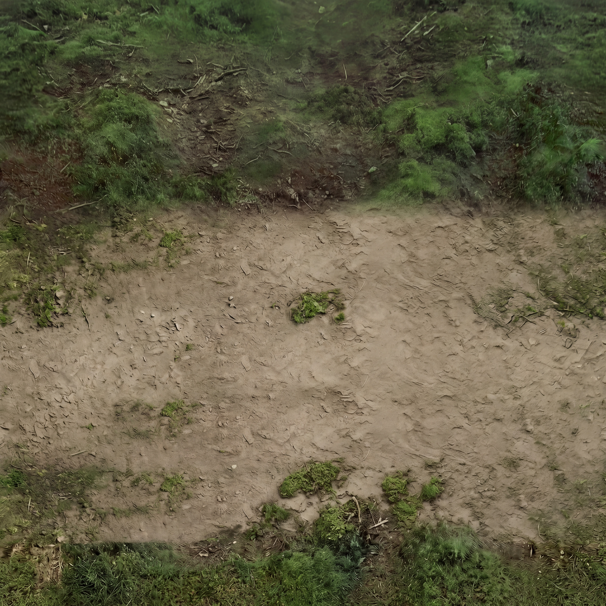

### 貼回三注意

1. 原位貼回、座標零位移(Crop-Gen-Paste 鐵律)
2. **遮罩範圍是決定點**:生成順手在路面中段長了苔塊 — 只要下緣咬合就只露
   下緣帶;路面苔塊要不要收,對照「路基 master = 中性無劇情」的定位決定
3. offset 50% 驗左右縫(裁切段左右邊被重畫過)

## PS 確定性技法(新增)

| 技法 | 用途 | 要點 |
|---|---|---|
| **整寬橫帶性質** | 二方連續貼圖的變體/移植 | 二方連續貼圖的任何「整寬橫帶」本身仍二方連續;垂直搬移不破壞性質 |
| **翻轉+offset 防重複** | 帶內複製時避免「同款兩份」 | 水平翻轉與水平 offset 都保持二方連續性質,疊加使用讓借來的帶認不出來源 |
| **凹凸移植(柔光疊明暗)** | 平面區域借立體感 | 借凹凸區整寬帶→去飽和→輕高斯模糊→柔光 50-70% 蓋到平區(本輪效果被判不足,重生成勝出;技法留檔備用) |
| **縱深梯度補償** | 橫向素材轉直向用 | 直路遠端疊黑→透明線性漸層(色彩增值),吸管對齊同高度草地亮度 |

## 四方連續 SOP

```
1. 先殺垂直色調梯度(prompt 2 換頂帶;上下緣吸管抽查同色調)
2. PS 濾鏡 > 其他 > 畫面錯位:水平+垂直各 50% → 修十字縫 → offset 回來
3. 2×2 拼貼縮圖瞇眼測試 — 重複感在四方連續是平方級放大
```

⚠️ **地標 = 重複圖騰**:有身份的特徵(V 形凹谷、異色斑塊)在滿鋪時一眼可辨,
驗收不過就仿製圖章淡化。二方連續橫掃一次即可,四方標準更嚴。

## 檔案版本管理(梯度是資產屬性,不是缺陷)

| 檔案 | 特徵 | 用途 |
|---|---|---|
| `master_道路版` | 橫路帶+縱深暗化 | tile 1;tile 3/4 的道路素材源 |
| `草地_走道版` | 無路+保留縱深暗化 | tile 2 走道排(與 tile 1 同排混用,暗化必須一致) |
| `草地_四方版` | 無路+勻色+四方連續 | 滿鋪 filler |

同排混用的 tile 縱深暗化必須同款——這是「邊緣合約」的一部分:
tile 的左右邊緣輪廓(草地邊/含路帶邊)決定它能跟誰相鄰。

---

## 踩坑紀錄

| # | 現象 | 根因 | 解法 |
|---|---|---|---|
| 1 | 道路帶替換成草地後「材質對了但太平」,與中央苔地凹凸不符 | prompt 只寫「same material」沒寫凹凸——**沒點名的屬性 = 模型自由發揮**(B1 允許清單效應的屬性版) | 重要屬性逐項寫死:`NOT a flat fill` + 丘/坑/明暗/尺度;並加 `no trace` 鎖 |
| 2 | 柔光凹凸移植效果不足,被判不行 | 柔光只轉印明暗「感覺」,苔丘的材質細節(絨面顆粒)轉印不過去 | 回 master 用 prompt 1 重生成(把凹凸烙進替換任務);柔光技法留作輕量備用 |
| 3 | 遮罩重畫的直路材質走樣(濕滑泥流 ≠ 乾燥壓實土素材) | ①AI「轉述」材質必失真 ②prompt 寫 `damp dark earth` 與素材(乾燥蒼白)屬性衝突 — 文字與參考打架時文字常贏 | 材質同源一律走佔位縫合(見直路生成節);prompt 的材質形容詞必須照著素材寫,不要憑印象 |
| 4 | 路面出現縱向黑影帶 | 「凹陷」用 darker seam(暗縫)表達,被模型畫過頭 | 凹陷改用「苔唇 + 輕微色差」表達,明文 `NOT a dark shadow line`;修 prompt 時順帶把失敗表達寫進禁令 |
| 5 | edit pass 輸出 = 輸入,零變化(連兩輪) | ①可修範圍圈錯位置 ②目標佔比 <2% + `Fix ONLY artifacts` 讓模型自判「無缺陷」 | 見〈橫路下緣縫合〉除錯階梯:圈對範圍 → 裁大目標(Crop-Gen-Paste)→ 缺陷宣告成事實 |

## 驗收 checklist(每張變體)

- ☐ 編輯帶與周圍:縮圖瞇眼無明暗顆粒差、100% 原寸材質連續
- ☐ 原編輯位置無殘影/無色調斷帶(`no trace` 驗證)
- ☐ offset 50% 縫乾淨(四方版:H+V 各 50% 十字縫)
- ☐ (四方版)2×2 拼貼縮圖瞇眼測試,無地標圖騰
- ☐ 與同排 tile 並排 render:色調/縱深暗化一致
- ☐ 上下緣(四方版)吸管抽查同色調

## 進度

- ✅ tile 1 草地橫向道路(master,雙相機管線產出)
- ✅ tile 2 全草地:走道版 + 四方連續版
- ✅ tile 4 草地直向道路 — **路基版 road_base_master 完成,引擎驗證通過**
  (佔位縫合路線,見〈直路生成〉節;車轍/碎石/端頭變體備而未做)
- ☐ tile 3 橫接直路口 — 直路規格已定案(650px/x 1723–2373),
  = tile 1 橫路 + 本直路規格相交,難點在交叉口咬合

## 學到的(可複用結論)

- ✅ **「同圖材質替換」是全管線成功率最高的任務型**:目標材質在同一張圖裡,
  風格參考零漂移、零構圖滲漏,AI 只做「把 A 區長成 B 區的樣子」。
- ✅ **套圖一致性的正解是編輯鏈,不是重複生成**:同 prompt 重生成 N 張是 N 次
  獨立抽樣;從已驗收結果逐步衍生,一致性由像素繼承保證。
- ✅ **prompt 沒點名的屬性會被自由發揮**——材質替換要同時鎖「長什麼樣」(材質)
  和「起伏怎麼長」(凹凸/明暗/尺度),缺一項就得重抽。
- ✅ **確定性工具負責性質,AI 負責質感**:二方連續、防重複、梯度補償都有
  PS 構造性解法(整寬帶/翻轉 offset/漸層疊加),不要求 AI 保證幾何性質。
- ✅ **「修症狀」和「治病根」要分清**(直路 v1→v2 的判決):prompt 迭代能修掉
  症狀(失敗色/黑影/黑縫),但治不了架構級錯誤(讓 AI 轉述材質)。同一方向
  修兩版仍不到位 → 停止修辭,檢查路線本身。失敗版 prompt 一律逐字留檔+
  寫根因——經驗傳承的載體是「為什麼錯」,不是只有「怎麼對」。

## 圖檔

✅ 十三張已入庫:tile 1/2 系列 ×4 + 直路生成系列 ×9(輸入三件/失敗 v1v2/
合成 BASE/定稿/引擎 before-after)。選配:`b4-4way-offset-check.png`(可略)。
