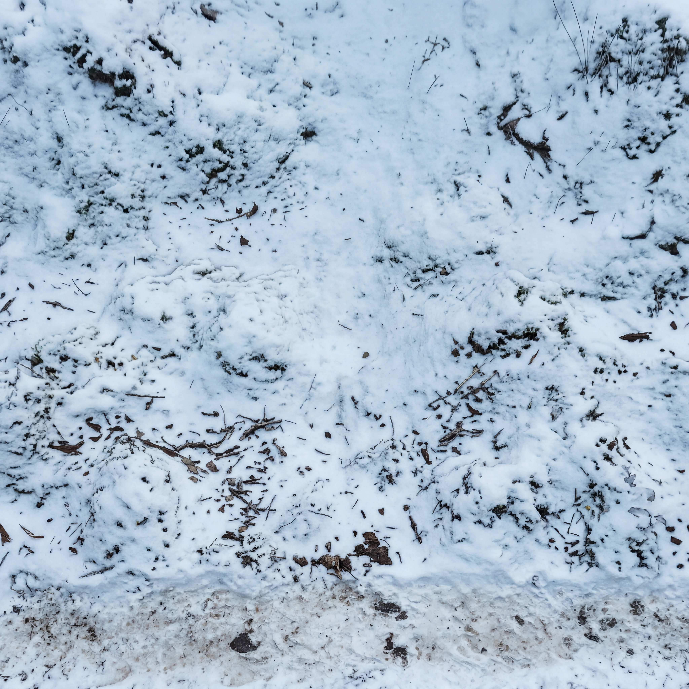
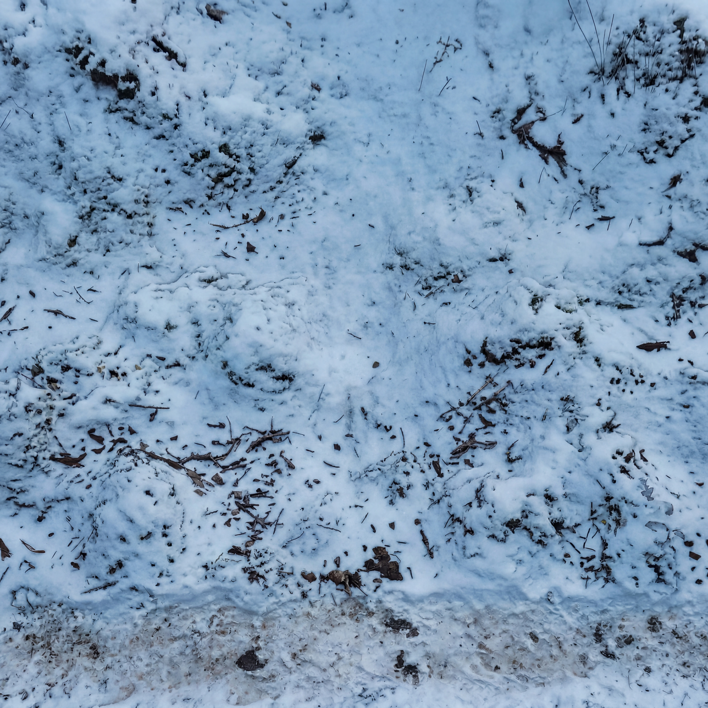
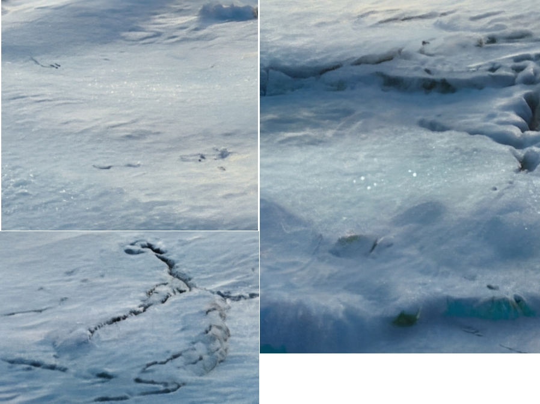
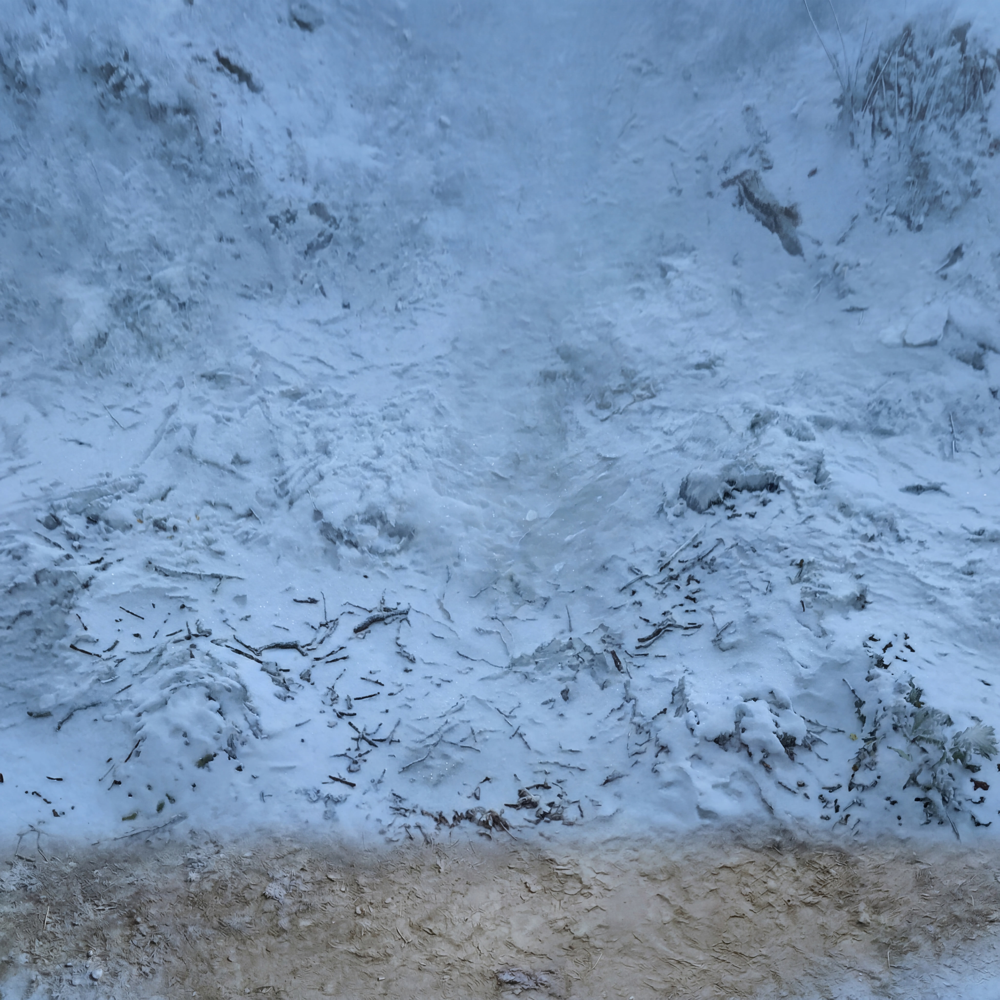
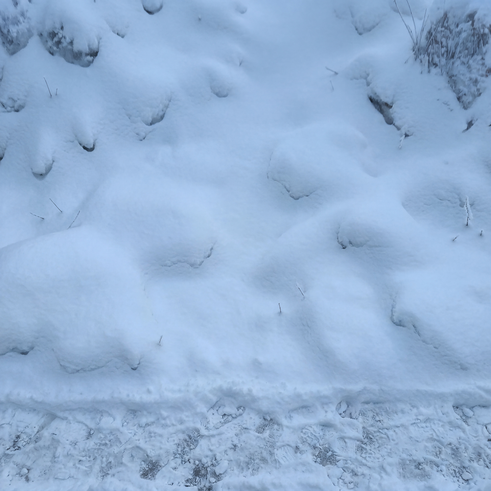
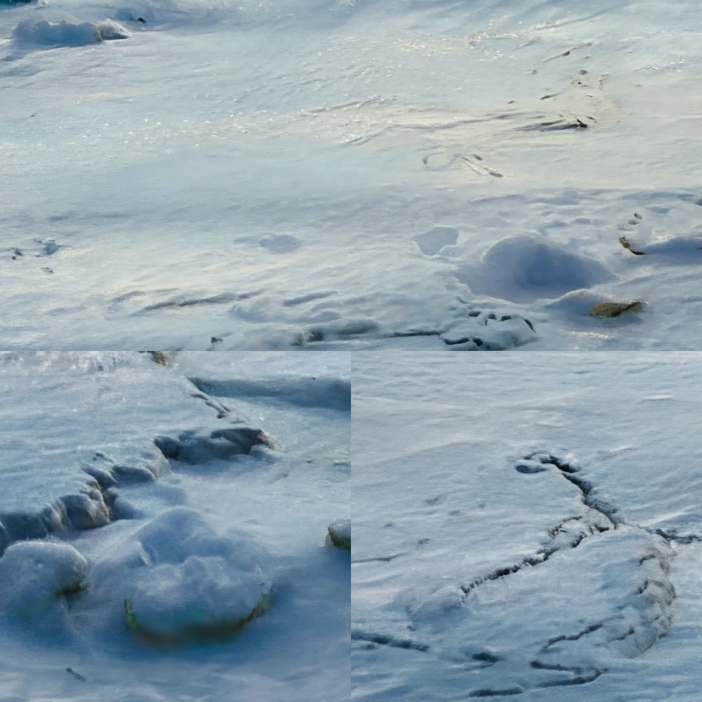
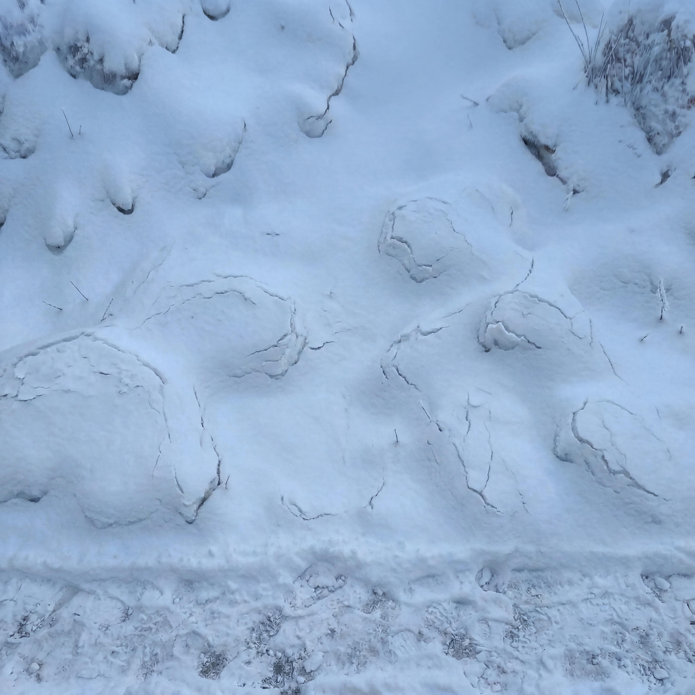
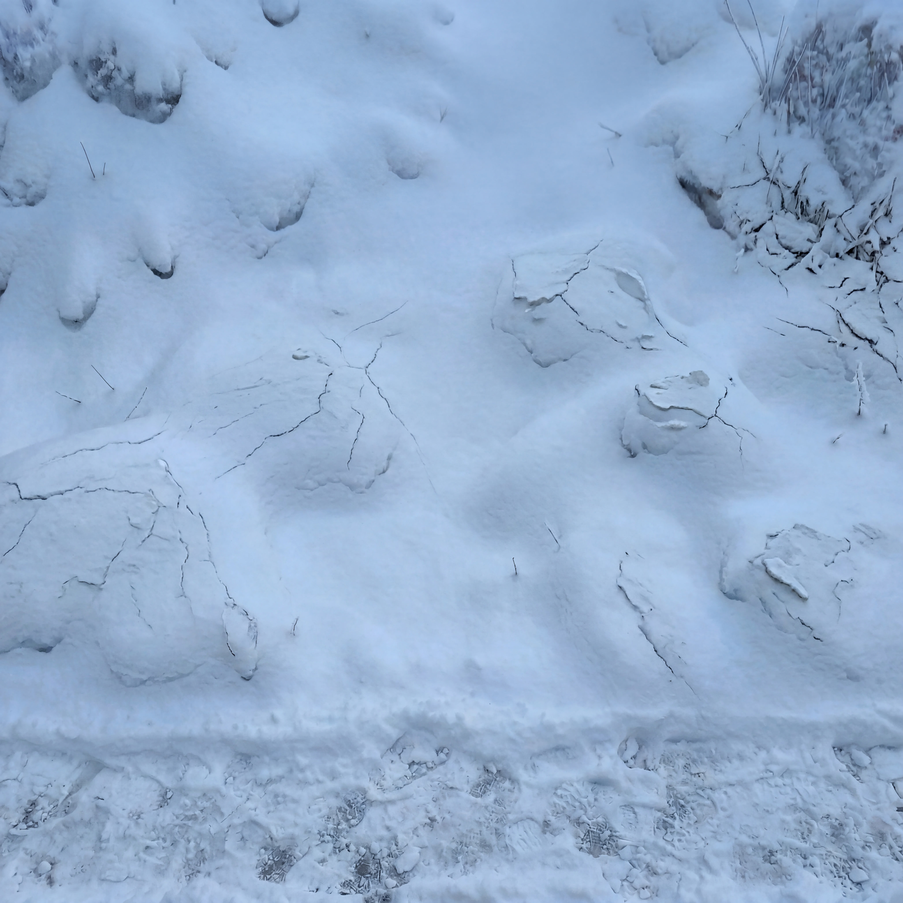
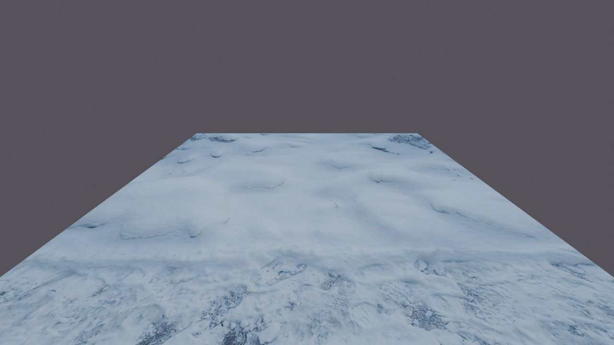
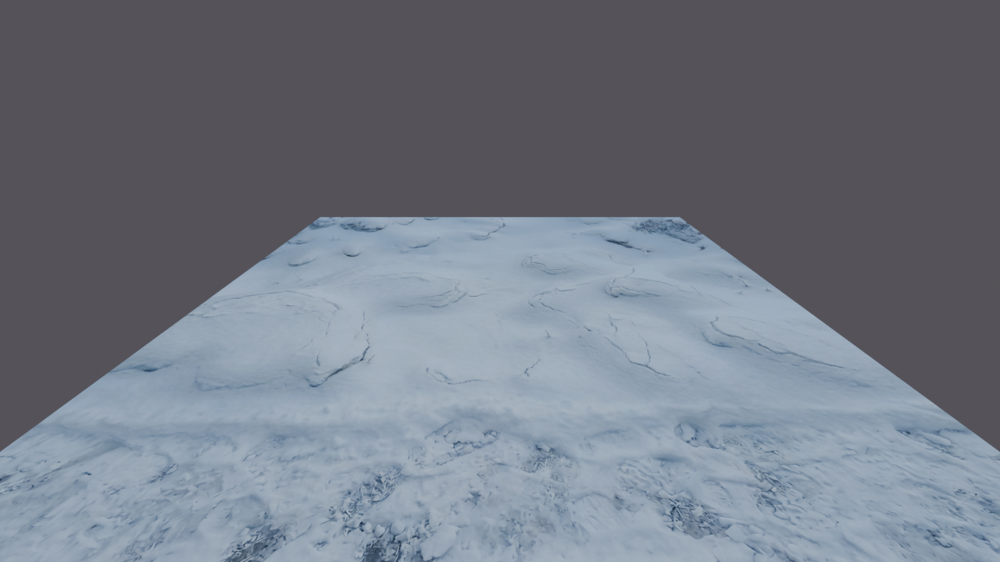

# 實戰紀錄 — B5 master 主題翻譯:森林 → 雪地(三檔位雪 master)

> 已驗收的森林 master 一張圖,透過「主題翻譯 → 厚度檔位 → 品種雕刻」三層變體,
> 產出整組雪地 master。透視/模組/相機全套零成本繼承。
> 前置:[B4](B4-master-variant-tileset.md)(區域編輯鏈/老三樣)、B2(鎖句)、B1(色票板)。

**🔑 關鍵字(日後對 Claude 說這些詞即可叫出本紀錄):**
`B5`、`B5 紀錄`、`主題翻譯`、`森林轉雪`、`雪地 master`、`換皮`、`品種切換`、
`薄雪`、`厚雪`、`冰殼雪`、`雪殼`、`雕刻 pass`、`鎖分層`、`大形鎖`、
`鏈要短`、`調色歸 PS`、`檔位`、`BURY COMPLETELY`、`NOT bare dirt`

## 來源(索引)

- **素材:** B4 森林道路 master([b4-master-road](images/b4-master-road.png))
- **平台:** Leonardo.ai / Nano Banana 2 + Photoshop(調色/局部修復)
- **Claude 對話連結(本案全程:主題翻譯 → 厚度檔位 → 品種雕刻 → 逐輪判讀 → 紀錄;同串亦產出 B4、B6):**
  `https://claude.ai/code/session_01McptxmyoZ38F6SvbgpnK5Y`
- **日期:** 2026-07-07
- **結果:** ✅ 雪地三檔位 master 完成並過引擎透視驗證

## 核心心法

**透視不住在貼圖裡。** 主題翻譯只換貼圖內容;模組幾何、CAM_GEN2、遊戲相機、
UV、二方連續機制、道路規格書全部原封不動繼承 → **換主題的成本 = 只有材質翻譯**。

### 檔位樹(每 pass 只改一件事)

```
森林 master(B4)
  →〔主題翻譯 pass〕薄雪(日光粉雪,雜物露出=初雪感)
  →〔厚度 pass〕    厚雪(枝條全埋,雪道踩實)
  →〔雕刻 pass〕    冰殼(硬殼版塊+裂紋,掛色票板)
  ※ 冷色 = PS Camera Raw 預設,所有生成 pass 跑完後最後統一套用
```

### 原則(新增,可跨主題複用)

1. **鏈要短**:能用確定性工具做的變更(調色/裁切/縫合)絕不用生成 pass 做;
   生成 pass 只留給非它不可的變更(材質/結構)。每 pass 一次世代損耗,鏈越短越乾淨。
   調色存**預設集**套全系列 = 色調一致性由確定性保證。
2. **鎖分層**:品種切換若涉及表面結構特徵(裂紋/版塊/風紋 = 幾何級特徵),
   結構全鎖會把特徵一起鎖死(→只變色不換品種)。正解:**大形鎖 FINAL、
   小形明文授權**(`carve ... INTO the existing surface` + 允許清單)。
3. **色票板配比 = 主旋律**:模型學的是板上的大面積內容——特徵特寫必須佔大格;
   純白留白必裁;定向光高光/雜色先壓(挑選時「色調偏暖」列淘汰標準兜底)。
4. **reference 宣告數 = 實餵數**:目標材質底圖裡已有 → 單圖(厚雪);
   底圖裡沒有 → 掛色票板(冰殼)。多餵的圖模型不會閒置。

---

## 逐字 prompt(勝利版)

### 1. 主題翻譯 pass(森林 → 雪,雙型分區翻譯)

```text
Reference image is a seamless mossy forest floor texture with a dirt
path strip along the bottom edge. TASK: convert this EXACT ground into
mid-winter — a material translation, not a redesign:
- The mossy areas become a continuous snow cover — every moss cushion
  becomes a snow-covered mound with the SAME shape, bumps and dips
  underneath; scattered twigs and litter poke through the snow.
- The dirt path becomes a trampled, compacted snow path — slightly
  dirty snow with patches of frozen mud showing through.

STRUCTURE LOCK: the layout, the path position and width, every mound
and dip, the texture scale and the outer edges stay EXACTLY as the
reference. Keep the soft relief shading — mound tops lighter, crevices
darker.

Muted cold palette, soft even ambient light, no cast shadows, no fog,
no footprints of a specific person, no animals, no trees, no rocks, no
new objects, no sparkle or glitter.
```

### 2. 厚雪 pass(加重版 — v1 失敗後定稿)

```text
Reference image is a seamless snowy ground texture with a trampled
path strip along the bottom edge. Its large-scale layout is correct
and FINAL: the positions of the mounds and dips, the path position
and width, the texture scale and the outer edges all stay. Keep the
palette exactly.

TASK: deepen the snow into HEAVY snowfall accumulation — a thick,
fresh, deep layer that buries this ground:

1. DEEP POWDER EVERYWHERE: surfaces become soft, pillowy and rounded
   over the existing mounds; large continuous areas of clean,
   unbroken snow.
2. BURY THE DEBRIS COMPLETELY: all twigs, branches and leaf litter
   disappear under the snow — including the dense litter bands in the
   middle of the image. At most a few tiny twig tips remain visible
   in the ENTIRE image. No clusters of exposed debris anywhere. No
   exposed dark soil.
3. THE PATH IS SNOW-COVERED TOO: the trampled path is NOT bare dirt —
   it is covered by compacted, trodden, grey-white snow, clearly
   walked on, with only a few small patches of frozen mud breaking
   through. Soft banks of fresh snow pile along both its edges. At
   least four fifths of the path surface is snow.

Keep the soft relief shading — pillow tops slightly lighter, hollows
slightly darker. Soft, even, non-directional ambient light, no sun,
no cast shadows, very restrained sparkle. NO falling snowflakes in
the air. No footprints, no animals, no rocks, no new objects.
```

> 空中雪花不烙進貼圖——飄雪是引擎粒子的事(同「霧交給引擎」原則),
> 貼圖只烙「雪落地後的結果」。

### 3. 雕刻 pass(冰殼品種,鎖分層版;ref 2 = 冰殼色票板)

```text
Reference image 1 is the BASE — a seamless ground texture of thick,
pillowy fresh snow with a trampled snow path strip along the bottom
edge. Its LARGE-SCALE layout is correct and FINAL: the positions of
the snow pillows and hollows, the path position and width, the
texture scale and the outer edges all stay. Keep the palette exactly.

Reference image 2 shows the TARGET SNOW SURFACE: hard, wind-packed,
crusted old snow — slabby patches with raised broken edges, fine
cracks running through the crust, subtle wind-carved ripples. Use it
ONLY for the surface character of the snow. Do NOT copy its terrain,
its shapes or its composition.

TASK: age reference 1's fresh snow into reference 2's KIND of snow —
carve the crust character INTO the existing surface:
- the open snow areas develop a hard wind-packed crust: slabby patches
  with small raised broken edges, thin cracks running through the
  crust, and faint wind-carved ripples — at the same physical scale as
  the features in reference 2;
- the crust forms ON the existing pillows and hollows — it does not
  move, add or remove them;
- the trampled path strip stays compacted trodden snow, unchanged in
  position and width.

Soft, even, non-directional ambient light — no sun, no long cast
shadows. Very restrained sparkle. No footprints, no animals, no rocks,
no new objects.
```

---

## 產出對照

### 主題翻譯 pass — 薄雪(日光粉雪,雜物露出)


### 踩坑 #1 — 品種換皮 v1:只變冷色,特徵沒長(❌ 對照組)


當輪輸入的色票板 v1(配比稀釋:平滑雪原佔大格+右下留白):


### 踩坑 #2 — 厚雪 v1:枝條沒埋、道路裸土(❌ 對照組)


### 厚雪定稿(加重版 prompt:BURY COMPLETELY + NOT bare dirt)


### 冰殼色票板定稿(配比翻轉:裂紋+版塊佔大格、無留白)


### 踩坑 #3 — 雕刻 pass 候選一:環狀裂紋圖案化(❌ 對照組)


### 冰殼定稿 — 候選二:樹枝狀龜裂、分佈自然(⚠️ 右上灌木 PS 修復待做,修復後同檔名覆蓋)


### 引擎透視驗證(CAM 遊戲相機)



## 踩坑紀錄

| # | 現象 | 根因 | 解法 |
|---|---|---|---|
| 1 | 品種換皮 v1:只變冷色,冰殼特徵沒長出來 | ①結構全鎖與表面結構特徵矛盾(裂紋/版塊是幾何,被 every mound and dip EXACTLY 鎖死)②色票板大面積是平滑雪原,特徵被稀釋 | 鎖分層(大形 FINAL/小形 carve INTO 授權)+ 色票板配比翻轉(特徵特寫佔大格) |
| 2 | 厚雪 v1:枝條沒埋、道路仍是裸土 | bury 力度不足;`compacted dirty snow` 被理解成「保留土路」 | `BURY COMPLETELY` + 點名 `dense litter bands` + `NOT bare dirt`(否定失敗模式)+ 量化下限 `at least four fifths` |
| 3 | 雕刻 pass 候選一:每個雪丘繞一圈環狀裂縫 | 特徵圖案化 — 單一 motif 重複,拼圖必成圖騰 | 開 4 挑 1 判準加「特徵分佈自然不對稱」;環狀重複的淘汰 |
| 4 | 雕刻 pass:右上角既有雪尖被放大成枯枝灌木 | 全圖重繪對既有小物件的「補完」傾向 | 大形對齊沒漂 → PS 從底圖把該區蓋回(遮罩合成反向用),不重抽 |

## 驗收 checklist

- ☐ 疊回上一檔位底圖:大形(雪枕/路帶)重合;被授權的變更(埋雜物/長裂紋)不算漂移
- ☐ 品種特徵縮圖可見(只變色不長特徵 = 淘汰)
- ☐ 特徵分佈自然不對稱、無單一 motif 重複
- ☐ offset 50% 左右縫乾淨(每個全圖 pass 後必驗)
- ☐ 色調:冷色由 PS 預設統一,吸管抽查各檔位一致
- ☐ 引擎三驗:texel 尺度 vs 角色(裂紋有絕對尺寸感!)/多模組並排看重複/遊戲相機原寸看前景帶

## 資產清單

| 檔案 | 內容 | 用途 |
|---|---|---|
| `snow_master_thin` | 薄雪(雜物露出) | 初雪/屋簷下/簷廊 |
| `snow_master_thick` | 厚雪(枝條全埋+雪道) | 大雪場景主力 |
| `snow_master_crust` | 冰殼(版塊+裂紋) | 風蝕老雪/曠野 |
| Camera Raw 冷色預設 | 雪地官方色調 | 所有雪 tile 最後一關統一套用 |

之後出雪地套圖(全雪版/直路版/四方版)= B4 編輯鏈在雪 master 上重推。

## 圖檔

✅ 十張已入庫(見產出對照)。唯一待辦:`b5-snow-crust.jpg` 目前是
**未修復版**(右上灌木,踩坑 #4)——PS 蓋回後同檔名覆蓋重傳即可,
文件引用不動,Git 保留修復前後版本。
