# 實戰紀錄 — B6 三相機管線:遊戲相機 / 出圖相機 / 生成相機(反解)

> 「AI 喜歡的透視」與「遊戲要的透視」解耦:生成相機伺候 AI(舒適區+像素預算),
> 遊戲相機伺候引擎,中間用投影做確定性轉換。
> [B4](B4-master-variant-tileset.md)/[B5](B5-theme-translation-snow.md) 的
> master 貼圖全部由本管線產出。
> 對應工作流:`ai-media-generator`;前置:[B2](B2-greybox-module-pipeline.md)(像素預算/Crop-Gen-Paste)。

**🔑 關鍵字(日後對 Claude 說這些詞即可叫出本紀錄):**
`B6`、`B6 紀錄`、`三相機`、`雙相機`、`生成相機`、`遊戲相機`、`相機解耦`、
`反解相機`、`CAM_GEN2`、`homography`、`投影攤平`、`Sensor Fit`、
`sensor 換算`、`FOV 換算`、`路線 D`、`品質三資源`、`像素預算相機`

## 來源(索引)

- **場景:** 30×24m 走道模組(+前緣 6m 泥土條,bbox 總深 30m)、Blender、
  Unity 匯入相機 rig
- **平台:** Blender(相機/投影/攤平)+ Leonardo.ai NB2(生成)
- **日期:** 2026-07-06 ~ 07
- **結果:** ✅ 三相機系統定案,[B4](B4-master-variant-tileset.md) 森林 master 與
  [B5](B5-theme-translation-snow.md) 雪地系列皆由此產出

---

## 三相機架構

```
相機1 遊戲相機(Unity 匯出 → Blender)
  └ 真相基準:遊戲實際怎麼看。13.46mm,掛在多層 rig 裡
相機2 出圖相機(8.5mm 視野 → 計算成 13.46mm + Sensor Fit 調整)
  └ 視野需求來自 8.5mm/27.64 那組,但 focal 維持 13.46mm 不動(與相機1
    同數字):sensor 換算成 43.77mm 等效;Vertical fit 讓 Resolution X
    直接擴橫向視野 — Blender 端出圖/檢視用
相機3 生成相機 CAM_GEN2(反解 + 腳本新增)
  └ 從 AI 自由生成的成品圖反解出來的相機 — 餵 NB2 生成 + 投影回模組
```

### 管線流

```
相機3 渲染貼材質灰盒(滿框) → NB2 生成/變體 pass
  → 相機3 把成品投影回模組(透視被幾何吸收)
  → 正交頂視攤平 → 平面二方連續貼圖(資產本體)
  → 模組貼圖 → 相機1/2(引擎/Blender)任意出圖
```

**核心心法:透視不住在貼圖裡。** 貼圖攤平後是純平面資產,透視由模組幾何+相機
決定 → 換主題(B5)、換相機、旋轉重用全部零透視成本。

### 三相機視角與設定對照

相機1(遊戲相機,13.46mm 原始 sensor)— render 範圍與鏡頭設定:
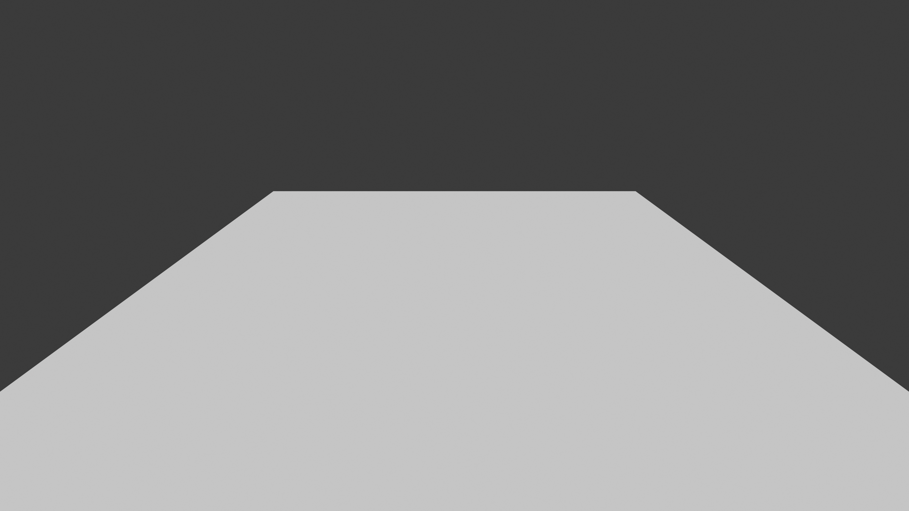
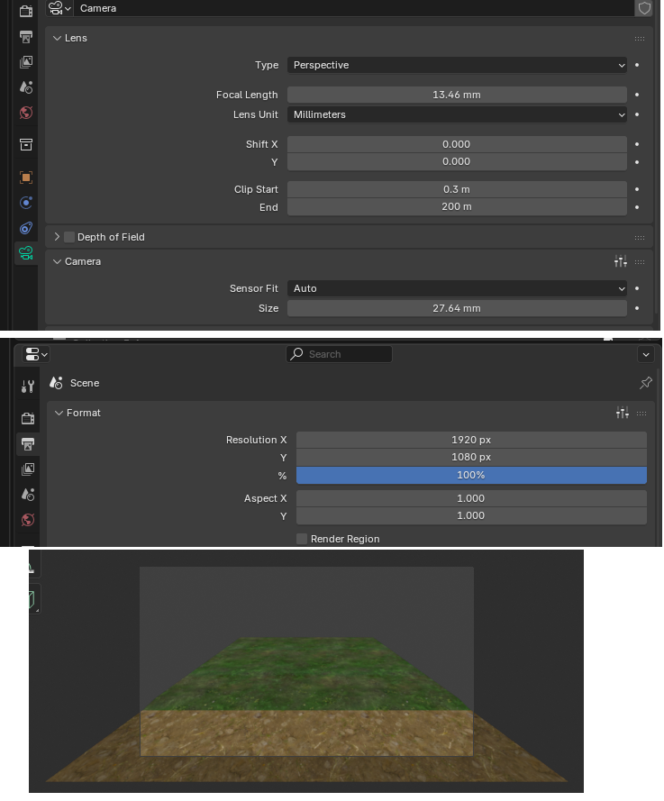

相機2(出圖相機,13.46mm + Sensor Fit 換算)— render 範圍、鏡頭設定與調整後數據:
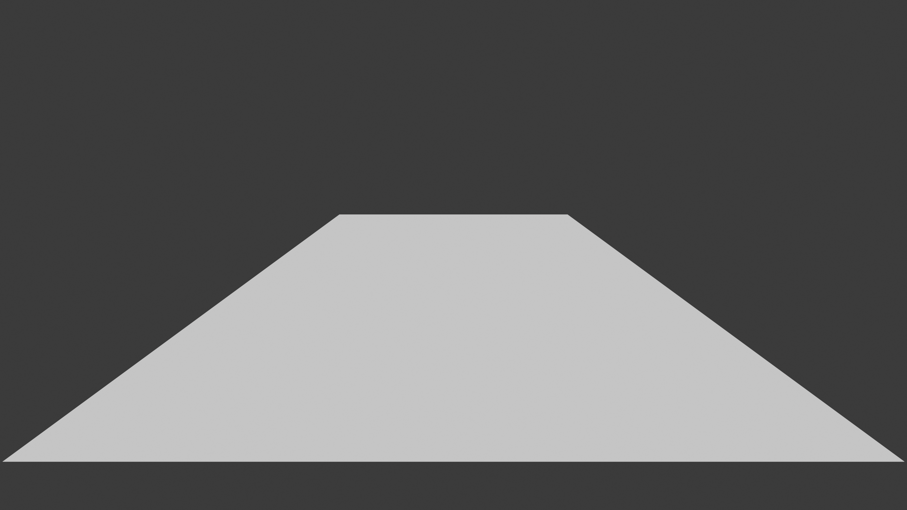
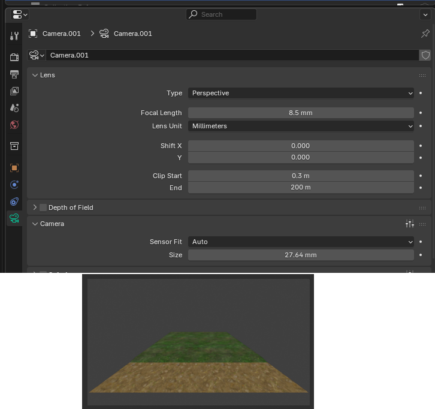
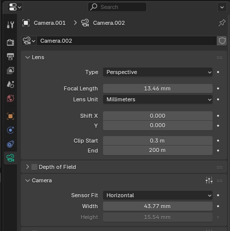

相機3(生成相機 CAM_GEN2,21.10mm 反解)— 視角(貼材質灰盒滿框):


---

## 相機2 的設定:8.5mm 視野計算成 13.46mm + Sensor Fit

**FOV 只由「sensor 尺寸 ÷ 焦距」比值決定;Resolution 不改視野,只決定用多少像素畫。**
要「拿到 8.5mm 那組的視野、但 focal 維持 13.46mm」,旋鈕只有 sensor;
之後要「改 Resolution X 擴橫向」,靠 Sensor Fit 鎖對方向。

| 步驟 | 做法 |
|---|---|
| ① 視野等效換算 | sensor = 27.64 × 13.46/8.5 = **43.77mm**(**13.46mm/43.77 ≡ 8.5mm/27.64**,水平視角同 116.81°,逐像素相同) |
| ② 改成橫向可擴 | **Sensor Fit = Vertical** + Height = 43.77 × 1080/1920 = **24.62mm** → 之後只加大 Resolution X,直向構圖不動、往左右多看 |

Sensor Fit 的邏輯:**鎖哪個方向,哪個方向的視野就固定**。
- Vertical fit → 直向鎖死,**改 Resolution X = 真的往左右多看**(直向構圖不動)
- Horizontal fit → 橫向鎖死,改 Resolution X 反而動到直向 — 跟直覺相反,別搞錯

> 換算後畫面與原相機逐像素相同(驗算:24.62 × 1920/1080 = 43.77,
> 水平視角同為 116.81°)。「維持某個焦距數字」只剩匯出/紀錄意義 —
> 焦距單獨一個數字不決定任何東西,永遠是跟 sensor 成對決定視角。

## 相機3:從成品圖反解生成相機

### 為什麼需要

AI 自由生成的品質來自「模型自由」— 它偷走你的相機時,同時給了自己三樣資源
(**品質三資源**):①滿版像素預算 ②自編分佈 ③舒適視角。全鎖 prompt 拿回控制
的同時會沒收這三樣 → 品質垮(悶糊地毯)。解法不是二選一,是**把 AI 喜歡的那顆
相機收編成 Blender 正式相機**:品質資源顯式補回(滿框=像素預算、貼材質灰盒=分佈、
色票板=精緻度),控制由投影鏈保證。

### 反解方法(homography,需要 6 個數字)

**適用前提:** 本解法是「對稱單點透視」簡化解——模組必須在畫面中**左右對稱**
(相機位於模組中線上;檢查法:遠邊中點與近邊中點的 x ≈ 畫布中線,本案
2750/2744 vs 2752 ✓)。模組偏一側或帶偏航角(yaw)的圖不能用這個解,
要另立完整 homography 分解。

輸入:①模組實際寬深 W×D(Blender bbox,含所有 mesh!)②成品圖畫布尺寸
③模組頂面四角在成品圖的像素座標(PS Info 面板讀;斜切角取直邊延長交點)。

**輸入數據長這樣**(照著抄即可):

Blender 讀模組尺寸 — 主體 30×24 與前緣泥土條 30×6(bbox 總深 30,踩坑 #3 的主角):
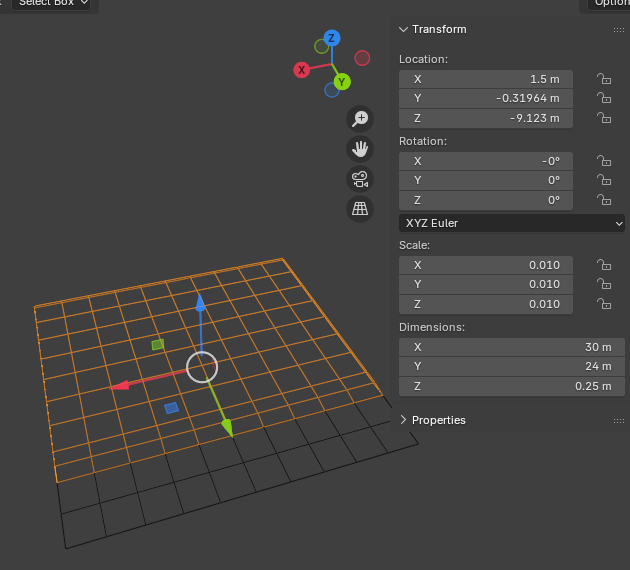
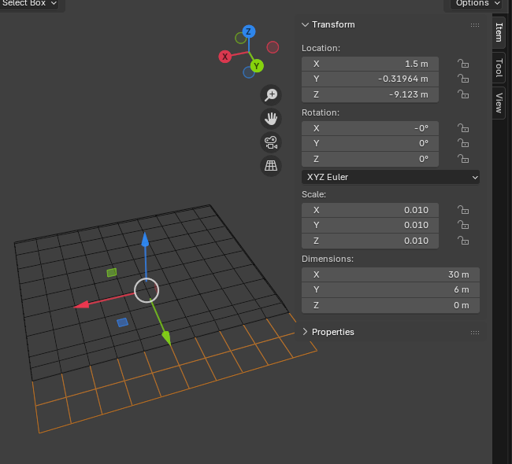

PS Info 面板讀四角像素座標 — 遠邊兩端與近邊兩端:
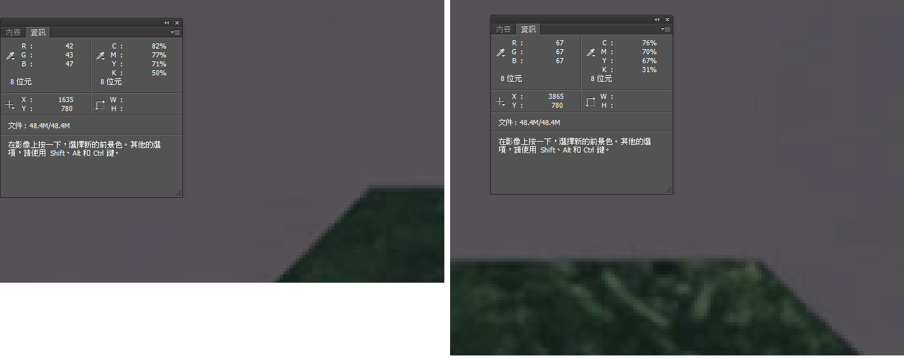
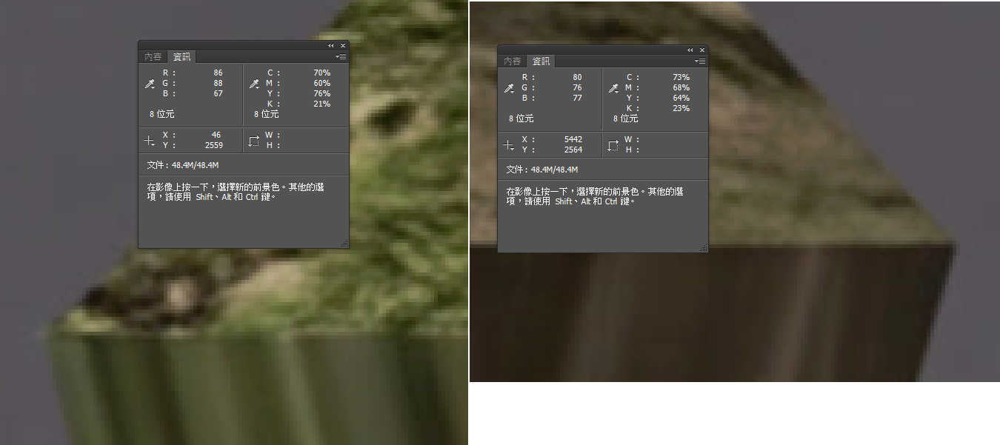

```python
import math
W, D = 30.0, 30.0            # 模組 bbox 實際寬深(m)— 深度含前緣條!
cw, ch = 5504, 3072          # 成品圖畫布
farL, farR = (1635,780), (3865,780)      # 遠邊左右端(像素)
nearL, nearR = (46,2559), (5442,2564)    # 近邊左右端
cx, cy = cw/2, ch/2
a1 = (nearR[0]-nearL[0])/2; a2 = (farR[0]-farL[0])/2
v1 = (nearL[1]+nearR[1])/2; v2 = (farL[1]+farR[1])/2
hw = W/2
s  = hw*((v1-cy)/a1 - (v2-cy)/a2)/D      # sin(俯角)
th = math.asin(s)
f  = D*math.cos(th)/(hw*(1/a2 - 1/a1))   # 焦距(px)
Z1 = hw*f/a1
b2 = (v1-cy)*Z1/f
d1 = Z1*math.cos(th) - b2*math.sin(th)   # 相機到近邊水平距離
h  = Z1*math.sin(th) + b2*math.cos(th)   # 相機高於模組頂面
print(f"俯角 {math.degrees(th):.2f}°(rotX {90-math.degrees(th):.2f}°)")
print(f"焦距 {f*36/cw:.2f}mm, 高 {h:.2f}m, 距近邊 {d1:.2f}m")
```

本案定案值(重投影誤差 ≤8px/5504):**俯角 31.94°(rotX 58.06°)、21.10mm、
高於頂面 14.32m、距近邊 12.20m、畫布 5504×3072**。

### CAM_GEN2 建立腳本(讀世界座標,自動判前向)

```python
import bpy, math
from mathutils import Vector

PITCH_DEG = 31.94   # ← 填反解結果
LENS_MM   = 21.10
CAM_H     = 14.32
DIST_NEAR = 12.20
AZ_FLIP   = True    # 渲出來前後顛倒就切換重跑

meshes = [o for o in bpy.context.selected_objects if o.type == 'MESH']
assert meshes, "先選取模組全部 mesh(主體+前緣條)再執行"
corners = [o.matrix_world @ Vector(c) for o in meshes for c in o.bound_box]
center  = sum(corners, Vector()) / len(corners)
top_z   = max(c.z for c in corners)

tgt = bpy.context.scene.camera
d = (tgt.matrix_world.translation - center) if tgt else Vector((0, -1, 0))
front = Vector((d.x, d.y, 0)).normalized()
if AZ_FLIP: front = -front

half_depth = max(abs((c - center).dot(front)) for c in corners)
th = math.radians(PITCH_DEG)
cam_data = bpy.data.cameras.new("CAM_GEN2"); cam_data.lens = LENS_MM
cam = bpy.data.objects.new("CAM_GEN2", cam_data)
bpy.context.scene.collection.objects.link(cam)
cam.location = center + front * (half_depth + DIST_NEAR)
cam.location.z = top_z + CAM_H
F = -front * math.cos(th) + Vector((0, 0, -math.sin(th)))
cam.rotation_euler = F.to_track_quat('-Z', 'Y').to_euler()
```

### 執行與鎖檔 check

**執行:** 先在空白處點一下**取消全選** → 只點選目標模組(的全部 mesh)→
Run Script,會建一顆 `CAM_GEN2`。

**選取注意(踩坑 #5 的操作面):** 場景裡若有多份灰盒副本
(GRAYBOX_A、A01、A02…),腳本是拿「**所有選取物件的總包圍盒**」計算——
多選到別的模組,包圍盒被撐大,相機被擺遠,目標模組在畫框裡就變小。
重跑前務必取消全選再只選目標。

**三個必要條件,缺一就對不上:**

1. **渲染解析度 = 反解畫布**(本案 5504×3072)——整組解綁定這個畫布,換比例就歪
2. **模組 = 反解時量的那塊**(本案 30×24m+前緣條)——換尺寸不同的模組要重新反解
3. **相機建好後不要再手動移動**——要調整一律改腳本常數重跑,保持可重現

**驗收與鎖檔:** CAM_GEN2 渲染灰盒 → PS 疊到來源成品圖上 50% 透明度,
梯形四邊應幾乎重合(誤差個位數像素)。重合即鎖檔——這顆就是「成品圖相機」,
整套 tile 全用它,一個數字都不改。成品圖近邊以下的 diorama 厚度剖面帶
蓋不到是正常的(那是 AI 畫的側面,本管線不復刻)。

**鎖檔後接管線:** 貼材質灰盒渲染 → 活化 pass → 頂光 pass →
CAM_GEN2 投影 → 正交頂視攤平/出圖。

### 手動微調旋鈕(不走反解時的近似法)

| 旋鈕 | 管什麼 | 調法 |
|---|---|---|
| 俯角(rotX) | 看到多少地面深度 | 90°=平視;58°≈俯視32°;越俯看到越多表面 |
| 焦距+距離(成對) | 梯形收斂強度 | 長焦+遠=平行感;短焦+近=近大遠小 |
| 對照指標 | 遠邊寬÷近邊寬 | AI 舒適區參考值 ≈ 0.4~0.6;模組滿框留 2~4% 邊 |

---

## 投影攤平交付(相機3 的下半場)

生成品從 CAM_GEN2 投影回模組後,**正交頂視攤平**(ortho 相機垂直向下,
Orthographic Scale = 模組寬,方形解析度)→ 得到平面二方連續貼圖。

投影覆蓋範圍(桃紅 = 生成圖蓋到的區域;邊角細條蓋不到):
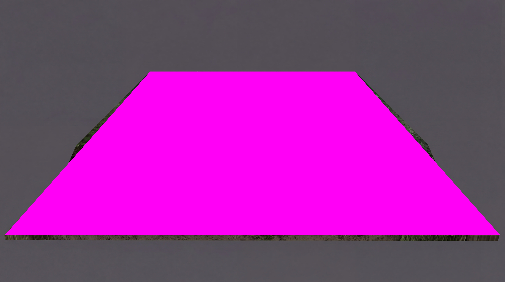

回貼後待修補區(桃紅細縫 = 投影開天窗處,畫框留邊+斜切角所致 — 預期現象,
PS 內容感知補,收在攤平之後做):
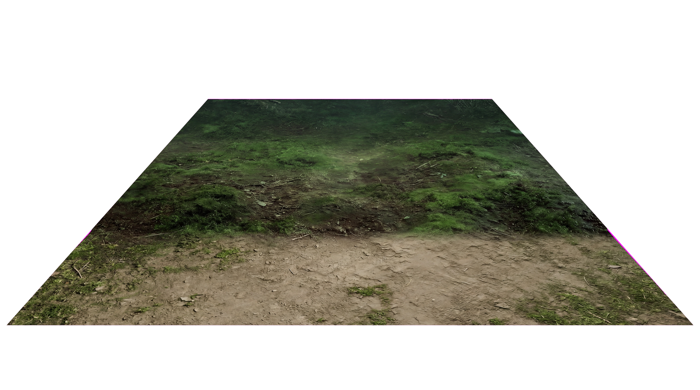

- ✅ 修縫在無透視變形的平面空間做(offset 50%),最準
- ✅ 頂光/均勻光規格與貼圖空間自洽 → 可旋轉、可翻轉復用
- ⚠️ **唯一的稅:texel 前後密度差**。生成圖裡前段約 180 px/m、後段約 74 px/m,
  攤平後後半較軟 → 100% 原寸檢查,不足就對攤平貼圖跑 B1 材質保真 pass 補
- 備選路線 D(單張 hero 用):自由生成 → PS 四角 Distort 對位 → 投影。
  homography 對平面精確、緩坡只是近似;且每次自由生成重新發明分佈/色調,
  量產一致性給不了 — 套圖一律走反解相機路線

## 踩坑紀錄

| # | 現象 | 根因 | 解法 |
|---|---|---|---|
| 1 | 自由生成:相機漂成 3/4 diorama、附贈厚度側邊、前景變日光、霧烙入 | 素灰盒幾何訊號弱 + 輸入 1:1 輸出 16:9 強迫重構圖 + 中文弱約束 prompt(「參考」不是鎖)+ NB2 對空背景模組的 diorama 先驗 | 貼材質灰盒 + 輸出比例=輸入比例 + 鎖句 prompt(camera FINAL / do NOT crop, zoom, outpaint / no slab thickness) |
| 2 | 全鎖後品質垮(悶糊均勻地毯) | 品質三資源被沒收:像素預算(模組只佔畫面四成)、分佈無人負責、舒適視角沒了 | 反解相機滿框(=像素預算)+ 貼材質灰盒(=分佈)+ 材質色票板(=精緻度) — 資源顯式補回 |
| 3 | 反解相機遠邊對不齊 | 反解假設深度 24m,實際 bbox 30m(漏算前緣條) — 同一個梯形有無限組相機,只有深度對的那組四邊同時合 | 反解的 W×D = **實際選取 mesh 的 bbox** 尺寸;證據:腳本相機落點距中心 20.74 = 15+5.74 反推出 bbox 半深 15 |
| 4 | 相機 rig 的 N 面板數值算不出世界位姿 | Unity 匯入相機掛六層父子鏈,面板顯示的是局部座標 | 不手抄面板;腳本用 `matrix_world` 讀世界座標 |
| 5 | 跑腳本後模組在畫框裡過小 | 選取物件不對(多選其他灰盒副本/漏選)→ bbox 撐大或偏移 | 跑前取消全選,只選目標模組的**全部** mesh(主體+前緣條) |
| 6 | 成品貼圖帶前後亮度梯度(遠緣亮 25~30%,實測) | 灰盒渲染的打光/視角相依效果被烙進生成品 | GEN 渲染用**平均無方向光**;驗收加「旋轉 180° 自比」檢查 |
| 7 | 要擴橫向視野卻改了 Horizontal fit | Sensor Fit 鎖哪向哪向固定,Horizontal 下改 Resolution X 動到的是直向 | 擴橫向 = **Vertical fit** + 換算 Height(見相機2 節) |
| 8 | 模組側面白色楔形進了生成輸入 | 厚度側面沒指定材質,預設白最誘發誤讀(高光/雪/紙邊) | 側面指定深色材質(近背景色);畫框留邊防切角(切出框的部分投影開天窗) |

### 踩坑 #2 現場重建(輸入 × prompt × 輸出)

當輪輸入(素灰盒渲染 — 像素裡沒有任何分佈圖案)與平台設定:
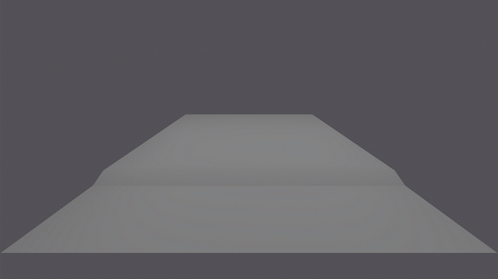
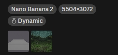

當輪逐字 prompt:

```text
Reference image 1 is the BASE — a game ground module (a forest walkway
with a gentle rise at the back) rendered with a flat placeholder
texture. Its camera, perspective, outer silhouette, empty background,
and the soil/moss distribution PATTERN are all correct and FINAL.
Keep them EXACTLY — do NOT crop, zoom, extend, outpaint, or change
the camera angle. The module is a flat textured surface — no 3D slab
thickness, no visible side faces, no diorama presentation.

Reference image 2 is the MATERIAL SWATCH — use it ONLY for material
quality and palette: how moss, soil and litter look at small scale.
Nothing from its composition may appear in the result.

TASK: bring reference 1's exact pattern to life at reference 2's
fidelity.
- FRONT walkway area: packed, compacted damp dark earth, fully matte,
  fine mud grain, sparse moss — a well-trodden forest path.
- BACK rise area: undisturbed forest floor — low spongy moss cushions,
  fine leaf litter, thin twigs.
- Add gentle natural micro-relief; the outer silhouette stays unchanged.

LIGHTING: soft, even, non-directional ambient light — no sun, no cast
shadows, uniform exposure across the whole module — no vignette, no
left-right or front-back brightness gradient. NO fog, no mist, no haze.
Muted dark teal-green night palette — do not brighten. No standing
grass tufts or grass blades, no bushes, no trees, no rocks, no props.
The background stays empty exactly as reference 1.
```

當輪輸出(悶糊均勻地毯):
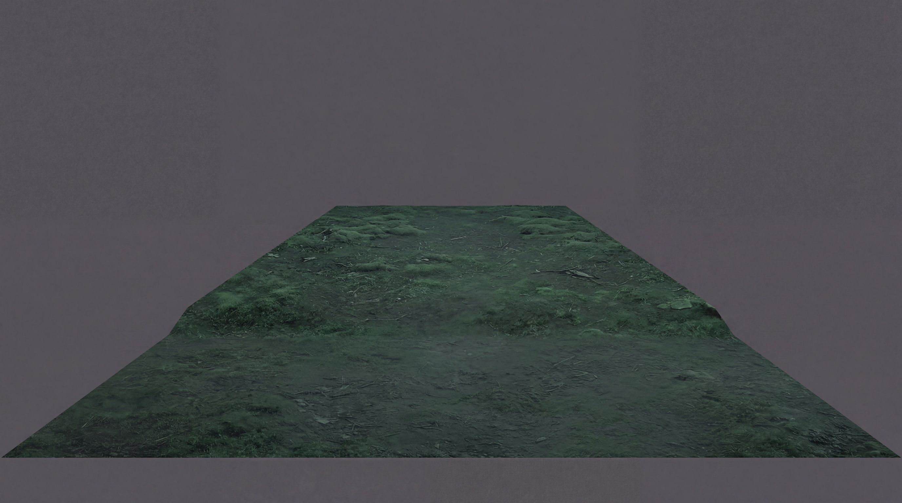

**分析 — prompt 無罪,錯在輸入沒有兌現 prompt 的前提:**

1. prompt 宣告 BASE 帶著 `flat placeholder texture ... distribution
   PATTERN ... correct and FINAL` — 但實際輸入是**素灰盒**,像素裡沒有
   任何圖案。「圖案活化」任務找不到可活化的圖案,模型只能做最安全的
   均勻填充;鎖句同時封死了它即興補救的路。**鎖句型 prompt 的前提 =
   輸入自帶真相**,輸入空白時宣告變成空頭支票。
2. LIGHTING 段要求均勻、無梯度、暗色不提亮 — 模型**全部服從** →
   均勻+暗+零光影調變 = 悶糊地毯。**每一個鎖都執行成功,品質卻垮掉**:
   因為品質三資源(像素預算/分佈/精緻度)一項都沒補。
3. prompt 無罪的最好證明:**同一份 prompt**,後來配上貼材質灰盒 +
   CAM_GEN2 滿框輸入,直接變成 B4 森林 master 的勝利 prompt —
   一字未改,換輸入而已。

## 學到的(可複用結論)

- ✅ **相機解耦是像素預算問題的根治解**:Crop-Gen-Paste 是補丁,滿框生成相機
  把問題從源頭消掉——補丁技法變多,通常是路線錯的訊號。
- ✅ **AI 的相機可以被收編**:自由生成的「意外好視角」不是抽獎結果,是模型
  舒適區的座標——反解一次、鎖檔、全套沿用,舒適區紅利變成固定資產。
- ✅ **品質和控制不是二選一**:品質的來源(像素/分佈/精緻度參考)每一項都能
  顯式補回,補齊後全鎖 prompt 不再犧牲品質。
- ✅ **確定性轉換優先**:透視轉換用投影(幾何精確、每張一致、緩坡也對),
  不用 PS 手拉(每張手工、平面近似);調色歸 PS 預設(B5 鏈要短原則同源)。

## 附錄:用 Resolution 擴投影/出圖視野的通用規則(雙向)

> 出圖/投影畫面範圍要變大時查此表。適用於相機2(出圖相機),
> 同理可用於任何 Blender 相機。

**Sensor Fit 鎖哪個方向,哪個方向的視野固定 → 想用 Resolution 擴某方向,
Fit 就鎖「另一個」方向:**

| 需求 | Sensor Fit | 動哪個 Resolution | 例 |
|---|---|---|---|
| 左右擴(上下不動) | **Vertical**(鎖直向) | 加大 **Resolution X** | sensor 換算節步驟② |
| 上下擴(左右不動) | **Horizontal**(鎖橫向) | 加大 **Resolution Y** | 13.46mm/Width 27.64、3840×2160 → Y 調 2880:等效高度 15.54 → 20.73mm,上下視野 +33%,左右零變化 |

- 擴展以視線軸為中心**對稱**發生;只想往**單邊**多看用 **Shift X/Y**
  (鏡頭位移,平移取景框、透視線不變,不是轉相機)——兩招可疊用:
  Resolution 擴總量、Shift 調偏向。
- **自檢法**:改完 Resolution 後看灰掉的另一向 sensor 數字(如 Horizontal
  fit 下的 Height)有沒有跟著變——有變 = 視野真的擴了;沒變 = Fit 方向鎖錯。

「上下擴」實例設定(改 Resolution Y / Horizontal fit,Width 27.64 不動):
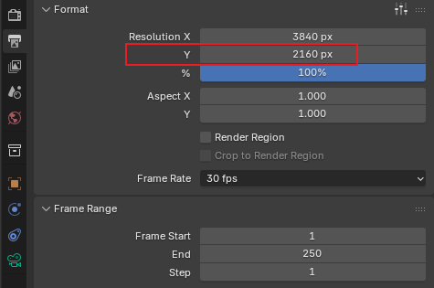
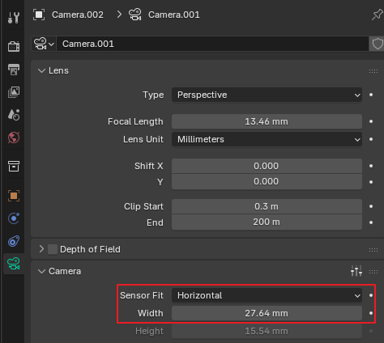

## 圖檔

✅ 已入庫 15 張:反解輸入 ×4、三相機 render/lens/視角/調整後數據 ×6、
投影範圍/待補區 ×2、踩坑 #2 現場重建(輸入/設定/輸出)×3。
選配:`b6-diorama-drift.jpg`(踩坑 #1 的自由生成 diorama 圖 —
即反解量四角座標時在 PS 開的那張 5504×3072 原始成品圖,找得到再補)。
