# 實戰紀錄 — B7 三相機 → Unreal 重現(相機1 ✅ 相機2 ✅)

> 目標:[B6](B6-three-camera-pipeline.md) 的三相機(遊戲/出圖/生成)在 Unreal
> 裡重現**逐像素相同的鏡頭畫面**。第一階段先做相機1(遊戲相機)。
> 路線:數值直搬(確定性轉換),不走 FBX 相機匯入(filmback 常被改寫)。
> B6 在分支 `claude/b2-greybox-experiment-fgsc06` 上。

**🔑 關鍵字:** `B7`、`Unreal 相機`、`UE 相機`、`CineCamera`、`filmback`、
`相機搬 UE`、`Blender 轉 Unreal`、`座標系轉換`、`FOV 水平垂直`

## 狀態

- ✅ **相機1 實機驗收通過**(2026-07-11,UE 5.5)— Blender→UE 轉換路線成立
- ✅ **相機2 實機驗收通過**(2026-07-11)— UE Current HFOV 對上 116.81°
- 階段:①相機1 ✅ → ②相機2 ✅ → ③相機3 CAM_GEN2(待做)

## 快速摘要(整條流程三步)

1. **Blender** 開 B6 場景,確認 scene camera = 相機1,執行
   `tools/unreal-camera-port/blender_cam_export.py` → 得 `cam_unreal.json`
   (它讀 `matrix_world`,承 B6 踩坑 #4,六層 rig 不用手抄面板)
2. 同一個 .blend 把模組 mesh(主體+前緣條)用**預設 FBX** 匯出 →
   UE 匯入,擺原點零旋轉
3. **UE** 啟用 Python plugin,改 `unreal_cam_import.py` 的 `JSON_PATH`
   後執行 → 生成相機(景深已自動關掉,避免誤判)

細節、踩坑、逐步圖解見下方「SOP §0–§13」;做相機2/3 只換相機名與 json 檔名。

## 工具(已入庫)

| 檔案 | 跑在哪 | 做什麼 |
|---|---|---|
| [`tools/unreal-camera-port/blender_cam_export.py`](../../tools/unreal-camera-port/blender_cam_export.py) | Blender Text Editor | 讀相機 `matrix_world`(B6 踩坑 #4:多層 rig 不抄面板)+ Sensor Fit 展開,轉 UE 座標,寫出 `cam_unreal.json` |
| [`tools/unreal-camera-port/unreal_cam_import.py`](../../tools/unreal-camera-port/unreal_cam_import.py) | UE Python(Output Log → Cmd 切 Python) | 讀 json 生成 CineCameraActor,filmback/focal 照抄、位姿套用、關景深 |
| [`tools/unreal-camera-port/locked/cam1_unreal.json`](../../tools/unreal-camera-port/locked/cam1_unreal.json) | (資料檔) | **相機1 鎖檔 json**(2026-07-11 驗收通過那份)— 日後在任何 UE 專案重現相機1,拿這份跑 import 腳本即可,**不必重做 Blender 匯出** |
| [`tools/unreal-camera-port/locked/cam2_unreal.json`](../../tools/unreal-camera-port/locked/cam2_unreal.json) | (資料檔) | **相機2 鎖檔 json**(同日驗收通過)— 用法同上 |

### 重現與擴充規則(鎖檔後)

- **重現**:json = 鎖檔資產。任何 UE 專案:啟用 Python 外掛 →
  `unreal_cam_import.py` 的 `JSON_PATH` 指向 `locked/` 裡的 json → 執行,
  相機分毫不差回來。Blender 半場只在**相機本身動了**時才需要重跑。
- **擴充**(相機2/3):每顆各做一次匯出 → 驗收 → json 入 `locked/`,
  命名 `cam2_unreal.json`、`cam3_unreal.json`。做完三份,整組三相機
  在 UE 的重現能力就永久固定,与素材/主題無關。

### cam_unreal.json 是什麼

兩支腳本之間的**交接檔**:Blender 和 Unreal 是獨立軟體,腳本不能直接對話,
所以 Blender 端把「重建這顆相機需要的所有數字」打包成一個 JSON,
UE 端腳本照單全收建出一模一樣的相機。

```
Blender(有相機1的場景)                Unreal(空關卡)
blender_cam_export.py  →  cam_unreal.json  →  unreal_cam_import.py
       (寫出)              (同機路徑/隨身碟)        (讀入,照著建相機)
```

三件套實體(兩支腳本 + 交接檔,放同一資料夾最好找):
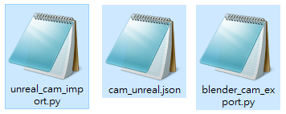

裡面裝什麼(全部是**已轉換成 Unreal 格式**的值):

| 欄位 | 內容 | 例子 |
|---|---|---|
| `focal_mm` | 焦距 | 13.46 |
| `sensor_mm` | 有效 sensor 寬高(Sensor Fit 已展開) | 27.64 × 15.5475 |
| `location_cm` | 相機世界位置(已做 Y 鏡像 + 公尺→公分) | 如 [0, 1000, 500] |
| `rotator_deg` | UE 的 pitch/yaw/roll(已從 Blender 旋轉反解) | 如 pitch −20 |
| `fov_deg` | 換算出的水平/垂直 FOV — 給 UE 面板**驗算**用 | 91.51 / 60.02 |
| `resolution`、`clip_m`、`name` | 解析度、裁剪距離、相機名 | 紀錄與命名用 |

它幫你避開的坑:相機1 掛在 Unity 匯入的多層 rig 裡(B6 踩坑 #4),
面板顯示局部座標,手抄必錯;座標系轉換(右手→左手、公尺→公分)與
Sensor Fit 展開也容易算錯方向——全部由匯出腳本算好、凍結在 JSON 裡,
**不手抄任何數字**。

檔案位置:執行 Blender 腳本後存在 **.blend 檔旁邊**(同資料夾)。
Blender 與 Unreal 不在同一台機器時,複製這個 JSON 過去即可——
它是純文字的「相機身分證」,記事本也能開。

## 相機1 參數與換算

Blender 端(來源:B6 `b6-cam1-lens.png`):

| 項目 | 值 |
|---|---|
| Focal Length | 13.46 mm |
| Sensor | 27.64 mm,Sensor Fit = **Auto** |
| Resolution | 1920×1080(16:9,Auto → 27.64 吃橫向) |
| 有效 sensor | **27.64 × 15.5475 mm**(27.64 × 1080/1920) |
| 水平 FOV | 2·atan(13.82/13.46) = **91.51°** |
| 垂直 FOV | **60.02°** ≈ Unity 標準 vFOV 60° ← 佐證這顆確實是 Unity 遊戲相機 |
| Clip | 0.3 – 200 m |

Unreal 端(CineCameraActor)——**照抄,不換算**:

| CineCamera 欄位 | 值 |
|---|---|
| Filmback → Sensor Width | 27.64 mm |
| Filmback → Sensor Height | 15.5475 mm |
| Current Focal Length | 13.46 mm |
| Current Aperture | 22(縮小光圈)+ Focus Method = Disable(關景深) |
| 驗算 | 細節面板 Current FOV 應顯示 ≈ 91.5°(UE 的 FOV 是**水平**) |

> ⚠️ 別用普通 Camera Actor 的 FOV 欄位對數字:UE 的 FOV 定義是**水平**、
> Unity 是**垂直**,「都填 60」會差一大截。CineCamera 走 filmback+focal
> 這條路完全繞開 FOV 定義差異 —— 與 B6 的結論同源:焦距永遠跟 sensor
> 成對決定視角,照抄整對就零誤差。

## 座標系對照(為什麼是 x, −y, z ×100)

| | 手性 | Up | 單位 | 相機朝向 |
|---|---|---|---|---|
| Blender | 右手 | Z | m | 局部 −Z(up = 局部 +Y) |
| Unity | 左手 | Y | m | 局部 +Z |
| Unreal | 左手 | Z | cm | 局部 +X(rotator:pitch/yaw/roll) |

- Blender → UE:**(x, y, z) → (x, −y, z)**,位置 ×100。一個 Y 鏡像補齊
  右手↔左手差,這也正是 Blender 預設 FBX 匯出 → UE 預設匯入對 mesh 做的事,
  所以**相機(本腳本)與模組 mesh(FBX)各走各的路,到 UE 會重合**。
- Rotator:yaw/pitch 從 forward 向量反解,roll 從 up 對比「無滾轉 up」取角
  (已用已知位姿驗算:朝 −Y 俯 20° → yaw −90° / pitch −20° / roll 0 ✓)。
  Unity rig 帶滾轉也照搬,不假設 roll = 0。

## SOP(相機1)— 逐步實操全紀錄(2026-07-11 實測定稿)

> 以下是相機1 實際走通的每一步,含 UI 位置與當場踩的坑。
> 相機2/3 照抄本節,只換 §2 的相機名與 §4 的 json 檔名。

### §0 前置:抓兩支腳本(一次性)

1. GitHub repo → 分支 `claude/unity-camera-unreal-export-m50ht8` →
   `tools/unreal-camera-port/`,兩支都要:
   `blender_cam_export.py`、`unreal_cam_import.py`
2. 開檔案點 **Raw** → 右鍵另存。⚠️ Windows 會偷加 `.txt` 變
   `*.py.txt`:檔案總管 **檢視 → 顯示 → 副檔名** 打開,**F2** 刪掉尾巴
   `.txt`(Blender 端不改也能跑,**UE 端執行檔案必須是 `.py`**)

抓法圖解(Raw → 另存新檔;`locked/cam1_unreal.json` 鎖檔也同法可抓):
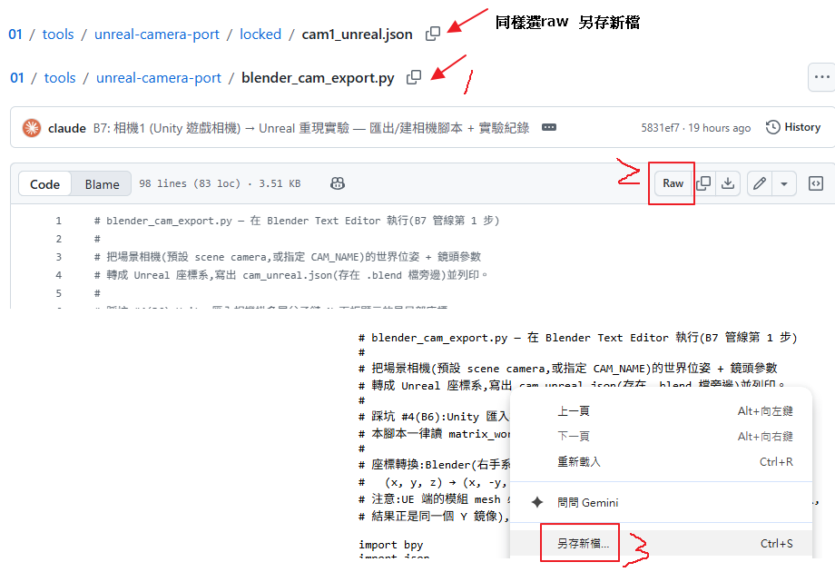

### §1 Blender:確認渲染解析度(先做!)

Properties → **Output 頁籤**(印表機圖示)→ Resolution X/Y = **1920×1080**。

- 實測第一輪就栽在這:場景殘留 4096×2286(成品圖比例),垂直 FOV 跑成
  59.61° ≠ 遊戲的 60°。**解析度比例參與 sensor 換算,必須先對**
- 水平視野跟解析度無關(Auto fit 橫向吃 sensor),錯的只有直向

### §2 Blender:認出相機、填 CAM_NAME

1. Outliner 展開相機 rig。本案六層:
   `[System] → CameraSystem Variant → MainCamera → WorldAnchor → LocalAnchor → Camera`
2. **判讀規則:橘色圖示 = 物件;物件底下縮排的綠色攝影機圖示 = 資料塊**。
   要填的是**物件**名 → 本案 = 倒數第二層的 `Camera`
   - ⚠️ 第三層空物件叫 `MainCamera`、相機資料塊也叫 `MainCamera` —
     **絕不填 MainCamera**,會抓到 rig 中間的空物件
3. 工作區頁籤切 **Scripting** → 文字編輯器 **Open** → 選
   `blender_cam_export.py` → 改第一個參數:`CAM_NAME = "Camera"`
   (scene camera 已是目標相機的話留 `""` 也行)

六層 rig 判讀 + CAM_NAME 填法(紅箭頭 = 要填的物件;其下綠色圖示為資料塊):
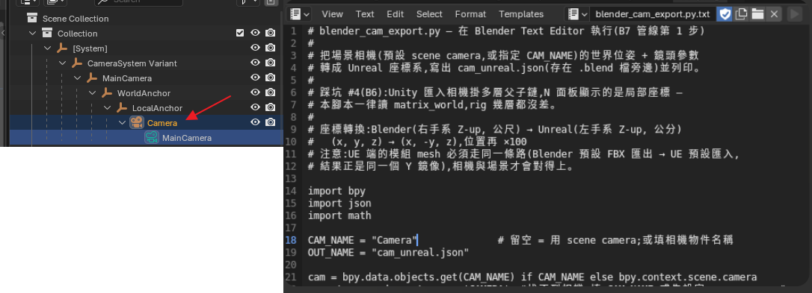

### §3 Blender:執行匯出

1. **Text 選單 → Run Script**(視窗太窄時右上角 ▶ 會被擠不見 —
   選單這條路永遠在;或滑鼠停在編輯器上按 Alt+P)
2. 執行紀錄出現打勾的 `bpy.ops.text.run_script()` = 成功(紅字 = 失敗):
   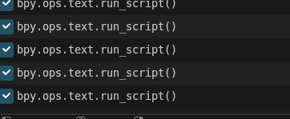
3. 產出 `cam_unreal.json` 在 **.blend 檔旁邊**(⚠️ .blend 沒存過檔會
   寫不出來 → 先 Ctrl+S 再跑)

### §4 檢查 json(記事本開)

| 欄位 | 相機1 正解 | 錯了代表 |
|---|---|---|
| `name` | `Camera` | 出現 `.001` 後綴 = 場景有重複相機,刪複製品重跑 |
| `focal_mm` | 13.4622 | 抓錯相機 → 回 §2 |
| `sensor_mm` | 27.6352 × 15.5448 | 解析度/Sensor Fit 不對 → 回 §1 |
| `fov_deg.vertical` | 60.0 | 同上(≈59.6 = 還在 4096×2286) |
| `resolution` | [1920, 1080] | 回 §1 |

實測時 `name` 一度變 `Camera.001`(誤複製了相機,位姿相同故數據無害)—
刪掉複製品重跑,以乾淨的 `Camera` 定案。

json 定案版(記事本檢視):
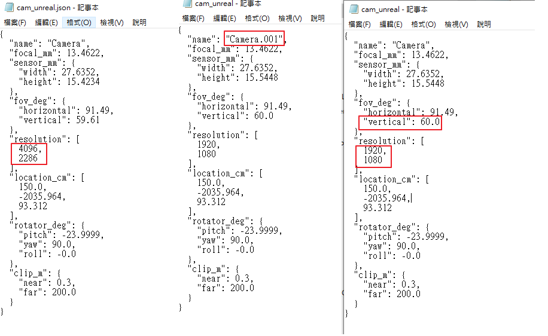

### §5 Blender:渲基準圖

確認 scene camera = 相機1(Scene 頁籤 Camera 欄)→ **F12** →
Image → Save As → `cam1_blender_base.png`(1920×1080,驗收的標準答案)

### §6 模組 FBX → UE

1. Blender:空白處點一下**取消全選** → 只選模組**全部** mesh
   (主體+前緣泥土條;別選到其他灰盒副本 — B6 踩坑 #5)
2. File → Export → FBX → 勾 **Limit to: Selected Objects**,其餘**全預設**
3. UE:FBX 拖進 Content Browser(預設選項)→ mesh 拖進關卡 →
   Details 把 **Location/Rotation 全部歸零** — 世界位置已烙在 FBX 頂點裡,
   actor 必須在原點,相機才對得上

### §7 UE:啟用 Python(一次性)

**Edit → Plugins** → 搜 `python` → 勾 **Python Editor Script Plugin**
(Scripting 分類)→ **Restart Now**。
驗證:Window → Output Log → 底部輸入列最左下拉多了 `Python` 選項。

### §8 UE:改 JSON_PATH

記事本開 `unreal_cam_import.py`,改這行:

```python
JSON_PATH = r"C:\Users\USER\Downloads\cam_unreal.json"
```

- 路徑不會打?檔案總管 **Shift+右鍵 json → 複製路徑** → 貼進引號
- 反斜線 `\` 沒關係,**引號前的小寫 `r` 必須保留**
- 改完 Ctrl+S

改哪裡(紅框 = 換成你的 json 路徑):
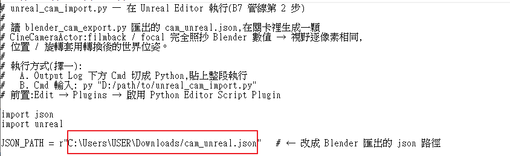

### §9 UE:執行腳本(用「路徑執行法」)

Output Log 底部輸入列 → 左邊下拉切 **Python** → 輸入**腳本檔完整路徑**一行,Enter:

```
C:/Users/USER/Downloads/unreal_cam_import.py
```

- ⚠️ **不要整段貼腳本內容**:UE console 看到內容含 `.py` 字樣會把輸入
  當檔名載入,報 `Could not load Python file '# unreal_cam_import.py'`
  (實測踩到)。Python 模式下「輸入一個 .py 路徑 = 執行那個檔」最穩

  貼整段的失敗現場(最後一行紅字即該錯誤):
  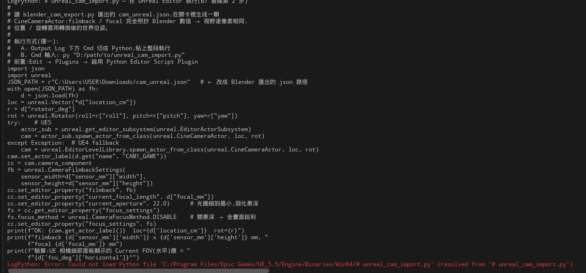
- 成功輸出:`OK: Camera loc=[150.0, -2035.964, 93.312] ...` +
  filmback/focal + FOV 預測行,Outliner 多一顆 `Camera`(CineCameraActor)

成功現場 — 模式下拉(Cmd/Python)+ 路徑輸入 + OK 輸出:
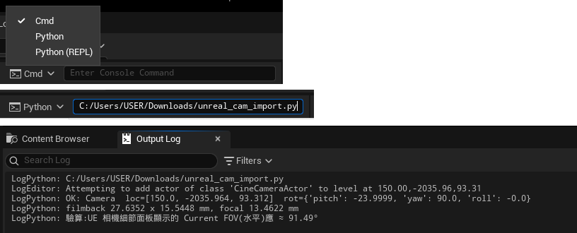

### §10 UE:面板驗數

點相機 → Details:

| 搜尋 | 應顯示 |
|---|---|
| Transform | Location (150, −2035.964, 93.312);Rotation (0, −23.9999, 90) — UE 順序 Roll/Pitch/Yaw |
| `sensor` | Filmback 27.635201 × 15.5448,Aspect 1.777778 |
| `current` | Focal 13.4622、Aperture 22、Focus = Disable |
| `fov` | **Current Horizontal FOV = 91.492805**(對上腳本預測 91.49 = 視野零誤差)|

`Aspect Ratio Axis Constraint = Maintain X-Axis FOV` 為正確預設,不動。

面板實測三連 — Transform / Filmback / Current FOV:
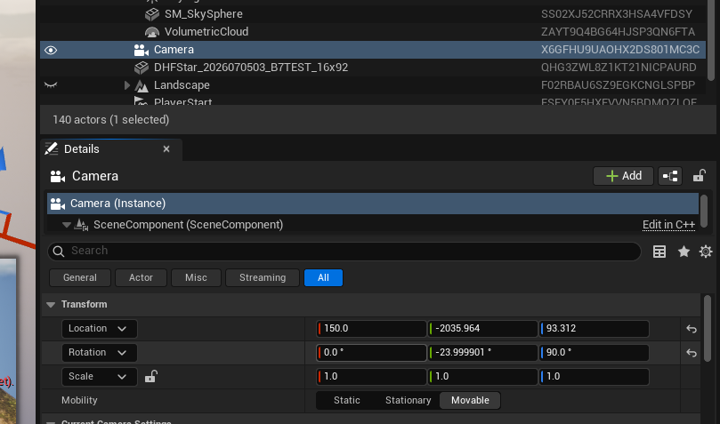
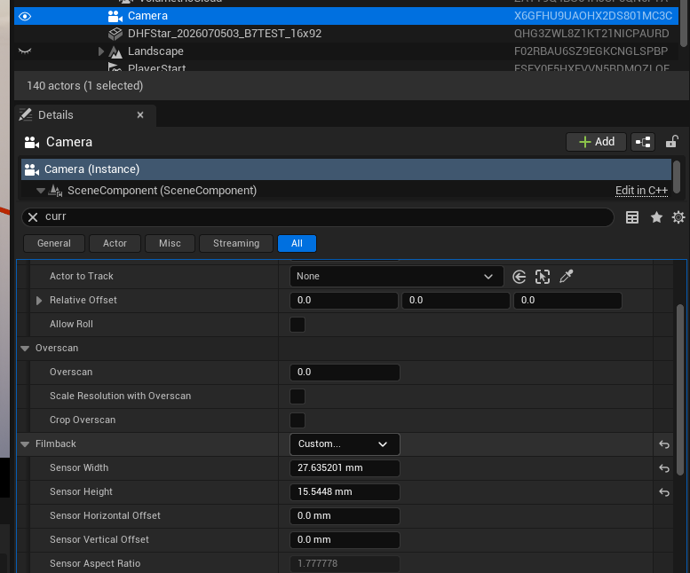
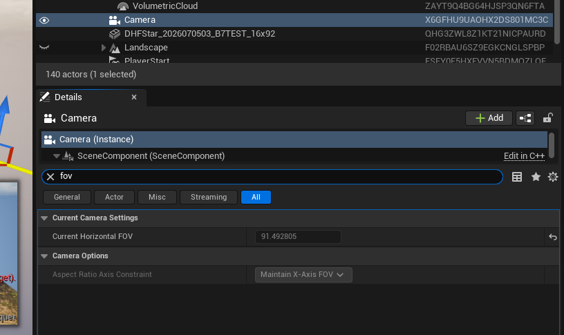

### §11 UE:Pilot 看畫面

- Outliner 右鍵 `Camera` → **Pilot 'Camera'**(或視口左上 `Perspective`
  下拉 → 選 Camera);選中相機時右下也會浮出小預覽窗
- 按 **G**(Game View)藏圖示;上下黑邊 = 16:9 取景框,正常
- ⚠️ **Pilot 中禁用 WASD/滑鼠飛行** — 會直接搬動相機本體!誤動:
  左上 ⏏ 退出 → Ctrl+Z;或重跑 §9 重生一顆
- 退出 Pilot:視口左上橫條的 **⏏**

選中相機時的小預覽窗(此輪同框:顯存超支紅字,見踩坑 7):
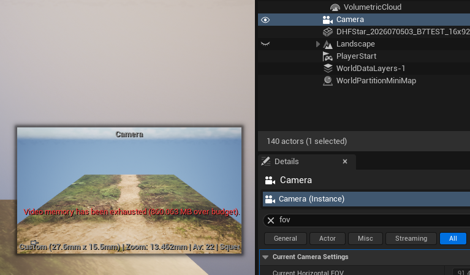

視口切相機視角圖解(Perspective 下拉 → PLACED CAMERAS 選 Camera;
此輪同框:相機1 視角 + 顯存警告 + §9 執行紀錄):
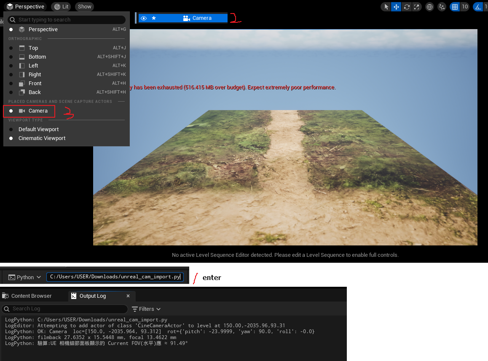

### §12 UE:截圖(Cmd 模式)

輸入列下拉切回 **Cmd**(⚠️ 留在 Python 模式會把指令當程式碼,報
SyntaxError — 實測踩到;口訣:**Cmd 吃引擎指令,Python 吃程式碼**):

```
HighResShot 1920x1080
```

存檔:`<專案>\Saved\Screenshots\WindowsEditor\HighresScreenshot0000N.png`
(每拍編號 +1,拿最大編號;Output Log 也會印出完整路徑)

留在 Python 模式打指令的失敗現場(SyntaxError):
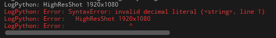

### §13 驗收比對

- UE 截圖 vs §5 基準圖:模組梯形四邊、中央小徑、近緣裁切位置應同座標
- 量化版:PS 兩張疊圖,上層混合模式 **Difference** — 重合處全黑,
  邊緣偏移會浮出細亮線,一眼讀出差幾像素(比 50% 透明度利眼)
- 亮度/霧感/天空不同 = 渲染器差異(天光/大氣霧/自動曝光),與相機無關,
  不列入驗收;之後要比對**材質顏色**時再刪 Fog、曝光改 Manual
- ✅ 相機1 實測:構圖重合,驗收通過 → json 入庫
  `tools/unreal-camera-port/locked/cam1_unreal.json` 鎖檔

驗收對照 — UE 相機1 視角(上)vs Blender 基準渲圖(下),
梯形四邊/中央小徑/近緣裁切同座標;亮度與天空差異屬渲染器,不列入驗收:
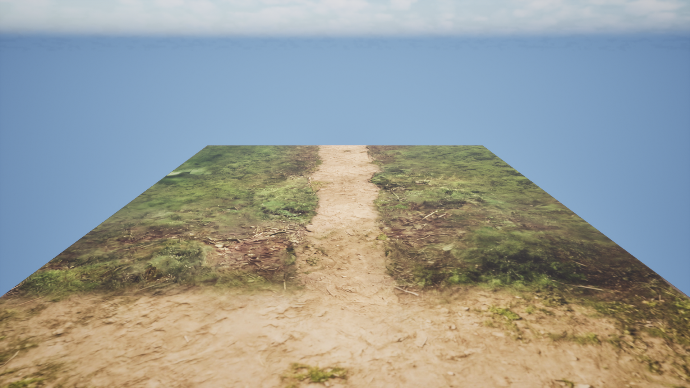
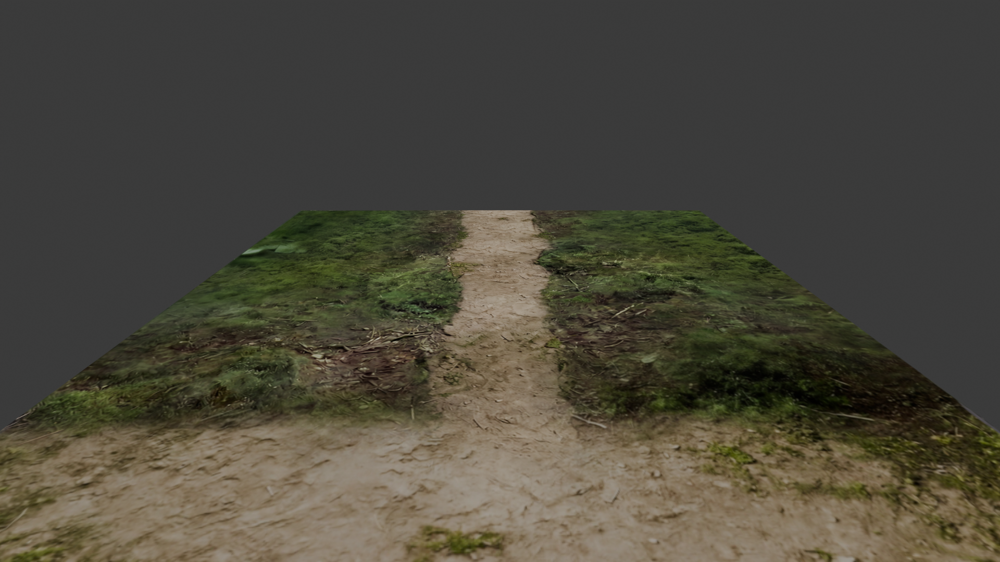

## 圖檔

✅ 已入庫 21 張,零缺圖。
相機1(16):GitHub 抓檔 ×1、三件套 ×1、rig 判讀 ×1、Blender 執行成功 ×1、
json 定案 ×1、JSON_PATH 改法 ×1、UE 執行成功 ×1、UE 面板驗數 ×3、
失敗現場 ×2(貼碼當檔名/模式錯置)、預覽窗+顯存警告 ×1、
視口切相機圖解 ×1、驗收對照 ×2。
相機2(6):Blender 鏡頭面板 ×1、兩套 rig Outliner ×1、json 定案 ×1、
UE FOV 驗證 ×1、驗收對照 ×2。

## 相機1 實測紀錄(2026-07-11 定案值)

json 定案值(比面板的四捨五入值更精確,以此為準):

| 項目 | 定案值 | UE 端實測 |
|---|---|---|
| focal | **13.4622 mm** | Current Focal Length 13.4622 ✓ |
| 有效 sensor | **27.6352 × 15.5448 mm** | Filmback 同值,Aspect 1.777778 ✓ |
| location(UE cm) | **[150.0, −2035.964, 93.312]** | Transform 同值 ✓ |
| rotator | **pitch −24.0° / yaw 90° / roll 0** | Rotation (0, −23.9999, 90) ✓(UE 顯示順序 Roll/Pitch/Yaw) |
| 水平 FOV | 預測 91.49° | **Current HFOV 91.492805** ✓ 零誤差 |

畫面驗收:UE Pilot 視角與 Blender 基準圖構圖相符,通過。
rotator 數字乾淨(整數 −24°/90°)= `matrix_world` 正確攤平了六層 rig。

### 解析度插曲(重要觀念)

第一次匯出 json 時場景 Resolution 是 4096×2286(配合 5504×3072 成品圖比例),
垂直 FOV 算出 59.61° ≠ 遊戲的 60°。改回 1920×1080 重跑才定案。

- **水平視野跟解析度無關**(Auto fit 橫向吃 sensor,永遠 91.49°),
  比例只影響直向多看/少看一點
- **素材不同永遠不需要動相機**(透視不住在貼圖裡,B6 心法):
  json 只在「換相機」時才多一份,最終就是相機1/2/3 各一份,鎖檔沿用
- 5504×3072(1.7917)那個比例屬於**相機3 的反解畫布**,輪到相機3 再用
- 鐵則:驗收時渲圖、json、截圖三處**同一顆相機同一個比例**

## 相機2 實測紀錄(2026-07-11 定案值)

Blender 端原始設定(紅框 = 相機2 身分證:Sensor Fit Horizontal、Width 43.77;
⚠️ 面板灰字 Height 15.54 只是當下比例的預覽值,16:9 輸出的有效高度
= 43.77 × 1080/1920 = **24.62** — 以 json 的 24.6206 為準):
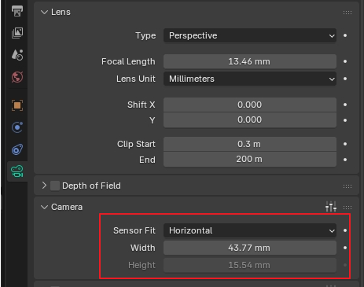

照 SOP §0–§13 走,只換相機名與 json 檔名,一次過:

| 項目 | 定案值 | 對照 B6 |
|---|---|---|
| Blender 物件名 | **`Camera.001`**(資料塊 Camera.002) | B6 `b6-cam2-adjusted` 同名 ✓ |
| focal | 13.4622 mm | 與相機1 同數字(B6 設計如此) |
| 有效 sensor | **43.77 × 24.6206 mm** | B6 換算值 43.77 × 24.62 ✓ |
| 水平 FOV | **116.81°** | B6 定案 116.81° 一字不差;UE Current HFOV 對上 ✓ |
| 垂直 FOV | 84.88° | |
| location / rotator | 與相機1 完全相同 | **證實兩顆同掛點,只差 sensor 寬窄** |
| 鎖檔 | `locked/cam2_unreal.json` | |

json 定案版與 UE 端 FOV 驗證(116.81° 對上):
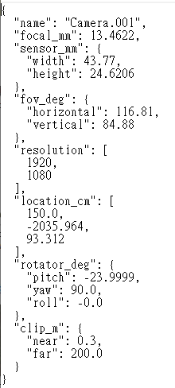
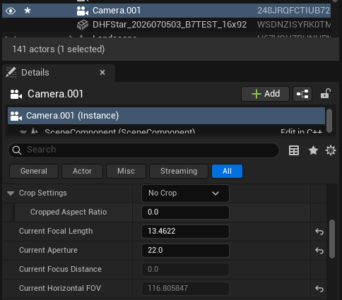

### 相機2 輪的發現與小坑

1. **場景其實有兩套完整 rig**:`[System]` 尾端 = `Camera`(相機1)、
   `[System].001` 尾端 = `Camera.001`(相機2)。相機1 輪 json 一度冒出
   `Camera.001`,當時以為是誤複製 — 實為第二套 rig 的相機2。
   **教訓:看到 `.001` 別急著刪,先點開看鏡頭參數**(相機2 的身分證 =
   sensor 43.77)。

   兩套 rig 的 Outliner 與 CAM_NAME/OUT_NAME 成對改法:
   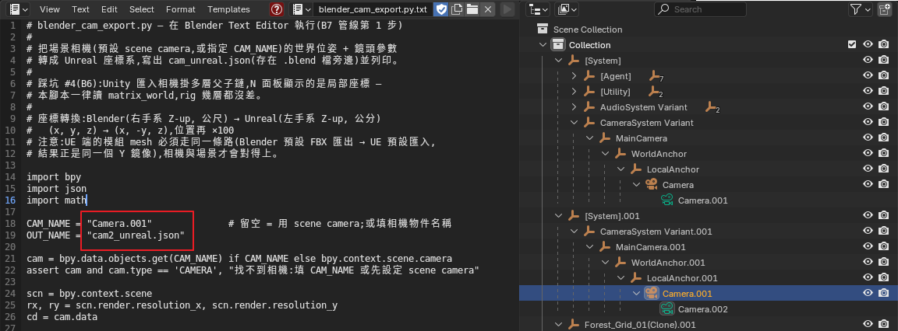
2. **`OUT_NAME` 忘了改會覆蓋前一顆的 json**:相機2 第一次匯出寫進了
   `cam_unreal.json`,蓋掉 Downloads 的相機1 檔(repo `locked/` 有正本,
   無實害)。之後每顆相機:`CAM_NAME` 與 `OUT_NAME` **成對改**。
3. UE 端兩顆 CineCamera 並存無衝突,名字照 json(`Camera`/`Camera.001`),
   切著 Pilot 即可對照;同位置不同視野,相機2 畫面裡模組小一圈。

驗收對照 — UE 相機2 視角(上)vs Blender 基準渲圖(下),
同視點、比相機1 寬一大圈(116.81° vs 91.49°):
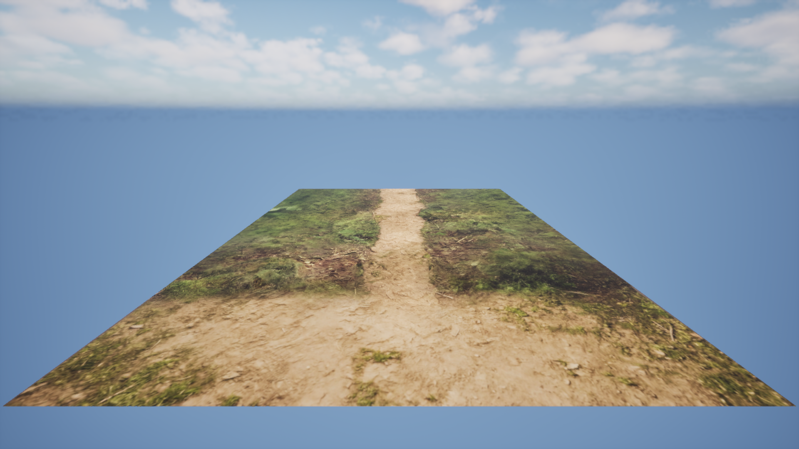
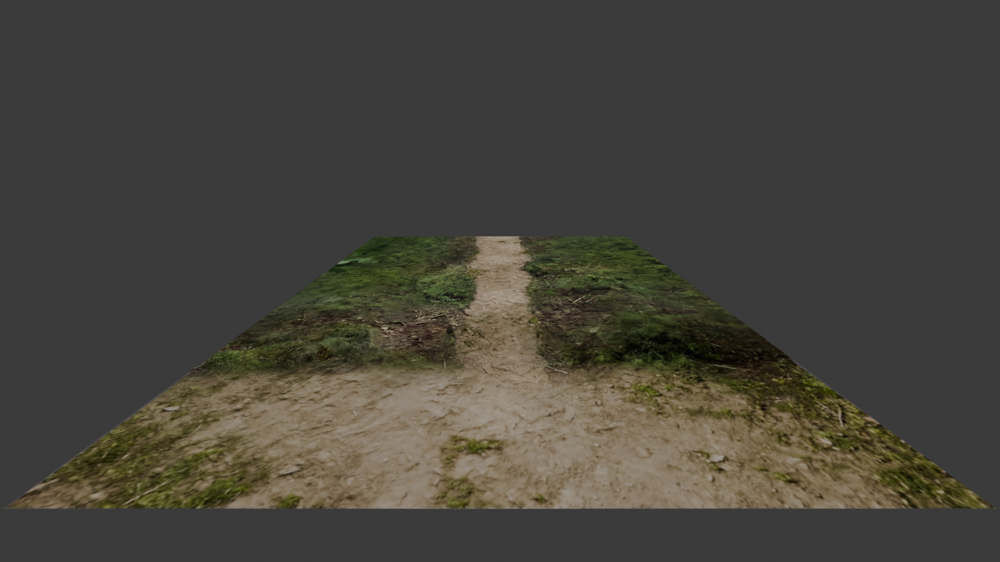

## 實戰踩坑(相機1 這輪實際遇到)

| # | 現象 | 根因 | 解法 |
|---|---|---|---|
| 1 | 填 `CAM_NAME` 時不知道填哪個 | rig 六層鏈:`[System]→CameraSystem Variant→MainCamera→WorldAnchor→LocalAnchor→Camera`,且相機**資料塊**也叫 MainCamera(綠色圖示)跟第三層空物件撞名 | 填**物件**名 `Camera`(橘色圖示、倒數第二層);絕不填 `MainCamera` |
| 2 | json 的 name 變 `Camera.001` | 操作中誤複製出第二顆相機(位姿相同故數據無害) | Outliner 搜 Camera 刪複製品;渲基準圖前確認 scene camera 與 json 同一顆 |
| 3 | 從網頁另存腳本變 `.py.txt` | Windows 自動加副檔名 | Blender 端無所謂(只看內容);**UE 端執行檔案必須是 `.py`** — 檔案總管開「顯示副檔名」後 F2 改名 |
| 4 | Text Editor 沒有 ▶ 按鈕 | 編輯器區塊太窄,按鈕被擠出畫面 | 用 **Text 選單 → Run Script**(等效)或 Alt+P |
| 5 | UE 貼整段腳本報 `Could not load Python file '# unreal_cam_import.py'` | UE Python 輸入列看到內容含 `.py` 字樣,把整段輸入當**檔名**去載入(console 怪癖) | 不貼內容,改成在 Python 模式直接輸入**腳本檔完整路徑**執行:`C:/.../unreal_cam_import.py` |
| 6 | `HighResShot` 報 SyntaxError | 輸入列還在 Python 模式 | **Cmd 模式吃引擎指令、Python 模式吃程式碼**,拍圖前切回 Cmd:`HighResShot 1920x1080` |
| 7 | 視口紅字 Video memory exhausted | 測試關卡帶 Landscape+體積雲,顯存超支 | 驗收用 Empty/Basic Level 重建(模組+相機 30 秒重生);高解析截圖前尤其要處理,否則可能破圖 |

## 預防踩坑(照 B6 經驗預埋)

| # | 風險 | 預防 |
|---|---|---|
| 1 | Unity rig 多層父子鏈,面板是局部座標(B6 #4 同源) | 腳本讀 `matrix_world`,不手抄 |
| 2 | 相機與 mesh 走不同轉換路徑 → 對不上 | mesh 走 Blender 預設 FBX → UE 預設匯入;相機走本腳本;兩者同一個 Y 鏡像 |
| 3 | UE 景深把畫面糊掉,誤判「對不上」 | 腳本已關 Focus + 光圈 22 |
| 4 | 拿普通 Camera 的 FOV 欄對 Unity 的 60 | 只用 CineCamera filmback+focal |
| 5 | 視口比例不是 16:9,構圖看起來不同 | Pilot + Constrain Aspect Ratio;驗收一律用 1920×1080 截圖 |
| 6 | rig 帶負縮放(鏡像)→ forward/up 反向 | 匯出腳本會偵測並警告;渲出來顛倒就回報處理 |
| 7 | UE 全域近裁剪(預設 10cm)吃掉超近物 | 相機1 clip start 0.3m=30cm,不受影響;若之後要更近,改 Project Settings → Near Clip Plane |

## 待辦

- [x] 相機1 實機走一輪 SOP → 驗收通過(2026-07-11;定案值見「相機1 實測紀錄」節)
- [ ] 相機1 嚴格鎖檔(選配):PS 50% 疊圖量化誤差(目前為目測相符);
  乾淨 Empty Level 重建一份,解掉顯存警告
- [x] 相機2:驗收通過(2026-07-11;filmback 43.77 × 24.6206,
  HFOV 116.81° 與 B6 定案值一字不差;json 已入 `locked/`)
- [ ] 相機3(CAM_GEN2):21.10mm + 5504×3072 畫布 → filmback 36 × 20.09
  (36 × 3072/5504);先確認 CAM_GEN2 的 sensor 設定再定案
- [ ] 三顆都鎖檔後:把 UE 端截圖與對照結論回填本篇,狀態轉全 ✅
