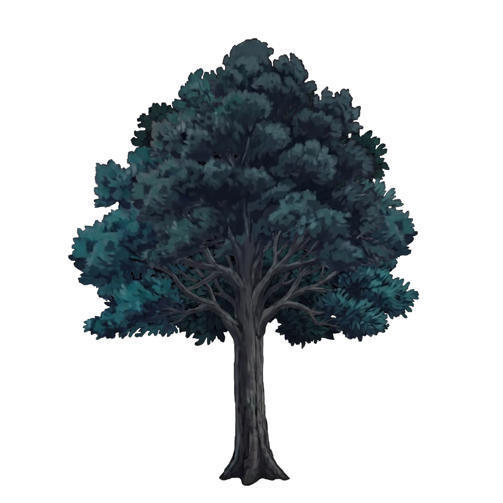
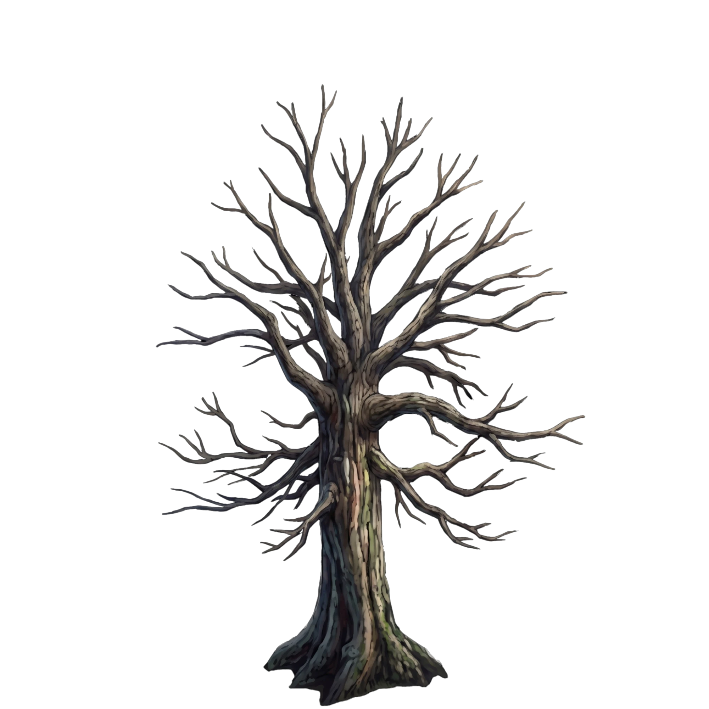
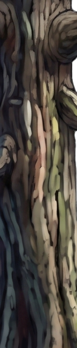
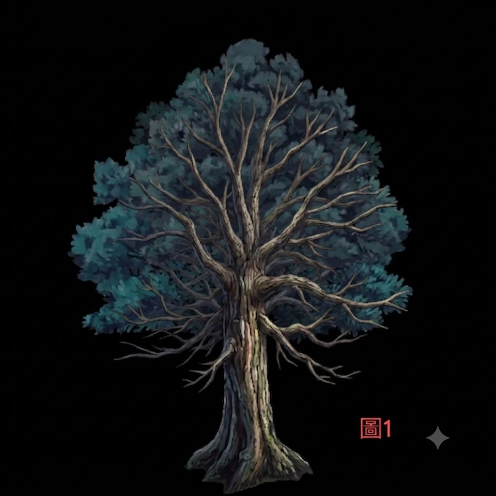
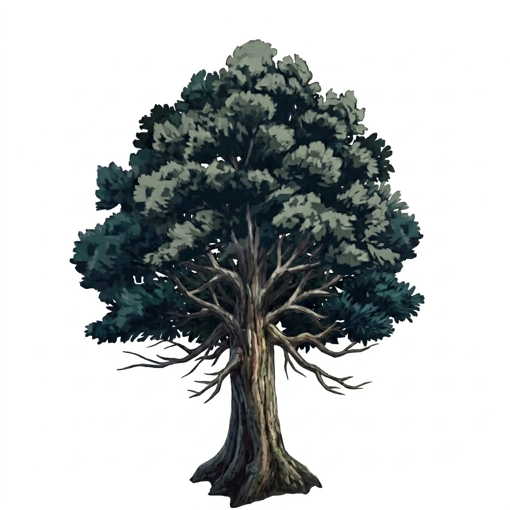
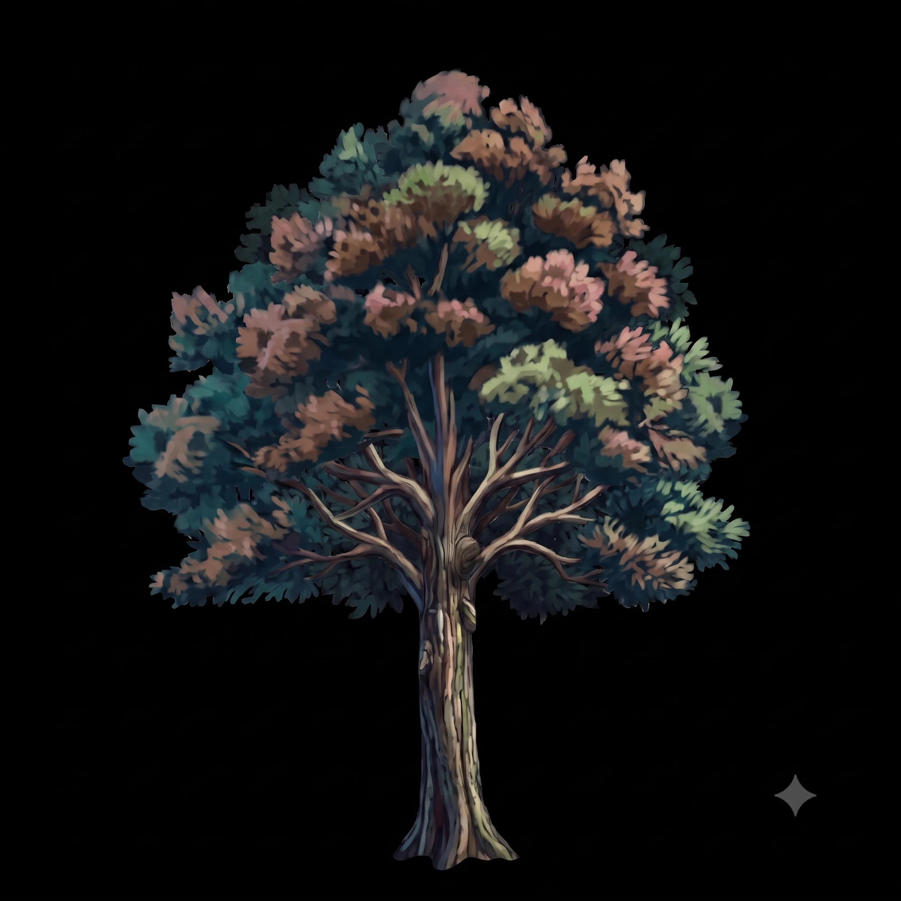

# B8 — 樹資產重上色:材質特寫參考路線(幾何滲漏根治法)

> 關鍵詞:`重上色`、`風格轉移`、`幾何滲漏`、`材質特寫`、`造型不變`、
> `restyle`、`bark texture`、`prompt 鎖形狀失敗`

## 任務

把夜霧森林的樹資產(圖1:完整樹冠 + 平塗暗色樹幹)的**樹幹上色方式**,
改成另一張枯樹參考(圖2)的樹皮畫法 — 明確樹皮縱紋、受光分面、
可見筆觸 — **但造型/輪廓完全不變**。

平台:Leonardo → Nano Banana 2(雙圖輸入編輯)。
平台設定照專案慣例:Prompt Enhance = None、Style = None、
輸出比例 = 輸入比例、輸入滿版。

---

## 結論先講(TL;DR)

| # | 路線 | 結果 |
|---|---|---|
| 1 | 雙圖輸入:圖2 = **整棵枯樹** + 英文鎖句(`style reference ONLY, ignore its shapes`) | ❌ **幾何滲漏**:枯枝整組嫁接到樹冠上、樹幹造型被改、日光暖木色滲入 |
| 2 | 單圖輸入:拿掉圖2,**純文字描述**樹皮風格 + 全套鎖句(輪廓鎖/樹冠凍結/黑鎖) | ❌ NB2 對話式編輯 = **整張重畫**,樹冠重排、樹幹改形。文字鎖壓不住,二連敗 |
| 3 | Crop-Gen-Paste + PS 剪裁遮罩(像素鎖) | ⏸ 備案,未跑(路線 4 先成功)。收錄於下方「像素鎖保險路線」 |
| 4 | 雙圖輸入:圖2 換成**純樹皮材質特寫**(裁掉所有幾何)+ 極短中文 prompt | ✅ **成功**。構圖/輪廓保持,樹幹吃進樹皮畫法 |

**核心教訓:幾何滲漏的根治不是「用文字叫模型別抄形狀」,而是「參考圖裡根本沒有形狀可抄」。**

---

## ✅ 勝利配方(路線 4)

**輸入:**
- 圖1 = 要編輯的樹資產(完整樹)
- 圖2 = **樹皮材質特寫**(從風格來源圖裁下的樹幹表面長條特寫 —
  只有材質,沒有輪廓、沒有枝幹結構、沒有完整物件)

**逐字 prompt(全文就這兩行):**

```
調整圖1的上色風格  不要改變構圖

要像圖2的上色風格
```

**為什麼成立:**

| 因素 | 作用 |
|---|---|
| 圖2 = 材質特寫、無幾何 | 模型想滲幾何也**無料可抄** — 滲漏源頭直接消失。與 B2「貼材質灰盒」同心法:參考只給材質,不給結構 |
| `不要改變構圖` 一句話 | 短句整包鎖構圖,實測**贏過三輪英文鎖句堆疊**。與 nano-banana 物件合成模板「少寫、整包交給模型對齊」心法一致 |
| 中文 prompt | NB2 原生多語,中文短指令無劣化 |

---

## 殘餘 delta(驗收時注意)

風格是**整棵樹**吃進去的,不只樹幹:

- 樹冠也被重上色(材質特寫裡的粉/橄欖綠/棕色調擴散到葉團)
- 原圖的夜間藍綠 grade 流失,整體變暖變亮

若需求是「只換樹幹、樹冠保持原夜色」,兩條修法:

1. **prompt 加色調鎖再跑一輪:**
   `樹冠保持圖1原本的夜間藍綠色調,只有樹幹用圖2的上色風格`
2. **PS 遮罩合成(零風險):** 新結果只取樹幹區域,
   用原圖樹幹輪廓做圖層遮罩貼回原圖 — 樹冠原封不動。

---

## 失敗路線解剖(以後別再踩)

### 路線 1:整棵枯樹當風格參考 → 幾何滲漏

參考圖以「圖像」身分進場,NB2 不只抄畫法,連枯枝結構整組嫁接:
禿枝畫到樹冠上面、樹幹輪廓變成參考圖的、日光暖色一起滲入。
`Image 2 is a STYLE reference ONLY — ignore its shapes entirely` 這類
鎖句**擋不住**。與 B2 幾何滲漏、B3「不能強求」同型。

### 路線 2:單圖 + 文字描述風格 → 整張重畫

拿掉參考圖後改用文字描述樹皮畫法,配全套 B1 鎖句
(輪廓鎖 + 樹冠凍結 + 畫框鎖 + 黑鎖 + `do NOT add branches`)。
結果 NB2 仍整張重畫:樹冠葉團重排、樹幹加長改形。
**結論:此資產型(單體樹、複雜輪廓),「用 prompt 鎖形狀」這條路本身不成立。**

### 像素鎖保險路線(路線 3,備而未用)

若材質特寫路線在其他資產上仍漂移,升級到物理鎖:

1. **裁**:從原圖裁「目標部位 + 少量周邊」矩形,原寸(B2 像素預算原則)
2. **生**:只餵裁切圖跑風格 pass(模型看不到整體,就改不了整體)
3. **貼**:結果貼回原座標,用**原圖部位輪廓**做剪裁遮罩 —
   漂移全被遮罩裁掉,造型 100% 物理保證
4. 1–2px 羽化收邊;色偏用 Hue/Sat 剪裁調整層修,不再跑生成

---

## 可複用結論(進鎖句/技法字典)

- **材質特寫參考**:要轉移「上色方式」時,參考圖一律裁成
  **無幾何的材質特寫**,不餵完整物件 — 幾何滲漏根治法
- **短句構圖鎖**:`不要改變構圖` 單句實測強於長英文鎖句堆疊
  (NB2 對中文短指令的服從度高)
- **prompt 鎖形狀的邊界**:單體資產 + 複雜輪廓 + NB2 對話式編輯
  = 文字鎖不可靠;要嘛參考圖去幾何(本案),要嘛像素鎖(Crop-Gen-Paste + 遮罩)
- 風格轉移預設**全圖擴散** — 只要局部就得加部位色調鎖或 PS 遮罩合成

---

## 圖檔

### 輸入

| 圖1 — 原始夜樹(要編輯的底圖) | 風格來源 — 整棵枯樹(路線 1 的參考圖) | 圖2 — 樹皮材質特寫(勝利參考,從左圖裁下) |
|---|---|---|
|  |  |  |

### 失敗 vs 成功

| 路線 1 ❌ 幾何滲漏(枯枝嫁接、樹幹被改形) | 路線 2 ❌ 整張重畫(樹冠重排、樹幹改形) | 路線 4 ✅ 成品(構圖保持、樹幹吃進樹皮畫法) |
|---|---|---|
|  |  |  |
