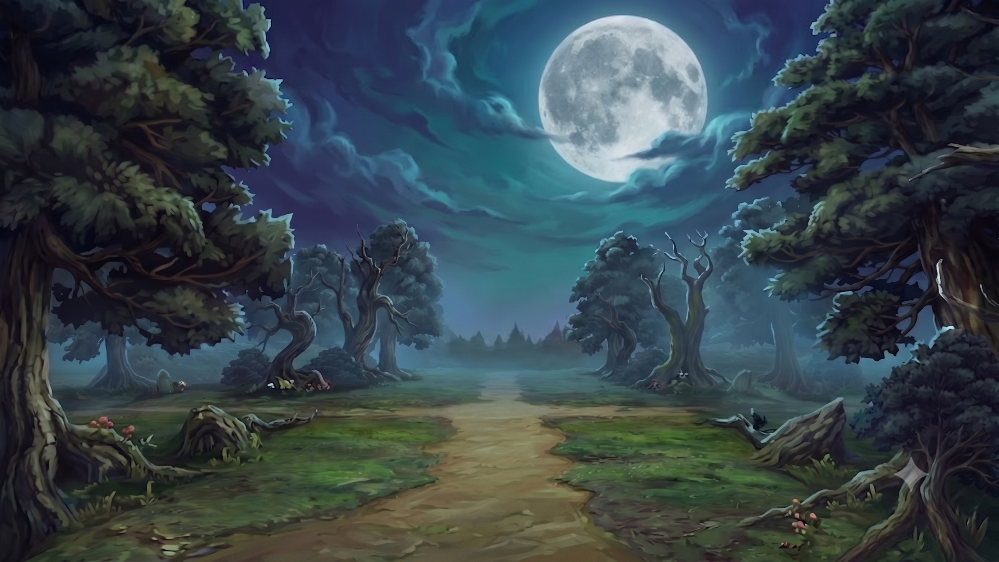
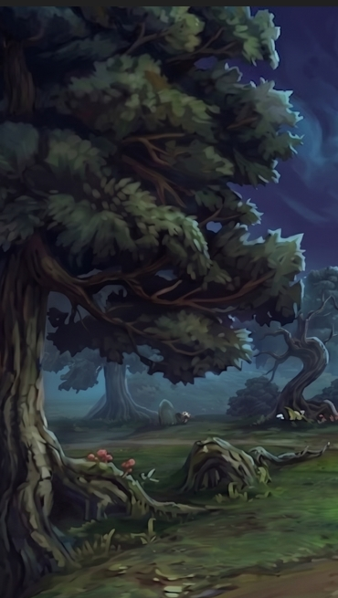
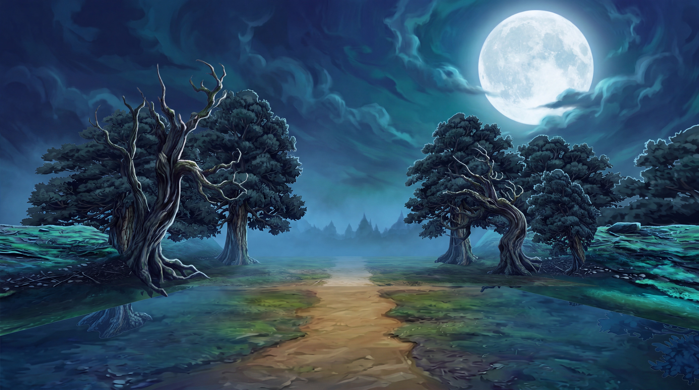
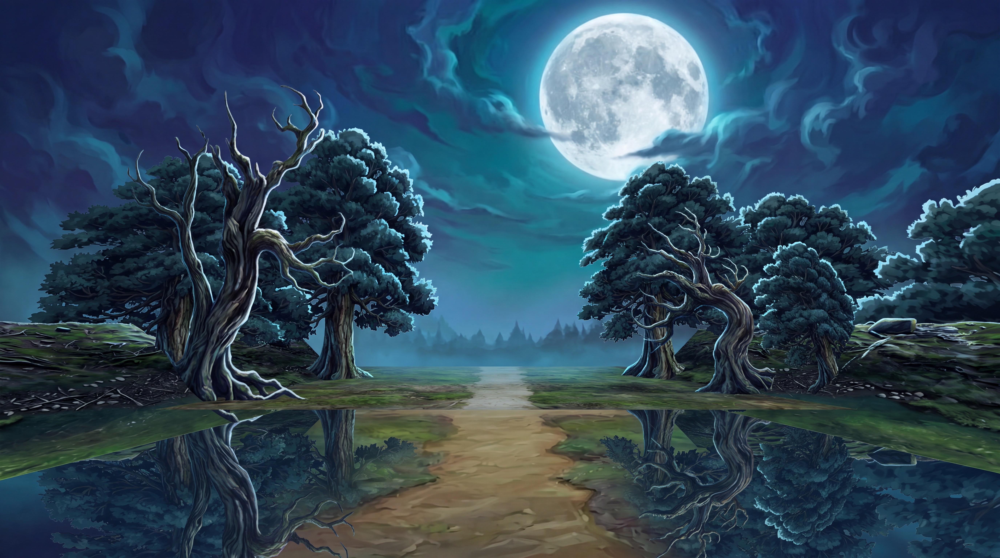
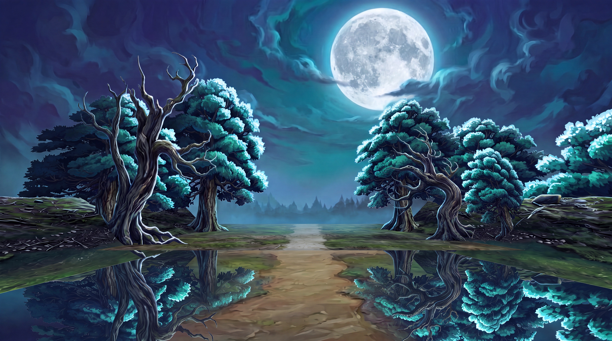
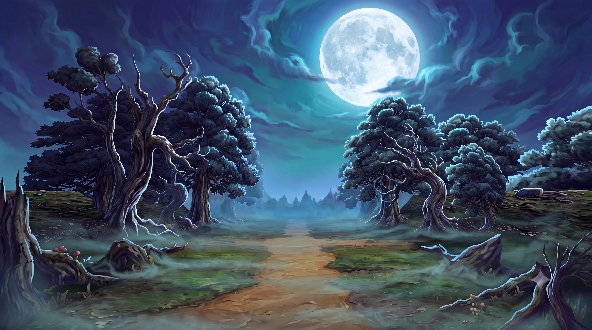
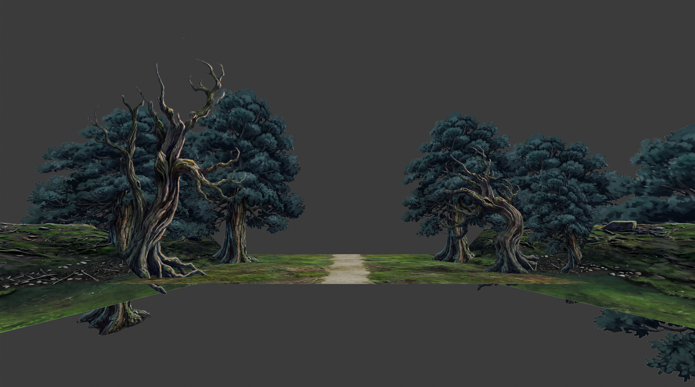
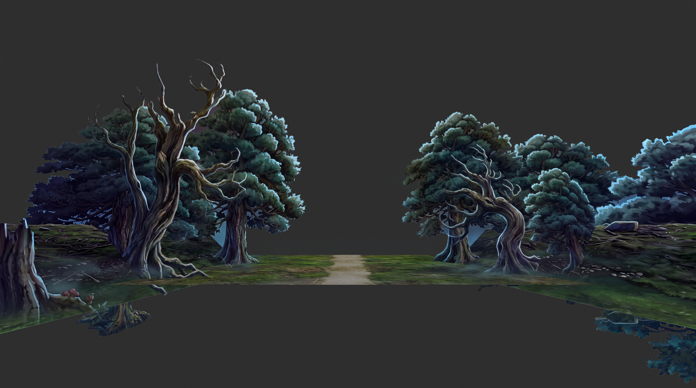

# 實戰紀錄 — B9 月夜 RPG 森林背景:風格 DNA 分析 + 衍生圖風格鎖句

> 一張「明亮浪漫月夜森林」完成插畫的風格拆解,目的 = 之後用它產生**同風格衍生圖**。
> 對應工作流:`ai-media-generator` + [SOP 打光公式](SOP-style-relight.md) Phase 1。
> ⚠️ 與 B8 魔森**不同風格** — B8 是暗黑恐怖(低調/枯木/骷髏/紅眼),
> 本圖是明亮夢幻日式 RPG(高明度藍月夜/繁茂綠葉/暖泥徑/童話蘑菇),風格 DNA 獨立記錄。

**🔑 關鍵字:** `B9`、`月夜森林`、`RPG 森林`、`明亮夜森林`、`夢幻月夜`、
`JRPG background`、`painterly night`、`風格 DNA`、`風格鎖句`、`--sref`

## 來源(索引)

- **素材:** 月夜 RPG 森林插畫(16:9 橫幅,約 2K)= 風格母本
- **用途:** 當**風格母本(STYLE TRUTH)**,產生同風格衍生背景圖 + 場景重打光
- **日期:** 2026-07-22
- **狀態:** ✅ 風格分析定案;✅ 引擎灰盒場景重打光+體積兩 pass 成功(2026-07-24,見下方)

### 風格母本(STYLE TRUTH)


---

## 風格 DNA(五層拆解)

### 1. 定位

**日式 RPG / 動漫感手繪奇幻夜景背景(JRPG painterly night background)。**
氣質**明亮、浪漫、寧靜**,而非恐怖 — 是「冒險者夜間紮營」的溫柔感,不是驚悚。
渲染 = 柔和厚塗(soft painterly / semi-cel),葉團與雲以團塊筆刷帶高光邊,
樹皮/樹根中筆觸半寫實,整體乾淨、飽和、可讀性高。**非照片寫實、非 3D、非暗黑。**
與 B8 的核心差:B8 壓灰壓暗走 low-key horror;B9 高明度、高飽和、月光普照。

### 2. 構圖文法(可套用到所有衍生圖)

| 元件 | 規則 |
|---|---|
| **舞台框景** | 左右兩株高大繁茂大樹當「舞台簾幕」,樹冠向上出框、樹幹佔左右邊 |
| **導引線** | 中央暖褐色泥土小徑呈 S 形/漏斗形從底邊引向中景霧林(單點透視) |
| **視覺焦點** | 右上大滿月 = 全圖最亮點,不置正中(偏右上,留呼吸感);視線 = 月 → 樹縫 → 小徑 |
| **三層深度** | 前景(高細節樹框+樹樁+蘑菇)→ 中景(霧中枯樹剪影+遠方尖塔)→ 遠景(月+漩渦雲天) |
| **地平線** | 中下,天空占上 55%(給月和雲留大面積) |
| **點景敘事** | 地面散置童話蘑菇叢、枯樹樁、苔石 — 增加親和的奇幻感 |

### 3. 色彩

- **主宰色:飽和的午夜藍 + 青綠**(saturated midnight blue + teal),明度比 B8 高一大截
- **天空:** 藍→青綠漸層漩渦雲,月周泛冷白光暈(發光感)
- **點綴/暖色:** 中央泥徑暖黃褐(warm ochre/tan)— 全圖唯一大面積暖色,與藍天成互補對比
- **植被:** 藍綠~墨綠葉團,受光緣帶青白高光;草地黃綠
- **點景色:** 蘑菇的紅/米白(小面積跳色)
- 整體**中高飽和**,不壓灰 — 這是與 B8 最大的色彩分界

### 4. 光

- 主光 = **右上滿月冷白光**,強度高;雲被月照亮出銀邊,天空整體發亮
- 前景樹**受光緣一圈青白 rim light**(月光描邊),但主體不死黑 — 保留藍綠固有色與細節
- 大氣:中景一層**藍色薄霧**做空氣透視,把遠樹/尖塔柔化推遠
- **中間調為主的夜景**(non-key horror 的反面):陰影是「深藍」不是「黑」,暗部通透可讀
- 無強發光體(無符文/紅眼);月光暈是唯一光源亮點

### 5. 筆觸/材質

- 雲:大軟筆漩渦混色 + 月周高光;葉團:團塊筆刷點畫、受光緣提亮
- 樹皮/樹根:中硬筆刷順紋理,半寫實;泥徑:平滑厚塗帶輪痕
- 細節密度梯度:前景高(蘑菇/苔/樹皮紋)→ 中景剪影+霧化 → 遠景漩渦天空大筆觸

**🍃 葉團渲染理想(2026-07-25 使用者理想圖定調 — 衍生圖葉子的目標):**
- **暖苔綠/橄欖綠中間調**受柔和月光,只在最深陰影袋轉 blue-green(⚠️ 不是冷青藍實心剪影)
- **一片片手繪葉觸**(leaf dabs / sprigs)在樹冠內部各自接光 — 有葉片細節,非平滑色塊
- **團塊分明 + 枝幹從葉隙透出** — 樹冠鬆散有深度,非實心一坨
- 光**柔和低對比、情緒感**,非硬邊 rim light
- 📌 反面教訓:葉子「黯淡」先查**色溫太藍 / 筆觸太平滑**,別反射性加亮(加亮→塑膠感)



---

## 母題清單(motif inventory — 衍生圖抽換用)

1. 高大繁茂框景大樹(樹冠出框)  2. 扭曲枯枝老樹(中景剪影)  3. 暖褐泥土小徑(S 形)
4. 右上大滿月 + 冷白光暈  5. 藍青綠漩渦雲天  6. 中景藍霧 + 遠方尖塔剪影
7. 童話紅傘/米白蘑菇叢  8. 枯樹樁 + 苔石  9. 黃綠草地  10. 樹幹青白月光描邊

> ⚠️ **每張衍生圖挑 2–4 個母題即可**(B1 踩坑 #8:多離散小物件注意力稀釋)。
> 蘑菇/尖塔是本風格的「親和奇幻」記號,想保留 RPG 感就至少留一個點景母題。

---

## 風格鎖句(逐字保存 — 衍生圖 prompt 的固定段落)

> 用法:整塊當 prompt 的「風格段」逐字沿用,前面只換主題/構圖描述。
> 全描述性詞、無 artist name(Flux/NB 系才吃)。

```text
STYLE: hand-painted Japanese-RPG fantasy night background, soft
painterly / semi-cel brushwork — clumped foliage with lit rim
highlights, semi-realistic bark and roots, smooth painted dirt path.
Bright, romantic and serene — NOT horror, NOT photorealistic, NOT a 3D
render.

PALETTE LOCK: saturated midnight-blue and teal night palette, MID-to-
HIGH brightness — shadows are deep BLUE, never black, and stay readable.
The only large warm note is the warm ochre dirt path (complementary to
the blue sky); foliage is blue-green to deep green with cool white rim
light on lit edges; small red-and-cream mushroom accents. Colors stay
clean and mid-to-high saturation — do NOT desaturate or grey it down.

LIGHTING LOCK: single bright cold moonlight key from the upper-right
sky; a large full moon with a cool white glow halo is the brightest
point; clouds are silver-lit; foreground trees get a cool white rim
light on their moonlit edges but keep their blue-green local color and
detail — this is a mid-key moonlit night, do NOT crush the shadows to
black. A layer of blue atmospheric haze softens the midground.

COMPOSITION: two tall leafy trees as left/right stage curtains, canopies
cropping out of frame; a warm dirt path winds from the bottom into a
misty treeline; the full moon sits upper-right (not centered); three
depth layers — detailed foreground, blue-hazed silhouetted midground,
glowing swirled-cloud sky; horizon in the lower-middle, 16:9.
```

---

## 平台路線(衍生圖生產)

| 路線 | 做法 | 備註 |
|---|---|---|
| **首選:image-grounded(Nano Banana Pro / NB2)** | 本圖當 style reference 掛參考圖,文字只寫「新主題 + 構圖差異 + 上方 PALETTE/LIGHTING LOCK」 | Leonardo 設定照 B1 表(Enhance None / Style None / 比例=輸入) |
| **Midjourney** | `--sref <本圖>` + `--sw 200-400`,`--ar 16:9 --s 400-750`(fantasy 甜蜜點);可加 `niji` 系加強動漫感 | prompt 用 comma chips 改寫鎖句重點 |
| **純文字平台(Seedream / Flux)** | 直接用上方風格鎖句整段 + 主題句 | Seedream 重要詞放前;Flux 80–200 字自然段 |

**沿用 B1 鎖句字典:** 光暈半徑鎖(月不變大)、深度鎖(藍霧後不銳化)、
畫框鎖(16:9 不 outpaint)— 逐字見 [B1 紀錄](B1-forest-bg-4k-detail.md#鎖句字典可複用)。
**⚠️ 曝光鎖要改寫:** B8 用「不准提亮暗部」;B9 相反,暗部本來就通透 —
改鎖「shadows stay deep blue and readable, do not crush to black」(見 PALETTE/LIGHTING LOCK)。

---

## 用本圖做場景重打光(SOP Phase 2)

本圖可當 **LIGHTING & MOOD REFERENCE(IMAGE 2)** 給灰盒/引擎場景重打光成「明亮月夜 RPG 氛圍」。
照 [SOP 打光公式](SOP-style-relight.md) Phase 2 走,但把 relight 段的定調換成 B9 方向:

- 時段/氣氛:`bright serene moonlit night, mid-key`(**不要**寫 low-key / horror)
- 光向:`cold moonlight key from the upper-right sky`
- 暗部:`shadows deep blue and readable — do NOT crush to black`(與 B8 相反,關鍵差異)
- 色盤:`saturated midnight-blue and teal, warm ochre path`
- 大氣:`blue atmospheric haze in the midground`
- 母題授權:想要 RPG 感 → 缺口授權句補「misty treeline with a faint distant spire silhouette」

> 🔑 **B8 vs B9 打光速記:** 同是青綠夜森林,但 **B8 = 壓暗壓灰 low-key horror,暗部塗黑**;
> **B9 = 高明度高飽和 mid-key,暗部深藍通透**。選錯母本 = 氣氛完全跑掉。

### ⚠️ B9 特有:平資產卡要「像 B9 一樣立體」= 體積 pass,不是 relight

B9 的招牌是**葉團球化 + 樹幹圓柱化的厚塗體積感**。用平的引擎資產卡跑 relight,
光色會對但**葉子仍扁平**(relight 的筆觸鎖保住原卡的平面內部)。要圖 2 級體積必須改走
**體積 pass**(silhouette-lock + 內部重畫),代價是失去像素對位 —
完整對照與逐字 prompt 見 [SOP §2b-alt 鎖的高度](SOP-style-relight.md#2b-alt-鎖的高度--relight-pass-vs-體積-passfont-重要分岔)。
✅ 實測 2026-07-23:relight 扁平 → 體積 pass 得到 B9 級葉團/樹幹體積。
✅ 定案 2026-07-24(2026-07-26 更正:**實測需兩 pass,非一次到位**):
- **Pass 1** = COMPOSITION LOCK + SOURCE LAYOUT/TRUNK DETAIL authoritative → 保構圖 + 保樹幹細節
  ([b9-pass1-trunk-detail.jpg](images/b9-pass1-trunk-detail.jpg))
- **Pass 2** = Repaint ONLY the leaf canopies(葉團值域/體積重畫)
  ([b9-pass2-foliage-repaint.jpg](images/b9-pass2-foliage-repaint.jpg))
- 兩 pass 疊出:構圖對位 + 圖 2 級體積 + B9 藍月光色。**樹幹與葉團要分兩 pass 才兩全**(部位分治,見 SOP §2b-alt)。

---

## ✅ 里程碑 — AI 強化 → PS 合成回引擎資產卡(2026-07-26)

完整閉環走通:引擎灰盒場景 → B9 重打光/體積/樹幹/葉團多 pass → **PS 合成各版最佳部位
→ 去背回引擎資產卡格式(灰底 + 地面條)**。前後對比:原始卡(扁平均勻青綠)→ 強化後
(葉團有體積層次+頂端青白亮團、樹幹 bark 暖調立體、繪本厚塗質感)。

- 🔑 **落點正確:當引擎素材卡用,不是投影對位** → 體積 pass 的像素漂移不是問題(引擎重新拼裝)。
- 觀察:右側體積略弱於左側(可補葉團 pass);底部鏡像倒影進引擎會裁掉;去背邊緣乾淨可直用。
- 意義:整條「風格分析 → 重打光 → 體積 → 樹幹保留 → 葉團理想 → 合成收尾 → 回引擎卡」
  管線驗證至**可用素材**,非僅出圖。

### 兩 pass 實證(樹幹細節 + 葉團體積分開跑)

首次單段 relight — 光色對但**葉團扁平**(relight 天花板,證明需體積 pass):


Pass 1 — 保構圖 + 保樹幹細節:


```text
Two reference images. IMAGE 1 = SOURCE LAYOUT + TRUNK DETAIL
(authoritative for composition AND for all bark). IMAGE 2 = FOLIAGE
VOLUME REFERENCE ONLY — match how its canopy leaves are modeled.

COMPOSITION LOCK (highest priority): reproduce IMAGE 1's layout exactly
— same tree count, positions, sizes, the path S-shape and width, banks
and gap. Do not add, remove, move or reshape anything.

TRUNKS, BRANCHES & ROOTS — PRESERVE, do NOT repaint: keep the EXACT
bark texture, grooves, knots and silhouette of every trunk, branch and
root from IMAGE 1. Only RELIGHT them to the moonlight — cool white rim
light on the moonlit edges, deep blue shadow on the far side. Do NOT
redraw, reinvent or add new bark detail; the wood stays exactly as
painted in IMAGE 1.

FOLIAGE ONLY — volume pass: repaint the leaf canopies to give them
volume like IMAGE 2 — clustered rounded masses, brightly moonlit tops,
deep blue shadowed undersides, layered front-to-back with self-shadowing.

LIGHTING: bright mid-key moonlit night, cold moonlight from the upper-
right; saturated midnight-blue and teal, warm ochre path; shadows deep
blue and readable, not black.

Fill the flat gray backdrop with IMAGE 2's midnight-blue swirled-cloud
sky and a full moon with a cool glow halo in the upper-right; add a
blue-hazed misty treeline in the central gap.
```

Pass 2 — 只重畫葉團(值域/體積):


### 加地面霧版


### 強化前後對比(回引擎資產卡)

強化**前**(原始引擎卡,扁平均勻青綠):


強化**後**(葉團體積層次+樹幹 bark 暖調立體+厚塗質感):


## 待辦

- ☑ 圖檔入庫(8 張):母本 / 葉團理想 / Pass1 / Pass2 / 地面霧 /
  強化前 `b9-enhance-before.jpg` / 強化後 `b9-enhance-after.png` / relight 天花板 `b9-relight-flat.jpg`
  — 皆已接上顯示(⚠️ before/after 原上傳檔名對調,已更正)
- ☐ 首張「同構圖換母題」衍生圖試產,驗風格鎖句有效性
- ☐(如需)用本圖當 IMAGE 2 跑一次場景重打光,驗證 mid-key 定調
- ☐ 驗收:衍生圖與母本並排 — 色盤/明度分佈/筆觸密度一致,僅內容不同
